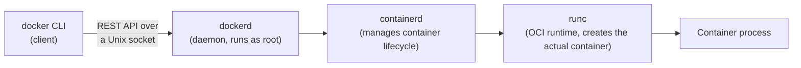
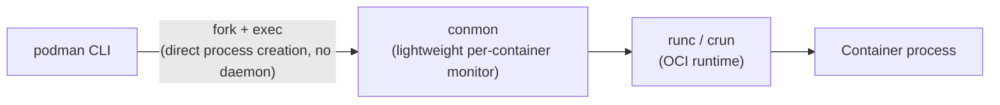

# Docker vs Podman architecture

## The core difference in one sentence

**Docker runs a root-owned background daemon that manages every container; Podman has no daemon at all — each container is just a direct child process of the command that started it.**

That one architectural choice cascades into almost every other difference between them.

## Docker's architecture: client/server with a daemon

- **`dockerd`** is a long-running background service, traditionally started at boot, traditionally running as **root**.
- The `docker` command you type is just a thin client — it sends a REST API call over a Unix socket (`/var/run/docker.sock`) to that daemon.
- The daemon delegates down to **containerd** (lifecycle management: pull, start, stop) and then to **runc** (the low-level Open Container Initiative, or OCI, runtime that actually calls the Linux kernel primitives — namespaces and cgroups — to create the container).

**The security implication:** if you can talk to the Docker socket, you effectively have root on the host. Mounting `/var/run/docker.sock` into a container, or adding a user to the `docker` group, is functionally equivalent to giving that user root. This single fact is one of the most common reasons enterprises move away from Docker in production.

## Podman's architecture: daemonless, fork/exec

- There is **no background daemon**. When you run `podman run`, the `podman` binary directly forks and execs the container — the container process is a **child of your shell**, not a child of some always-on root service.
- Podman still uses the **same OCI-compliant runtimes** (`runc` or the more Podman-native `crun`) and the **same OCI image format** as Docker — this is why `docker build` and `podman build` produce interchangeable images, and why `alias docker=podman` genuinely works for most day-to-day commands.
- **Rootless by default:** Podman is designed to run entirely as a normal, unprivileged user, using Linux **user namespaces** to remap container UID 0 (root inside the container) to an unprivileged UID on the host (via `/etc/subuid` and `/etc/subgid` ranges). The container process *thinks* it's root; the host kernel knows it's just your normal user.
- **`conmon`** is a small per-container monitor process that keeps the container's stdio/exit status available even if `podman` itself exits — it's how Podman avoids needing a persistent daemon to track running containers.

**Memorable hook:** *"Docker asks a root daemon to babysit your container. Podman just becomes your container's parent process directly — no babysitter, no daemon, no single point of failure or single point of compromise."*

## Why the name "Podman," and the systemd integration

Podman = **Pod Man**ager. Unlike Docker, Podman natively understands the concept of a **pod** — a group of containers sharing a network namespace — which is exactly the same *pod* concept Kubernetes uses. This isn't a coincidence: it's deliberate, because Red Hat designed Podman to be a natural stepping stone toward Kubernetes/OpenShift thinking, letting you prototype multi-container pods locally with `podman pod create` before they ever touch a cluster.

Podman also integrates with **systemd** in a way Docker's daemon model can't cleanly do: `podman generate systemd` (or the newer **Quadlet** format) lets you run containers as proper systemd units, with systemd itself handling restart policies, dependency ordering, and logging — instead of relying on a separate daemon's restart logic.

## Real-world examples

1. **Red Hat OpenShift's own move away from Docker.** OpenShift (and Kubernetes generally, since v1.24) dropped Docker as a supported container runtime in favor of runtimes that speak CRI directly (CRI-O, containerd) — the daemon/root model didn't fit Kubernetes' security and architecture goals. As a Red Hat Solution Architect, this is a conversation you'd have had directly with customers migrating off Docker Swarm or old Docker-based CI pipelines onto OpenShift.
2. **A regulated-industry customer (e.g. a Thai bank) that can't allow root daemons.** Financial-services security policies frequently forbid running any process as root that isn't strictly necessary. Podman's rootless model directly closes that gap — this is a live selling point in exactly the kind of financial-services account portfolio you owned at Red Hat.
3. **Local development parity with production.** If your production platform is OpenShift (which uses CRI-O under the hood, not Docker), developing locally with Podman instead of Docker Desktop gives engineers a runtime that's architecturally closer to what actually runs in production — fewer "works on my machine, fails on the cluster" surprises.

## Quick comparison table

| Aspect | Docker | Podman |
|---|---|---|
| Daemon | Yes — `dockerd`, traditionally root | None — daemonless |
| Default privilege | Root (daemon), containers often need care to run rootless | Rootless by default |
| Process model | Client/server (REST API over socket) | Fork/exec (direct child process) |
| Native pod concept | No (Docker Compose approximates it) | Yes — `podman pod` |
| systemd integration | Indirect | Native (`generate systemd`, Quadlets) |
| Image/runtime format | OCI-compliant | OCI-compliant (interchangeable images) |
| Kubernetes/CRI fit | Needed a shim (dockershim), now removed | CRI-O (Podman's sibling project) built for exactly this |
