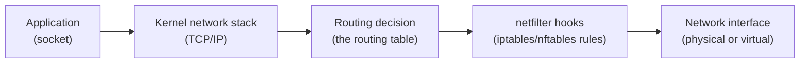
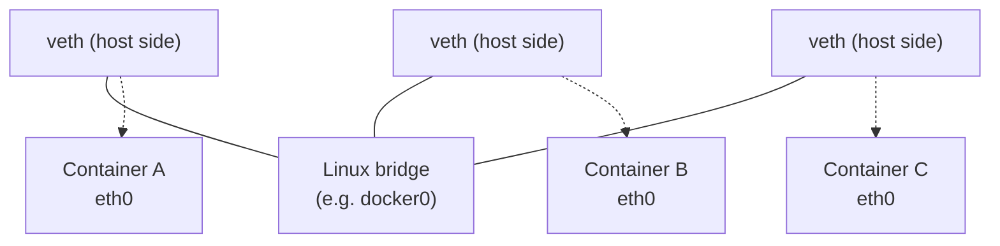

# Linux networking fundamentals

Everything later today — container networking, CNI, Kubernetes Services — is built on a small set of Linux networking primitives. This page is the foundation layer. Skip it and the later pages become "trust me" instead of "I understand exactly why."

## The one-line hook

> **A container's network is never physically real — it's virtual interfaces, virtual switches, and packet-rewriting rules, all implemented entirely in the host kernel.**

## The journey of a packet, conceptually

Every packet leaving or entering a Linux host passes through this same pipeline — whether it's a normal host process or a process trapped inside container namespaces. Understanding this pipeline is what lets you reason about *any* networking problem, containerized or not.

## The core primitives, one at a time

### Virtual Ethernet (veth) pairs

A **veth pair** is two virtual network interfaces that are permanently linked — anything sent into one end comes out the other, like a virtual patch cable. This is the single most important primitive in all of container networking: it's how a network namespace (which has no direct physical hardware) gets connected to anything at all. One end lives inside the isolated namespace (appears as `eth0`), the other end stays in the host's default namespace, typically attached to a bridge.

### The Linux bridge — a software switch

A **Linux bridge** (created with `ip link add br0 type bridge`) behaves like a physical Ethernet switch, entirely in software. Attach multiple veth pairs' host-side ends to the same bridge, and every namespace on the other end of those veth pairs can now reach each other at Layer 2 — exactly like plugging multiple computers into the same physical switch. Docker's default `docker0` interface and Kubernetes CNI plugins like Flannel's `cni0` are both ordinary Linux bridges.

### Routing — how the kernel decides where a packet goes next

The **routing table** (`ip route show`) is a simple decision list: "for destination X, send via interface Y, next hop Z." A default route (`default via <gateway>`) is just the catch-all entry used when nothing more specific matches. Every namespace has its *own independent* routing table — this is part of what "network namespace" actually isolates.

### netfilter and iptables/nftables — the packet-rewriting layer

**netfilter** is the kernel's packet-filtering and manipulation framework; **iptables** (and its modern successor **nftables**) is the userspace tool that configures it. Packets pass through a sequence of **chains** as they move through the stack:

| Chain | When it applies |
|---|---|
| `PREROUTING` | As soon as a packet arrives, before a routing decision is made |
| `INPUT` | Packets destined for this host itself |
| `FORWARD` | Packets passing through this host to somewhere else |
| `OUTPUT` | Packets generated by this host |
| `POSTROUTING` | Just before a packet leaves, after routing |

The **NAT (Network Address Translation) table** is where two operations you'll meet constantly in container/Kubernetes networking actually live:

- **DNAT (Destination NAT)** — rewriting a packet's destination address/port. This is exactly how `docker run -p 8080:80` works: a `PREROUTING` DNAT rule redirects traffic arriving on the host's port 8080 to the container's internal IP on port 80.
- **SNAT/MASQUERADE (Source NAT)** — rewriting a packet's source address. This is how a container with a private, non-routable IP can still reach the internet: as its traffic leaves via `POSTROUTING`, MASQUERADE rewrites the source to the host's real IP, so return traffic knows where to come back to.

**Memorable hook:** *"DNAT changes where a packet is going. SNAT/MASQUERADE changes where a packet claims to be from. Port publishing is DNAT; outbound container internet access is MASQUERADE."*

### ARP — turning an IP into a MAC address

**ARP (Address Resolution Protocol)** answers one question at Layer 2: "I know the IP address I want to reach on this local network — what's the actual hardware (MAC) address that owns it?" It matters here because bridges operate at Layer 2, and every "two containers on the same bridge can talk to each other" claim quietly depends on ARP resolving correctly first.

## Real-world examples

1. **`kube-proxy` in iptables mode.** This is the single biggest payoff of this page: a Kubernetes `Service`'s stable virtual IP is implemented as a set of iptables DNAT rules that kube-proxy continuously programs onto every node, rewriting traffic destined for the Service IP to one of the backing pod IPs. There is no special "Service" networking device — it's the same DNAT primitive covered above, just automated cluster-wide.
2. **Diagnosing "the container has no internet access" for a customer.** In a huge share of real incidents, the actual root cause is a missing or flushed MASQUERADE rule (often after a firewall tool or security hardening script resets iptables). Being able to say "check `iptables -t nat -L POSTROUTING` for the MASQUERADE rule" instead of "try restarting Docker" is a credible, senior-level diagnostic step.
3. **Legacy JBoss Fuse / integration workloads needing host networking.** Some latency-sensitive messaging workloads (as seen in nbn-style integration platforms) are deliberately run in host network mode specifically to skip the NAT/bridge overhead described above — a real, defensible architecture tradeoff that only makes sense once you understand what bridge mode is actually costing you.
