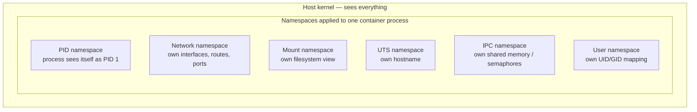
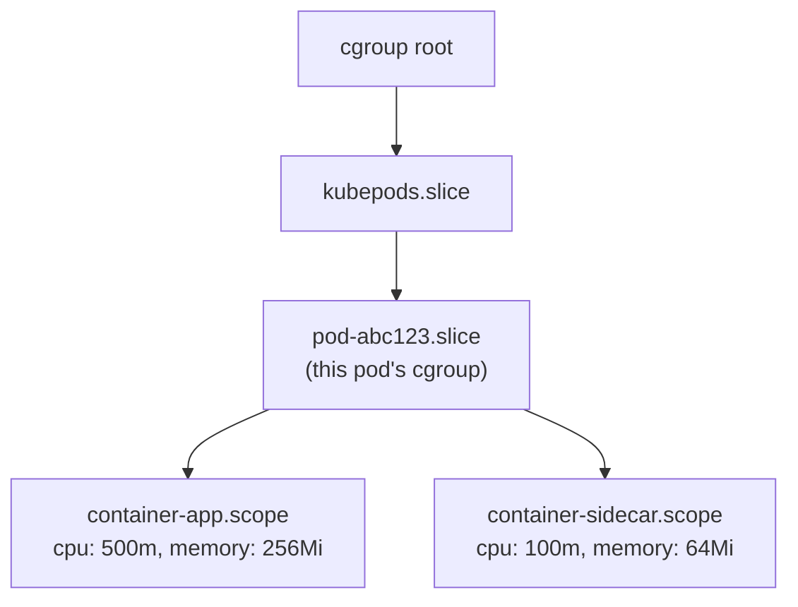

# cgroups and namespaces — the real mechanics of "container isolation"

This is the page that answers the exact follow-up you described: *"you said you know containers — what's the kernel actually doing?"* There is no magic. A container is just a normal Linux process with two kernel features applied to it.

## The one-line hook

> **Namespaces control what a process can *see*. Control groups (cgroups) control what a process can *use*.**

Memorize that split and you can reconstruct the rest of the answer live in the interview.

## Namespaces — what the process can see

A namespace wraps a global kernel resource so that a process inside the namespace sees its *own* isolated view of that resource, while the host still sees everything.



| Namespace | What it isolates | Interview-ready example |
|---|---|---|
| **PID** (Process ID) | The process ID tree | Inside the container, your app is PID 1. On the host, `ps aux` shows it as some high-numbered PID like 48213. Kill PID 1 on the host and the container dies; the container itself can't see or signal any host process. |
| **Network** | Network interfaces, routing tables, ports | Each container/pod gets its own `eth0`, own IP, own port space — two containers can both bind to port 8080 without conflict, because they're in different network namespaces. |
| **Mount** | The filesystem view | A container sees its own root filesystem (from the image layers); it cannot see the host's `/etc`, `/home`, etc. unless you explicitly bind-mount a volume in. |
| **UTS** (UNIX Time-Sharing) | Hostname and domain name | `hostname` inside a container returns the container ID or a name you set — completely independent of the host's actual hostname. |
| **IPC** (Inter-Process Communication) | Shared memory segments, semaphores, message queues | Two unrelated containers can't accidentally share memory segments or step on each other's semaphores, even if a bug tried to. |
| **User** | UID/GID mapping | This is what makes **rootless Podman** possible: UID 0 *inside* the namespace maps to an unprivileged UID (say, 100000) *outside* it, on the host. |

**Real-world example:** on the nbn Australia TnD Microservices work, when you decomposed the monolith into independently deployable services on Kubernetes, each service's pod got its own PID and network namespace automatically — that's *why* two microservices could each run a process that thinks it's PID 1, and why you didn't need to hand-manage port allocation between them the way you might have on a shared VM.

## cgroups — what the process can use

Control groups (cgroups) put **limits and accounting** on resource usage — CPU time, memory, disk I/O, number of processes — for a group of processes, regardless of what namespaces they're in.



### cgroups v1 vs v2 — the question that separates a level-5 answer from a level-8 one

| | cgroups v1 | cgroups v2 |
|---|---|---|
| Hierarchy | **Multiple** separate hierarchies — one tree per controller (cpu, memory, blkio each mounted separately) | **Single unified** hierarchy — one tree, all controllers attached to it |
| Consistency | A process could be in different positions across different controller trees — confusing, hard to reason about | A process has exactly one cgroup path across all controllers |
| Controllers | cpu, cpuacct, memory, blkio, pids, devices, freezer, net_cls, net_prio (fragmented) | cpu, memory, io, pids, freezer — cleaner, some merged/renamed (`blkio` → `io`) |
| Adoption | Legacy default for years | Default in modern kernels, required by current Kubernetes/OpenShift versions, needed for accurate `Burstable`/`Guaranteed` QoS enforcement |
| systemd relationship | systemd manages cpu/memory but other controllers could be managed elsewhere — split ownership | systemd is the **single cgroup manager** for the whole unified tree — no split ownership |

**Memorable hook:** *"v1 is one tree per resource — like separate elevators for CPU, memory, and disk that don't talk to each other. v2 is one elevator shaft with clear stops for everything — a single source of truth."*

### How Kubernetes actually uses this

When you write a pod spec with:

```yaml
resources:
  requests:
    cpu: "250m"
    memory: "128Mi"
  limits:
    cpu: "500m"
    memory: "256Mi"
```

the kubelet (via the container runtime) translates this **directly into cgroup settings** on that container's cgroup: `cpu.max` / `cpu.shares` for CPU, `memory.max` for the hard memory ceiling. Cross the memory limit, and the kernel's OOM (Out-Of-Memory) killer terminates the container — which is exactly what an `OOMKilled` pod status means. There is no Kubernetes-specific memory enforcement mechanism; it's cgroups all the way down.

## Real-world examples

1. **The "noisy neighbor" problem in a shared cluster.** Without cgroup limits, one misbehaving microservice can consume all available CPU/memory on a node and starve every other pod scheduled there. This is precisely the kind of scaling problem the TnD monolith-to-microservices decomposition needed to solve — cgroup-enforced `requests`/`limits` per service is what makes multi-tenant scaling on a shared cluster actually safe.
2. **Debugging an `OOMKilled` pod for a customer.** In a Red Hat or Kong customer engagement, "why did my pod keep restarting?" often traces straight back to `memory.max` in the cgroup being hit — the fix is either raising the limit or fixing a memory leak, and being able to explain *why* `kubectl describe pod` shows `OOMKilled` (as opposed to a vague "it crashed") is a strong technical-credibility signal.
3. **Rootless Podman in a regulated account.** As covered on the previous page, the user namespace is the specific mechanism that makes rootless containers possible — this is the exact technical detail that turns "Podman is more secure" from a marketing line into a defensible architecture statement in front of a skeptical customer's security team.
