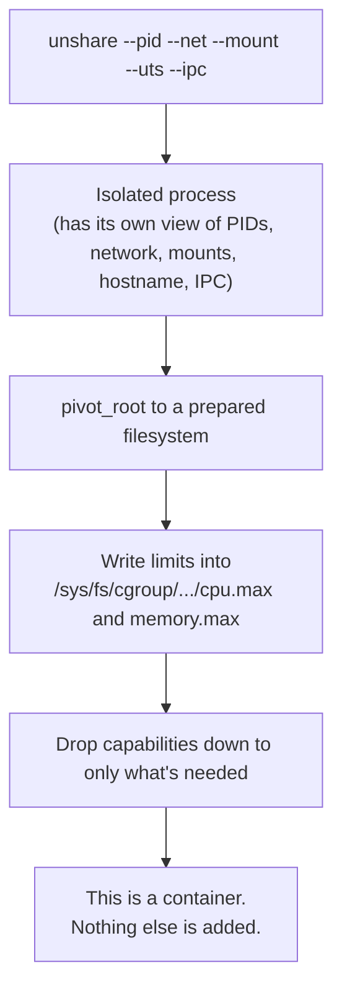

# Building a container from scratch — Linux containers the hard way

This is the page that answers the deepest possible version of "you say you understand containers" — by building one with nothing but raw Linux tools, no Docker, no Podman, no runc even. If you can walk through this from memory, there is no follow-up question about "what is a container, really" that can catch you off guard.

## The one-line hook

> **`docker run` is just a convenient wrapper around `unshare` + `chroot`/`pivot_root` + writing some numbers into `/sys/fs/cgroup` files. Nothing more mystical happens underneath.**

## What we're about to prove

A container is **not** a kernel object. There is no `struct container` anywhere in the Linux kernel. It is entirely an *illusion*, assembled from ordinary process isolation primitives that have existed in Linux for decades, most of them since the early-to-mid 2000s.

## Step 1 — isolate the process with namespaces, using `unshare`

The `unshare` command creates new namespaces and runs a command inside them directly — no container runtime involved:

```bash
sudo unshare --pid --mount --uts --ipc --net --fork --mount-proc bash
```

What each flag does:

| Flag | Namespace created |
|---|---|
| `--pid` | New PID namespace — the shell we just launched becomes PID 1 inside it |
| `--mount` | New mount namespace — filesystem mount changes here won't leak to the host |
| `--uts` | New UTS namespace — we can now set our own hostname without touching the host's |
| `--ipc` | New IPC namespace — isolated shared memory/semaphores |
| `--net` | New network namespace — starts with *only* a loopback interface, no connectivity yet |
| `--fork` + `--mount-proc` | Forks a new process for the namespace and remounts `/proc` so tools like `ps` report correctly *inside* the new PID namespace |

Run `hostname newbox` inside this shell and check the host's actual hostname in another terminal — it hasn't changed. Run `ps aux` inside — you'll see almost nothing, because this new PID namespace has its own process tree, and this shell really is PID 1 in it. **This alone is already 80% of what people mean when they say "container isolation."**

## Step 2 — change the root filesystem with `chroot` / `pivot_root`

Namespaces isolate *views* of the system, but the process is still looking at the host's real filesystem unless we also change its root. Two tools do this:

- **`chroot`** — the older, simpler tool. Changes what the process (and its children) consider `/` to be. Well known to be escapable by a sufficiently privileged process, which is why real container runtimes don't rely on it alone.
- **`pivot_root`** — the tool real container runtimes actually use. It swaps the current root filesystem for a new one *and* moves the old root out of the way (typically to be unmounted entirely), which closes the escape routes `chroot` alone leaves open.

```bash
# Inside the unshared mount namespace, with a prepared root filesystem at /tmp/newroot:
mount --bind /tmp/newroot /tmp/newroot
cd /tmp/newroot
mkdir -p oldroot
pivot_root . oldroot
cd /
umount -l /oldroot
```

After this, the shell's entire view of the filesystem is whatever was staged at `/tmp/newroot` — this is conceptually identical to what an unpacked container image gives you.

## Step 3 — apply resource limits by hand, using cgroups v2

No namespace so far limits *how much* CPU or memory this process can use — only *what it can see*. That's cgroups' job, and with the unified cgroups v2 hierarchy, it's just writing plain numbers into files:

```bash
sudo mkdir /sys/fs/cgroup/mybox
echo $$  > /sys/fs/cgroup/mybox/cgroup.procs        # move current shell into this cgroup
echo "50000 100000" > /sys/fs/cgroup/mybox/cpu.max   # cap CPU: 50ms out of every 100ms window
echo "268435456"    > /sys/fs/cgroup/mybox/memory.max # cap memory: 256 MiB
```

That's it. There's no separate "cgroups API" beyond this virtual filesystem interface — `cpu.max` and `memory.max` are the exact same files that Kubernetes' kubelet writes to (via the container runtime) whenever a pod spec declares `resources.limits`.

## Step 4 — Linux capabilities: splitting up what "root" even means

Even inside all of the above, a process running as UID 0 inside its namespace is still, by default, "root" with the full traditional power that implies — the ability to load kernel modules, change network configuration, bypass file permission checks entirely, and more. **Linux capabilities** split that monolithic root power into roughly 40 independent, individually grantable privileges.

| Capability | What it grants | Where you'd meet it |
|---|---|---|
| `CAP_NET_ADMIN` | Configure network interfaces, routes, firewall rules | A container that needs to manage its own VPN or network config |
| `CAP_NET_RAW` | Open raw sockets | Needed for a container to run `ping` (ICMP) |
| `CAP_SYS_ADMIN` | A notoriously broad grab-bag (mount filesystems, and much more) | Avoided wherever possible — often called "the new root" because of how much it actually grants |
| `CAP_CHOWN` | Change file ownership regardless of normal permission rules | |
| `CAP_SYS_TIME` | Change the system clock | Rarely needed, almost always dropped |

This is exactly what Docker's `--cap-drop`/`--cap-add` flags and Kubernetes' `securityContext.capabilities` field configure — and it's the deeper mechanism underneath OpenShift's default posture of dropping capabilities aggressively via its default Security Context Constraint.

**Memorable hook:** *"Root isn't one power, it's about 40 separate powers bundled together by default. Capabilities let you hand out exactly the ones a process actually needs, and not one more."*

## Step 5 — a nod to seccomp

**seccomp (secure computing mode)** is one layer deeper still: it filters which *system calls* a process is allowed to make at all, regardless of what capabilities or UID it has. Docker and most container runtimes apply a default seccomp profile that blocks a long list of rarely-needed, historically dangerous syscalls (like loading kernel modules directly via `init_module`). This is worth mentioning briefly if asked "what else limits a container beyond namespaces and cgroups" — it shows you know the isolation model has more than two layers.

## Putting it together



**This is, literally, what `runc` (the OCI runtime underneath both Docker and Podman) automates.** When you learned Docker/Podman architecture earlier today, "runc creates the actual container" was one line in a diagram — now you know exactly what that line means in kernel-level terms.

## Real-world examples

1. **Answering a customer's security team's "are containers as isolated as VMs?" question, credibly.** The honest, technically defensible answer is no — containers share the host kernel, so isolation is exactly as strong as the namespace/cgroup/capability/seccomp boundary, not a hardware-enforced hypervisor boundary. Being able to explain *why* in these exact terms is a stronger answer than a marketing-level "containers are lightweight and secure."
2. **Diagnosing a legacy application needing `CAP_NET_RAW` on OpenShift.** A workload that needs to run `ping` for health checks or diagnostics will fail under a default-dropped-capabilities SCC — understanding capabilities at this level turns a confusing permissions error into a two-minute, confident fix (grant exactly that one capability, not a blanket privileged SCC).
3. **Explaining why "containers aren't VMs" during a Red Hat presales workshop.** This exact from-scratch build is a genuinely effective whiteboard exercise for a technical customer audience — walking through `unshare` → `pivot_root` → cgroup limits live is far more convincing than a slide with the word "lightweight" on it.
