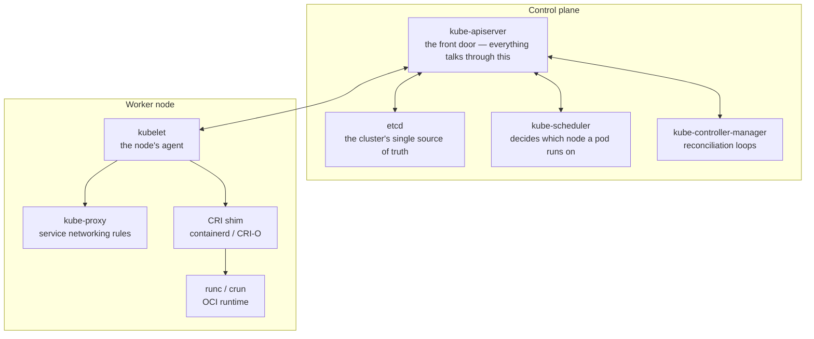
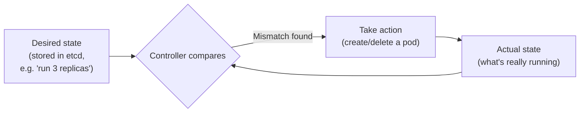

# Kubernetes architecture & the Container Runtime Interface (CRI)

## The one-line hook

> **Kubernetes never actually runs a container. It only ever tells something *else* to run a container — and the Container Runtime Interface (CRI) is the contract that lets it say that request in a way any compliant runtime understands.**

That distinction — Kubernetes as an *orchestrator*, never an *executor* — is the single idea that makes the rest of the architecture make sense.

## Control plane vs worker nodes

### Control plane components

| Component | Job | Hook |
|---|---|---|
| **kube-apiserver** | The only component that talks to `etcd` directly; validates and processes every REST request (`kubectl`, controllers, kubelets all go through it) | "The front door — nobody gets to the database except through this door." |
| **etcd** | A distributed, consistent key-value store holding the entire cluster state | "The cluster's memory. Lose etcd, lose the cluster's brain." |
| **kube-scheduler** | Watches for pods with no assigned node, picks the best node based on resource requests, affinity/anti-affinity rules, taints/tolerations | "A matchmaker — pairs unscheduled pods with nodes that can actually host them." |
| **kube-controller-manager** | Runs the **reconciliation loops** — constantly compares *desired state* (what's in etcd) against *actual state* (what's really running) and takes action to close the gap | "The thermostat — always checking 'is reality what I was told it should be?' and correcting if not." |

### Worker node components

| Component | Job |
|---|---|
| **kubelet** | The agent on every node; watches the API server for pods assigned to *this* node, and talks to the local container runtime via CRI to actually start/stop them |
| **kube-proxy** | Implements the networking rules that make a Kubernetes `Service`'s stable virtual IP actually route to the right pod(s), usually via iptables or IPVS rules |
| **Container runtime** | The thing that actually creates containers — reached via CRI |

## Why CRI exists — the history that makes it click

Before CRI existed, the kubelet had **Docker-specific code built directly into it**. That worked fine when Docker was the only runtime anyone used — but it meant:

- Every alternative runtime (CRI-O, containerd used directly, others) needed its own custom fork or shim of the kubelet
- Kubernetes' core codebase was tightly coupled to one vendor's implementation details

**CRI solved this by defining a standard gRPC API** between the kubelet and *any* container runtime. As long as a runtime implements two gRPC services — `RuntimeService` (start/stop/list containers) and `ImageService` (pull/list/remove images) — the kubelet can use it, with zero Docker-specific code.

Docker itself was never CRI-compliant, so Kubernetes shipped a translation shim called **`dockershim`** to keep supporting it. That shim was deprecated and removed starting with **Kubernetes v1.24** — which is *why* "Docker is deprecated in Kubernetes" became a widely (and often confusingly) reported headline. Docker wasn't banned — the special-case code that let Kubernetes talk to it *without* CRI was removed. Docker-built images still run fine, because they're standard OCI images; it's specifically the Docker *daemon* as the runtime kubelet talks to that's gone.

**Memorable hook:** *"Dockershim didn't die because Docker is bad — it died because it was the one runtime that refused to speak the standard language everyone else agreed on."*

### The two CRI-compliant runtimes you'll actually be asked about

| Runtime | Origin | Where you'd see it |
|---|---|---|
| **containerd** | Extracted from Docker itself, donated to the Cloud Native Computing Foundation (CNCF) | Default runtime for most managed Kubernetes (including Amazon EKS's default node AMIs) |
| **CRI-O** | Built by Red Hat and the Kubernetes community specifically to be a lightweight, Kubernetes-only CRI implementation — no extra features Kubernetes doesn't need | The default runtime in **Red Hat OpenShift** |

## The reconciliation loop, in one picture

This loop is the philosophical core of Kubernetes: you declare *what you want*, and a continuous background process keeps nudging reality toward that declaration. It's why killing a pod managed by a Deployment doesn't "break" anything — the controller notices the mismatch (3 desired, 2 actual) and creates a replacement within seconds.

## Real-world examples

1. **Red Hat OpenShift's choice of CRI-O.** As a Red Hat Solution Architect, this is a question you'd have fielded directly from customers: "why does OpenShift use CRI-O instead of just Docker or containerd?" The honest answer is exactly what's above — CRI-O was purpose-built to be minimal and Kubernetes-native, with no extra surface area Kubernetes doesn't use, which matters for OpenShift's security and support posture.
2. **TnD Microservices on AWS.** When that platform ran on Kubernetes on AWS, the kubelet on each worker node was doing exactly this dance — reading pod specs from the API server, and handing them to the local runtime via CRI — for every one of the decomposed microservices, whether the team was thinking about it at that level or not.
3. **Explaining an `OOMKilled` or `CrashLoopBackOff` pod to a customer.** Being able to say "the kubelet detected the actual state didn't match desired state, so the controller is repeatedly trying to reconcile it" is a stronger, more credible answer than "Kubernetes is trying to restart it" — it shows you understand the *mechanism*, not just the symptom.
