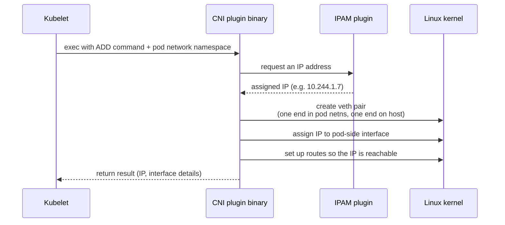

# Networking — Container Network Interface (CNI) deep dive

## The one-line hook

> **CNI isn't a network. It's a plugin contract — a way for the kubelet to say "give this pod a network interface" without caring how that plugin actually does it.**

Same pattern as CRI, one layer over: Kubernetes defines a standard interface, and lets the ecosystem compete on implementation.

## What problem CNI solves

Kubernetes has one non-negotiable networking requirement: **every pod gets its own IP address, and every pod can reach every other pod's IP directly, with no NAT (Network Address Translation) in between** — even across nodes. That's a much flatter, simpler model than traditional container networking (like Docker's default bridge network with per-host NAT), and it's what lets Kubernetes treat pods almost like they're all on one big flat network, regardless of which physical node they're actually scheduled on.

**The Container Network Interface (CNI)** is the specification that makes any plugin capable of fulfilling that requirement pluggable into the kubelet.

## How it actually works, step by step

1. The kubelet creates the pod's network namespace first (this is just the Network namespace covered on the cgroups/namespaces page).
2. It then **executes the configured CNI plugin as a binary**, passing it the pod's network namespace and an `ADD` command.
3. The plugin creates a **veth (virtual Ethernet) pair** — think of it as a virtual network cable with two ends: one end gets placed inside the pod's network namespace (appearing as `eth0` to the container), the other end stays on the host, typically attached to a bridge or routed directly.
4. An **IPAM (IP Address Management)** plugin — often bundled with the CNI plugin — hands out an IP from the cluster's configured pod CIDR range.
5. The CNI plugin configures routes (and, depending on the plugin, BGP peering, VXLAN tunnels, or eBPF programs) so that this new IP is actually reachable from every other node in the cluster.

**Memorable hook:** *"A veth pair is a virtual patch cable. One end goes into the pod's isolated network namespace, the other end plugs into the host's networking — that's the entire physical mechanism behind 'the pod has an IP now.'"*

## The major CNI plugins — what actually differs between them

| Plugin | Networking approach | Network Policy support | Where you'd meet it |
|---|---|---|---|
| **Flannel** | Simple overlay network, typically VXLAN encapsulation | No (by itself) | Common in smaller/simpler clusters, kubeadm quick-starts |
| **Calico** | Can run overlay (VXLAN/IPIP) **or** pure Layer 3 routing via BGP (Border Gateway Protocol) — no encapsulation overhead when BGP-routable | Yes — rich, enterprise-grade Network Policies | Large enterprise clusters needing real network segmentation and performance |
| **Cilium** | eBPF (extended Berkeley Packet Filter) — programs run inside the kernel itself instead of relying on iptables | Yes — plus L7-aware policies (can filter on HTTP methods/paths) | Performance- and observability-focused shops; increasingly common default in newer managed Kubernetes offerings |
| **OVN-Kubernetes** (Open Virtual Network) | Software-defined networking with a full virtual switching/routing layer (based on Open vSwitch) | Yes | **Default CNI in Red Hat OpenShift** since OpenShift 4.x |

**Memorable hook for the encapsulation question:** *"Overlay networks (Flannel, Calico in VXLAN mode) wrap every packet in another packet — like putting a labeled envelope inside another envelope. BGP-mode Calico skips the extra envelope by teaching the real network routers the pod IPs directly."*

## Network Policies — the part people forget is CNI-dependent

A Kubernetes `NetworkPolicy` resource (which pods can talk to which other pods) is just a Kubernetes API object — **Kubernetes itself does not enforce it**. Enforcement is entirely the CNI plugin's job. This is a genuinely good trap question: if someone deploys `NetworkPolicy` resources on a cluster running plain Flannel, **nothing happens** — the policies are silently unenforced, because Flannel doesn't implement policy enforcement at all.

## Real-world examples

1. **OpenShift's default OVN-Kubernetes.** As a Red Hat Solution Architect, you'd position this directly: OpenShift ships with a production-grade, policy-enforcing CNI out of the box, rather than requiring the customer to separately evaluate and install a third-party CNI plugin — a real differentiator against a raw, self-assembled Kubernetes distribution.
2. **A multi-tenant customer cluster needing pod-to-pod isolation.** If a customer wants Team A's pods unable to reach Team B's database pods on the same cluster, that's a `NetworkPolicy` — but the conversation has to start with confirming the CNI plugin actually enforces it. This is exactly the kind of detail that separates a credible architecture conversation from a hand-wavy one.
3. **The TnD Microservices platform.** Decomposing a monolith into many small services running on Kubernetes on AWS only works cleanly if every service can reach every other service by a stable address, regardless of which node it lands on — that flat pod-to-pod reachability is the CNI's job, invisibly, underneath every service-to-service call the platform made.
