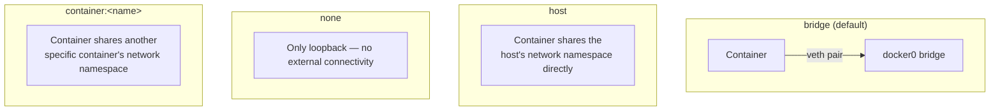

# Container networking deep dive

The Linux networking fundamentals page covered the raw primitives (veth, bridges, NAT). This page covers how a single-host container runtime (Docker or Podman, *before* Kubernetes enters the picture) actually assembles those primitives into "container networking" — and where that model breaks down, which is exactly why Kubernetes needed CNI in the first place.

## The one-line hook

> **"Container networking" (Docker/Podman, one host) and "CNI" (Kubernetes, many hosts) are solving the same underlying problem at two completely different scales — confusing them is a very common, very catchable mistake.**

## Docker's four networking modes

| Mode | What actually happens | When you'd choose it |
|---|---|---|
| **bridge** (default) | Container gets its own network namespace, connected via a veth pair to the `docker0` bridge; isolated from the host's network stack | The sensible default for almost everything — real isolation, still reachable via published ports |
| **host** | The container simply reuses the host's own network namespace — no veth pair, no bridge, no isolation at all | Latency-sensitive workloads where NAT/bridge overhead genuinely matters, at the cost of losing network isolation and port-conflict protection |
| **none** | Only a loopback interface, no external connectivity whatsoever | Security-sensitive batch jobs that should never be able to make network calls at all |
| **container:\<name\>** | Reuses *another specific container's* network namespace, rather than the host's | Sidecar-style setups — the classic example being how Kubernetes pods themselves work, covered below |

## How the default bridge mode actually works, end to end

1. Docker creates the `docker0` bridge on the host (an ordinary Linux bridge, exactly as covered on the Linux networking page).
2. For each new container, Docker creates a veth pair — one end goes into the container's new network namespace as `eth0`, the other end attaches to `docker0`.
3. Docker assigns the container an IP from a private subnet (commonly `172.17.0.0/16`) via a simple built-in IPAM.
4. Containers on the same bridge can reach each other directly at Layer 2/3 — no extra configuration needed.
5. For **outbound** internet access, an iptables `MASQUERADE` rule in the `POSTROUTING` chain rewrites the container's private source IP to the host's real IP as traffic leaves.
6. For **inbound** access, `docker run -p 8080:80` creates a `DNAT` rule in `PREROUTING`, redirecting traffic hitting the host's port 8080 to the container's internal IP on port 80.

This is precisely why, without an explicit `-p` flag, nothing on the network outside the host can reach a container at all — there's no route in, only the automatically-created route out.

## Where this model breaks — and why Kubernetes needed something else entirely

Docker's bridge networking is fundamentally a **single-host** model — `docker0` only exists on that one machine, and container IPs in that private subnet mean nothing to any other host. Kubernetes' core requirement — **every pod reachable by every other pod's real IP, across every node, with no NAT** — simply cannot be built out of one host's private bridge subnet. That gap is exactly why the Container Network Interface (CNI) exists as a separate, pluggable, cluster-aware layer, covered in depth later today.

**Memorable hook:** *"Docker's bridge network solves 'containers on one box talking to each other.' CNI solves 'pods on a hundred boxes all pretending they're on one flat network.' Same primitives, completely different scale of problem."*

## How a Kubernetes pod's networking actually maps back to Docker's modes

This is a genuinely good "aha" detail for an interview: a Kubernetes **pod** — a group of one or more containers sharing one network namespace — is implemented, under the hood, using exactly Docker's `container:` networking mode. Kubernetes silently creates one small, otherwise-invisible **"pause" container** per pod first, which owns the actual network namespace (and its veth pair into the cluster's CNI-managed network); every other container in that pod then joins that same namespace via `container:<pause-container-id>` — which is precisely why containers in the same pod can reach each other over `localhost`.

## Rootless container networking — the extra wrinkle Podman introduces

Creating a real bridge interface and writing iptables rules both require host-level privileges Docker's root daemon has by default — but rootless Podman deliberately doesn't have them. Rootless Podman instead uses a **userspace networking layer**, most commonly `slirp4netns` or the newer, faster `pasta`, which emulates the networking a container needs entirely in userspace, without touching the host's real bridge or iptables configuration at all. It's slower than a real bridge (userspace packet handling has real overhead) but requires zero elevated privileges — a direct, concrete tradeoff worth being able to explain.

## Real-world examples

1. **A latency-sensitive JBoss Fuse/messaging workload choosing host networking.** As referenced on the Linux networking page, this is a real, defensible tradeoff — skip the bridge/NAT overhead entirely, at the cost of losing network isolation between that workload and everything else on the same host.
2. **Diagnosing "container A can't reach container B" in a Docker Compose environment.** Almost always traces back to the two containers being on *different* custom bridge networks (Compose creates an isolated bridge per project by default) — a concrete, common incident this page directly explains.
3. **Choosing between rootful and rootless Podman for a customer's CI/CD runners.** Rootless is the safer default for untrusted build jobs, but the `slirp4netns`/`pasta` overhead is a real, measurable performance cost worth surfacing honestly in a network-heavy build pipeline — a nuanced, credible architecture conversation rather than a blanket "rootless is always better" claim.
