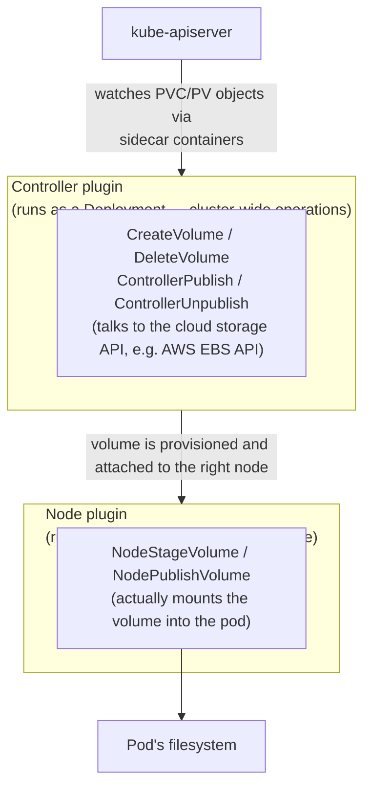
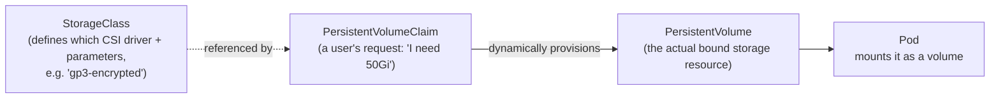

# Storage — Container Storage Interface (CSI) deep dive

## The one-line hook

> **CSI did for storage exactly what CRI did for runtimes and CNI did for networking: it moved vendor-specific code out of Kubernetes core and replaced it with a standard plugin contract.**

If you can explain CRI and CNI clearly (previous two pages), CSI is the same pattern applied a third time — an interviewer asking about all three in sequence is really testing whether you've noticed the pattern, not whether you memorized three unrelated acronyms.

## The problem CSI solves: "in-tree" volume plugins

Before CSI, every storage backend Kubernetes could use (AWS EBS, Azure Disk, Ceph, NFS, and so on) had its integration code **compiled directly into Kubernetes core itself** — called an "in-tree" plugin. That caused real problems:

- Adding or fixing support for a storage backend required a **full Kubernetes release cycle** — a storage vendor couldn't ship a bug fix on their own schedule.
- All that vendor code ran with the **same privileges as the Kubernetes core components themselves** — a bug or vulnerability in one storage vendor's code was a risk to the whole cluster, not just to that storage integration.
- The Kubernetes core codebase kept growing with code the Kubernetes maintainers didn't actually own or deeply understand.

**CSI moves all of that out-of-tree**: storage vendors ship and version their own CSI driver, deployed *into* the cluster as ordinary pods, completely decoupled from the Kubernetes release cycle.

## CSI architecture

A CSI driver isn't one component — it's split into two roles, both talking gRPC:

- **Controller plugin** (typically a `Deployment`, since it only needs to run once cluster-wide): handles operations against the storage backend itself — create the disk, delete it, attach it to a node.
- **Node plugin** (a `DaemonSet`, running on every node): handles the local, per-node operations — mounting the already-attached volume into the actual pod's filesystem.
- **Identity plugin**: a small service both of the above expose, just reporting the driver's name and capabilities.

### The sidecar pattern — a favorite deep-dive question

CSI drivers themselves **don't watch the Kubernetes API directly** — they only understand gRPC calls. So Kubernetes ships a set of standard **sidecar containers** that do the Kubernetes-API-watching and translate it into CSI gRPC calls:

| Sidecar | Job |
|---|---|
| `external-provisioner` | Watches for new `PersistentVolumeClaim` objects, calls `CreateVolume` on the CSI driver |
| `external-attacher` | Watches for volumes needing attach/detach, calls the CSI driver's `ControllerPublishVolume` |
| `external-resizer` | Watches for PVC resize requests, calls the CSI driver's volume expansion RPC |
| `node-driver-registrar` | Registers the node plugin with the kubelet so it knows which CSI driver is available on that node |
| `livenessprobe` | Standard health check for the CSI driver pods themselves |

**Memorable hook:** *"The sidecars are the translators. The CSI driver only speaks gRPC; the sidecars are the ones actually reading Kubernetes objects and turning 'someone created a PVC' into an actual CSI API call."*

## PersistentVolumeClaim, PersistentVolume, and StorageClass — how they connect

- A **`StorageClass`** is admin-defined and names a **provisioner** (the CSI driver, e.g. `ebs.csi.aws.com`) plus backend-specific parameters (disk type, encryption, filesystem).
- A **`PersistentVolumeClaim` (PVC)** is what an application developer actually requests — "give me 50Gi, ReadWriteOnce" — without needing to know or care about the underlying cloud API.
- With **dynamic provisioning** (the whole point of CSI combined with StorageClasses), the `external-provisioner` sidecar sees the PVC, calls the CSI driver, and a matching **`PersistentVolume` (PV)** is created and bound automatically — no cluster admin needs to hand-carve disks in advance the way pre-CSI Kubernetes often required.

## Real-world examples

1. **AWS EBS CSI driver on the TnD Microservices platform.** Any stateful component in that decomposition — a database, a message broker needing durable storage — would depend on exactly this chain: a `StorageClass` pointing at the AWS EBS CSI driver, a PVC requested by the service's deployment manifest, dynamically provisioning an actual EBS volume and attaching/mounting it to the right node.
2. **OpenShift Data Foundation (formerly OpenShift Container Storage) in Red Hat customer conversations.** Red Hat's own Ceph-based, CSI-compliant storage layer for OpenShift is a direct answer to "what do we do for stateful workloads on OpenShift" — being able to explain that it's CSI-compliant (not a proprietary bolt-on) is what makes the answer credible to a technically sharp customer.
3. **Explaining a stuck pod stuck in `ContainerCreating`.** A very common real incident: a pod won't start because its PVC never bound. Walking through *why* — StorageClass misconfigured, CSI controller pod not running, node plugin not registered on that node — is a strong demonstration of actually understanding the stack rather than just knowing the acronym.
