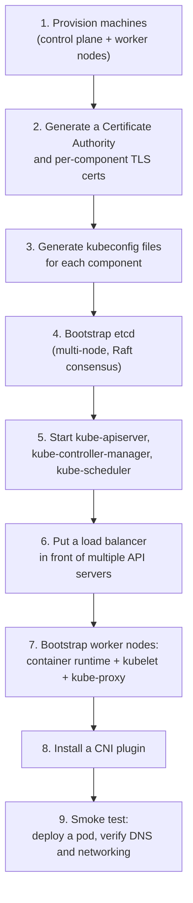

# Kubernetes cluster setup the hard way

`kubeadm init` runs in a couple of minutes and hides an enormous amount of work. This page unpacks exactly what that command — and every managed Kubernetes offering's "create cluster" button — is actually doing underneath, in the same spirit as Kelsey Hightower's well-known "Kubernetes the Hard Way" exercise. You don't need to have typed every one of these commands yourself to answer well; you need to be able to narrate the sequence and explain *why* each step exists.

## The one-line hook

> **Every managed Kubernetes control plane is built from the same handful of manual steps: generate certificates, bootstrap etcd, start the control plane components as authenticated clients of each other, then join nodes that trust the same certificate authority.**

## The full sequence

### 1–2. Provisioning and the certificate authority

Before any Kubernetes-specific work happens, you need machines (VMs or bare metal) reachable over the network, and — critically — a **Certificate Authority (CA)**. Every single connection between Kubernetes components is authenticated with mutual TLS (mTLS): the API server won't trust a kubelet, and a kubelet won't trust the API server, unless both present certificates signed by the same CA. This is why generating the CA and then issuing individual certificates for the API server, each kubelet, the scheduler, the controller manager, and the admin user is the very first real Kubernetes-specific step — nothing else can start without it.

**Memorable hook:** *"In Kubernetes, nobody just trusts anybody. Every component-to-component connection is mutual TLS, and the CA you generate in step 2 is the root of trust for literally the entire cluster."*

### 3. kubeconfig files

A **kubeconfig** file bundles together a cluster's API server address, the relevant CA certificate, and a client's own certificate/key — it's the complete "how do I authenticate to this cluster" package. Each control plane component gets its own kubeconfig; this is also exactly the file `kubectl` itself reads (`~/.kube/config`) to know how to reach and authenticate against a cluster.

### 4. Bootstrapping etcd

**etcd** is a distributed, strongly consistent key-value store, and it holds the *entire* state of the cluster — every object, every status field. For high availability, etcd runs as a cluster of its own (commonly 3 or 5 nodes, always an odd number), using the **Raft consensus algorithm** to agree on writes even if some nodes are unreachable. Raft requires a strict majority (quorum) to accept a write — which is exactly why etcd clusters use odd numbers: a 3-node cluster tolerates 1 failure, a 5-node cluster tolerates 2, while an even number like 4 doesn't actually buy you anything extra over 3 (you'd still only tolerate 1 failure, for a higher cost).

**Memorable hook:** *"etcd is the cluster's memory, and Raft is the rule that memory can only ever be written to when more than half the cluster agrees — that's why the node count has to be odd."*

### 5. Starting the control plane components

With etcd running and certificates in place, the three core control plane processes start — traditionally as systemd services in a true "hard way" build (managed Kubernetes typically runs these as static pods instead, but the logic is identical):

- **`kube-apiserver`** — started with flags pointing it at the etcd cluster and its own TLS certificate; this is the only component allowed to talk to etcd directly.
- **`kube-controller-manager`** — started with a kubeconfig authenticating it to the API server; runs all the reconciliation loops.
- **`kube-scheduler`** — same pattern; watches for unscheduled pods and assigns nodes.

### 6. High availability with a load balancer

A single `kube-apiserver` is a single point of failure. Real production setups run multiple API server instances (often colocated with etcd, one per control plane node) behind a **load balancer** — this is what a client's kubeconfig actually points at, not any individual API server directly. This detail is exactly what separates a real production-grade "hard way" build from a single-node lab cluster.

### 7–8. Joining worker nodes

Each worker node needs three things before it can host pods:

1. A **container runtime** (containerd or CRI-O) — covered in depth on the Kubernetes architecture/CRI page.
2. **`kubelet`**, configured with its own certificate and a kubeconfig pointing at the load-balanced API server address — this is literally the "join" step; the moment kubelet successfully authenticates and registers, the node appears in `kubectl get nodes`.
3. **`kube-proxy`** and a **CNI plugin** — without these, pods can be scheduled onto the node but won't actually be able to reach anything.

### 9. The smoke test

The traditional final step of any hard-way build: deploy a test pod, confirm it gets scheduled, confirm it gets an IP from the CNI plugin, and confirm cluster DNS (CoreDNS) resolves a Service name correctly. If all three work, every layer built above — certificates, etcd, the control plane, node join, CNI — is proven end-to-end.

## What this buys you in an interview

Knowing this sequence lets you correctly diagnose failures at the *right* layer instead of guessing:

| Symptom | Likely layer, based on the sequence above |
|---|---|
| `kubectl` can't connect at all | Load balancer or API server itself is down |
| Node never appears in `kubectl get nodes` | kubelet certificate/kubeconfig problem, or it can't reach the API server |
| Pod stuck `Pending` forever | Scheduler issue, or no node has enough resources |
| Pod scheduled but stuck `ContainerCreating` | Container runtime or CRI issue on that node |
| Pod running but has no IP / can't reach other pods | CNI plugin not installed or misconfigured on that node |

**Memorable hook:** *"Every Kubernetes failure has a layer. If you know the hard-way build order, you know exactly which layer to check first instead of guessing."*

## Real-world examples

1. **Setting credible expectations in a customer's cluster bring-up timeline.** Being able to explain what `kubeadm` or a managed offering is actually doing underneath — cert generation, etcd bootstrap, control plane start, node join — gives you a far more credible answer than "the tool just sets it up" when a customer asks why initial cluster provisioning takes as long as it does.
2. **Diagnosing "the kubelet won't join the cluster."** In real incidents, this is overwhelmingly a certificate or kubeconfig problem — expired cert, clock skew breaking TLS validation, or a kubeconfig pointing at the wrong API server address. Knowing the hard-way sequence turns this from a mystery into a two-step check.
3. **Explaining OpenShift's installer to a customer evaluating build-your-own Kubernetes versus OpenShift.** OpenShift's installer automates this *entire* sequence (and considerably more) using a temporary bootstrap node — a direct, credible lead-in to the OpenShift architecture and on-premises deployment pages later today.
