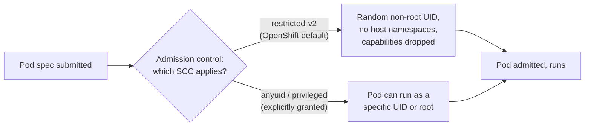
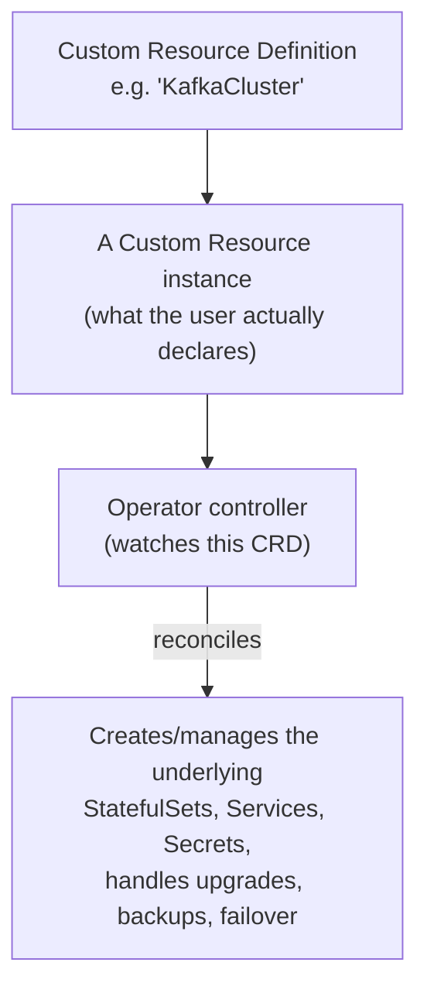

# OpenShift specifics — SCC, Operators, Routes vs Ingress

This page covers what Red Hat OpenShift adds *on top of* plain Kubernetes — the parts of your resume experience that a generic Kubernetes question won't reach, but a well-prepared interviewer who's done their homework on your background absolutely might.

## Security Context Constraints (SCC)

### The one-line hook

> **Kubernetes has Pod Security Standards as an opt-in, relatively recent guardrail. OpenShift has had SCCs as a mandatory, always-on admission control layer since long before that existed upstream.**

### What SCCs actually control

A **Security Context Constraint (SCC)** is an OpenShift-native admission control object that governs what a pod is *allowed* to request — not what it has by default, but the ceiling on what it can ask for. It controls things like:

- Whether the container can run as a specific user ID, or must run as a **randomly-assigned, non-root UID** (OpenShift's default posture)
- Whether the container can request host namespaces (host network, host PID, host IPC)
- Which Linux capabilities can be added or must be dropped
- Whether privileged mode is allowed
- Which volume types are permitted
- What SELinux context applies

**The single most common real-world friction point:** a container image built to run as a hardcoded UID (say, `USER 1000` baked into the Dockerfile) will often **fail to start on OpenShift** under the default `restricted-v2` SCC, because OpenShift assigns a *random* UID from a per-namespace range rather than honoring the image's hardcoded one. This trips up nearly every customer migrating an existing Docker-based application to OpenShift for the first time — and being able to explain *why*, and the two legitimate fixes (make the image UID-agnostic by using group permissions and `chmod g=u`, or explicitly grant a more permissive SCC when truly justified) is a very strong, very real Red Hat Solution Architect story.

**Memorable hook:** *"SCC is OpenShift asking 'what's the most this pod is allowed to ask for' — before the pod even gets a chance to ask."*

## Operators and the Operator Framework

### The one-line hook

> **An Operator is a piece of operational knowledge — the stuff a skilled human admin would do by hand — encoded as a Kubernetes controller that watches a Custom Resource Definition (CRD) and keeps reconciling toward it, forever.**

### Why Operators exist

A Deployment can keep a stateless app's replica count correct. But real operational tasks — safely upgrading a database with zero data loss, taking backups on a schedule, failing over a broker cluster, rotating certificates — need actual domain knowledge, not just "keep N replicas running." The **Operator pattern** packages that domain knowledge into software:

- A **Custom Resource Definition (CRD)** extends the Kubernetes API with a new object type — for example, `KafkaCluster`.
- A user (or another Operator) creates a **Custom Resource** — a `KafkaCluster` object describing the desired cluster: 3 brokers, this storage class, this replication factor.
- The **Operator's controller** watches that object and does whatever real operational work is needed to make it true — and keeps re-checking, exactly like the reconciliation loop pattern from Kubernetes core, just with far more domain-specific logic behind it.

**Operator Lifecycle Manager (OLM)** and **OperatorHub** are OpenShift's mechanism for discovering, installing, and upgrading Operators themselves through a catalog — this is the "one-click install a database Operator" experience inside the OpenShift console.

### Real-world tie-in: AMQ Streams

Your GitHub history includes hands-on work with **Red Hat AMQ Streams** — Red Hat's supported distribution of Apache Kafka on OpenShift, which is delivered *as an Operator*. This is a genuinely strong, concrete example to have ready: "I've worked directly with the AMQ Streams Operator, which is a textbook example of the Operator pattern — you declare a `Kafka` custom resource with your desired broker count and configuration, and the Operator handles provisioning, scaling, and rolling upgrades without you hand-writing StatefulSet YAML."

## Routes vs Ingress

### The one-line hook

> **Route came first and is OpenShift-specific; Ingress came later as the portable Kubernetes-wide standard — and on OpenShift, the Ingress Controller actually implements Ingress objects by creating Routes underneath.**

| | OpenShift Route | Kubernetes Ingress |
|---|---|---|
| Origin | OpenShift-native, predates Kubernetes Ingress | Kubernetes core API, designed for portability across distributions |
| TLS termination modes | Edge, passthrough, and **re-encrypt** (terminate at the router, then re-encrypt to the backend with a different cert) | Generally simpler; re-encrypt-style behavior depends entirely on the Ingress Controller implementation |
| Wildcard/subdomain support | Native, first-class | Depends on the Ingress Controller |
| Portability | OpenShift only | Works on any Kubernetes distribution with a compatible Ingress Controller |
| Underlying mechanism on OpenShift | Managed by the HAProxy-based OpenShift router | The OpenShift Ingress Operator actually creates Route objects behind the scenes to fulfill Ingress requests |

**Memorable hook:** *"On OpenShift, even when you write a plain Kubernetes Ingress object, OpenShift quietly turns it into a Route under the hood — Route is the real mechanism, Ingress is a portable API layered on top of it."*

## Real-world examples

1. **A customer's containerized legacy JBoss Fuse/WebSphere workload failing on OpenShift.** This is a near-certain scenario given your Marlo/nbn integration background — a legacy image built assuming root or a fixed UID hits the default SCC wall immediately. Being able to diagnose and fix this live is exactly the kind of "goes deep on your own experience" moment interviewers are fishing for.
2. **AMQ Streams (Kafka) via Operator** — direct, provable hands-on experience from your GitHub work, and a clean way to demonstrate you understand the Operator pattern beyond the textbook definition.
3. **Exposing a re-platformed nbn-style integration service externally.** Choosing Route with re-encrypt TLS termination (common for regulated environments needing end-to-end encryption, not just edge termination) versus a plain Ingress is a realistic, defensible architecture decision you could walk an interviewer through.
