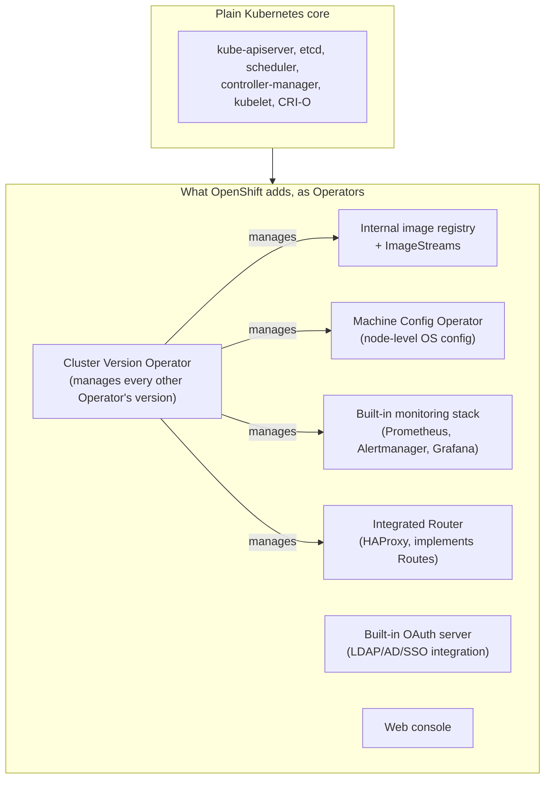

# OpenShift architecture

Everything so far today (namespaces, cgroups, CRI, CNI, CSI, and now a full hard-way cluster build) is *plain Kubernetes*. This page is about what Red Hat OpenShift actually adds on top — and the honest, technical answer to the question every OpenShift sales/architecture conversation eventually reaches: **"why not just use raw Kubernetes?"**

## The one-line hook

> **OpenShift's real architectural idea isn't any single feature — it's that almost everything OpenShift adds is itself built as a Kubernetes Operator, managed by other Operators, all the way up to the cluster's own upgrade process. It's "Operators all the way down."**

## The layered picture

## The components, one at a time

### The internal image registry and ImageStreams

OpenShift ships an integrated container image registry out of the box, so a customer doesn't need to separately stand up and secure their own registry just to have somewhere to push built images. On top of that registry sits an OpenShift-specific concept: an **ImageStream** — essentially a versioned, trackable pointer to one or more images (think of it as a named, mutable tag with history, rather than a single fixed image reference). The genuinely useful part: OpenShift can trigger automatic rollouts whenever a new image lands in a tracked ImageStream tag, without you writing any extra CI/CD glue to watch for it.

### The integrated Router

Covered in mechanism on the earlier Routes vs Ingress page — architecturally, the Router is an HAProxy-based component that OpenShift installs and manages *for you*, out of the box, as opposed to raw Kubernetes where you must separately choose, install, and operate your own Ingress Controller.

### The built-in OAuth server

OpenShift includes its own **OAuth server** as a core cluster component, with pluggable **identity providers** — LDAP, Active Directory, GitHub, SAML/SSO, and more. This is a direct, practical answer to a very common enterprise question: "how do our existing corporate logins work with this platform?" — without needing a separately bolted-on identity broker.

### Cluster-wide monitoring, out of the box

Raw Kubernetes gives you nothing for monitoring — you choose and install Prometheus, Alertmanager, and Grafana yourself. OpenShift bundles and pre-integrates all three, managed by the **Cluster Monitoring Operator**, watching the cluster from day one with no separate installation project required.

### The Machine Config Operator (MCO)

The **Machine Config Operator** manages *operating-system-level* configuration on every node — kernel parameters, systemd unit files, container runtime configuration — through a `MachineConfig` custom resource. Changes are rolled out node-by-node, cordoning and draining each node, applying the change, and rebooting if necessary, in a controlled sequence rather than all at once. This is genuinely unusual compared to raw Kubernetes, where OS-level node configuration is entirely outside Kubernetes' own scope, typically left to a separate tool like Ansible.

### The Cluster Version Operator (CVO) — the "operator of operators"

This is the architectural idea worth having crisp and ready: OpenShift's **Cluster Version Operator** doesn't manage application workloads at all — it manages the versions of *every other cluster component*, including all the built-in Operators listed above, continuously reconciling the whole cluster toward a single declared `ClusterVersion`. A cluster upgrade in OpenShift is, fundamentally, changing one version number and letting the CVO orchestrate every dependent component's upgrade in the right order — a meaningfully different (and for most enterprises, meaningfully safer) experience than manually sequencing upgrades of a hand-assembled Kubernetes stack's many independent pieces.

**Memorable hook:** *"Raw Kubernetes gives you a car engine. OpenShift gives you the whole car, and the Cluster Version Operator is the one component whose entire job is making sure every other part of the car gets upgraded together, in the right order, without you hand-coordinating it."*

## Node roles in a typical enterprise OpenShift layout

| Role | Hosts |
|---|---|
| **Master / control plane** | kube-apiserver, etcd, scheduler, controller-manager — kept isolated from regular workloads |
| **Infra** | Router, internal registry, monitoring stack — kept separate so noisy application workloads never compete with cluster-critical services for resources |
| **Worker** | Actual customer application workloads only |

This three-tier split (as opposed to just "control plane + workers") is a common, deliberate enterprise design choice, and a very natural thing for a Solution Architect to recommend and defend in a sizing conversation.

## Real-world examples

1. **The "why not just use raw Kubernetes" conversation.** This is close to a guaranteed question given your Red Hat background — the honest, defensible answer is the Operator-managed, integrated-by-default component set above, plus the coordinated upgrade story from the Cluster Version Operator, not a vague "it's more enterprise-ready."
2. **LDAP/Active Directory integration for a Thai enterprise customer.** A large share of enterprise OpenShift conversations in Thailand involve exactly this: connecting OpenShift's built-in OAuth server to an existing corporate identity system, rather than standing up a separate identity broker.
3. **Explaining upgrade risk to a customer nervous about platform upgrades.** The Cluster Version Operator's coordinated, all-components-together upgrade model is a genuinely strong, technical (not just marketing) answer to "how do we know an upgrade won't break something" — a real differentiator worth being able to explain mechanically, not just assert.
