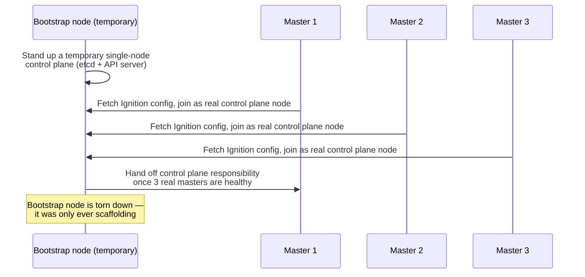

# OpenShift on-premises deployment architecture

Cloud-based OpenShift deployments (on AWS, Azure, GCP) can lean on the cloud provider's APIs to provision infrastructure automatically. On-premises deployment — very common across Thai enterprise, financial-services, and government accounts — has none of that available for free, and that gap is exactly what this page covers.

## The one-line hook

> **IPI automates infrastructure provisioning for you; UPI means you provision the infrastructure and OpenShift only bootstraps the cluster on top of it. On-prem, in security-conscious enterprises, UPI is usually the realistic answer.**

## IPI vs UPI

| | IPI (Installer-Provisioned Infrastructure) | UPI (User-Provisioned Infrastructure) |
|---|---|---|
| Who creates the VMs/machines | The OpenShift installer itself | The customer/admin, ahead of time |
| On-prem support | Bare-metal IPI exists, using Ironic/Metal3 for automated bare-metal provisioning — powerful, but requires specific hardware/network prerequisites (BMC access, PXE) | Works with essentially any existing infrastructure — VMware, existing bare metal, any hypervisor |
| Typical fit | Cloud deployments, or on-prem shops with mature bare-metal automation already in place | Regulated/security-conscious enterprises with existing provisioning processes, air-gapped environments, or infrastructure the installer can't directly control |
| Flexibility vs control tradeoff | Less manual work, less control over exactly how infrastructure is created | More manual prerequisite work, full control and auditability over every piece of infrastructure |

**Memorable hook:** *"IPI is 'let the installer drive.' UPI is 'you drive, the installer just gets in the car once it's built' — and most regulated on-prem enterprises insist on driving."*

## The bootstrap process — solving a chicken-and-egg problem

You can't stand up a Kubernetes control plane using Kubernetes, because there's no control plane yet to schedule anything onto. OpenShift solves this with a **temporary bootstrap node**:

1. A **bootstrap node** temporarily runs a minimal, single-node control plane — just enough to get real master nodes started.
2. Each real master node boots using an **Ignition config** (a declarative, first-boot provisioning format — similar in spirit to cloud-init, but used by Red Hat CoreOS, the immutable OS OpenShift nodes run) that tells it how to configure itself and join the forming cluster.
3. Once enough real master nodes (typically 3, for etcd quorum — same Raft-quorum logic covered on the Kubernetes-the-hard-way page) are healthy, the temporary bootstrap node hands off and is torn down entirely — it was only ever scaffolding.

## Required infrastructure you must provide (this is what UPI actually asks of you)

| Requirement | Why it's needed |
|---|---|
| **Load balancer** for the API (port 6443) and for Ingress/Router traffic (80/443) | Same HA requirement covered on the Kubernetes-the-hard-way page — clients need one stable address in front of multiple control plane/router instances |
| **DNS records**: `api.<cluster>.<domain>`, `api-int.<cluster>.<domain>`, and a wildcard `*.apps.<cluster>.<domain>` | The installer and every cluster component resolve the cluster entirely by these names — get this wrong and bootstrap fails early and confusingly |
| **DHCP or static IP reservations** for every node | Nodes need stable, predictable addressing before they can even reach the bootstrap process |
| **NTP (time synchronization)** | etcd's Raft consensus is genuinely sensitive to clock skew between nodes — this is a frequently-missed prerequisite that causes hard-to-diagnose cluster instability later |

**Memorable hook, the one worth remembering above all others here:** *"etcd doesn't just want time sync as a nice-to-have — Raft consensus can misbehave under real clock skew. NTP isn't an operational afterthought on an OpenShift on-prem build, it's a day-one architectural prerequisite."*

## Disconnected (air-gapped) installations

A large share of Thai financial-services and government on-prem deployments have no direct internet access at all, for good security reasons — but OpenShift's installer and every Operator normally pull images from Red Hat's public registries. The solution: **`oc-mirror`**, a tool that mirrors the exact set of release images and Operator catalog content your cluster needs into a local, internal registry, which the disconnected cluster then pulls from instead. Being able to name this tool and describe the workflow (mirror to a local registry, point the install config at it, mirror ongoing Operator updates the same way) is a specific, high-value, current detail — not something you can bluff your way through generically.

## Node roles, revisited for on-prem sizing

Following directly from the OpenShift architecture page's three-tier model, a realistic on-prem sizing conversation typically lands on:

- **3 master nodes** (never fewer, for etcd quorum; rarely more, since etcd write performance degrades as membership grows)
- **2-3 dedicated infra nodes** hosting the Router, internal registry, and monitoring stack, kept separate specifically so a noisy application workload can never starve cluster-critical services of resources
- **Worker nodes**, scaled purely to actual application capacity needs

## Real-world examples

1. **A Thai bank or government agency requiring a fully air-gapped OpenShift install.** This is close to the single most realistic, high-value on-prem scenario in your actual account context — `oc-mirror` and the disconnected registry workflow is exactly the kind of current, specific detail that separates a real practitioner's answer from a generic one.
2. **A customer with an existing, mature VMware provisioning pipeline choosing UPI over IPI.** A defensible, realistic architecture decision: their existing infrastructure automation already handles VM creation reliably, so UPI lets OpenShift slot in without duplicating or fighting an established process.
3. **Diagnosing a mysteriously unstable on-prem cluster that traces back to missing NTP.** A genuinely realistic, hard-to-spot incident — etcd leader elections flapping or unexplained request timeouts, root-caused to clock drift across the master nodes — a strong story for demonstrating you understand infrastructure prerequisites at a level beyond the installer's happy path.
