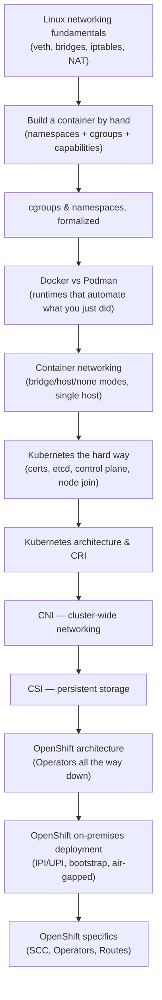

# Day 1 — Linux, Containers, Kubernetes & OpenShift

## Why this day matters

On your resume, "Cloud Computing," "Podman," "Kubernetes," and "Red Hat OpenShift" all sit in your top skills. An experienced interviewer will not stay at the surface. The moment you say "I've worked with containers and Kubernetes," expect the questioning to go all the way down and all the way up at once:

> "Okay — when you say container, what's actually isolating that process from the host? What's the kernel doing? ...And zooming back out, if you were standing up that Kubernetes cluster yourself, what would you actually need to do? And how does OpenShift change that on-prem?"

Day 1 is built to survive exactly that conversation — from raw Linux primitives, up through building a container by hand, up through a full hard-way Kubernetes cluster build, up to how OpenShift packages and deploys all of it in a real enterprise data center.

## The mental model for the whole day

The whole day is one continuous climb: **raw Linux kernel primitives → a hand-built container → the runtimes that automate that → single-host container networking → a hand-built Kubernetes cluster → Kubernetes' own architecture and pluggable interfaces (CRI/CNI/CSI) → OpenShift's opinionated, enterprise-ready packaging of all of it, including how that actually gets deployed on-premises.** Every later topic assumes the one before it — if a subtopic feels shaky, it's worth pausing and re-reading the page just before it rather than pushing forward.

## Today's pages (10-hour day)

| # | Page | Approx. time |
|---|---|---|
| 1 | [Linux networking fundamentals](01-linux-networking.md) | 45 min |
| 2 | [Building a container from scratch](02-container-from-scratch.md) | 75 min |
| 3 | [cgroups and namespaces](03-cgroups-namespaces.md) | 45 min |
| 4 | [Docker vs Podman architecture](04-docker-vs-podman.md) | 40 min |
| 5 | [Container networking deep dive](05-container-networking.md) | 45 min |
| 6 | [Kubernetes cluster setup the hard way](06-kubernetes-the-hard-way.md) | 75 min |
| 7 | [Kubernetes architecture & CRI](07-kubernetes-cri.md) | 40 min |
| 8 | [Networking — CNI deep dive](08-cni.md) | 40 min |
| 9 | [Storage — CSI deep dive](09-csi.md) | 40 min |
| 10 | [OpenShift architecture](10-openshift-architecture.md) | 45 min |
| 11 | [OpenShift on-premises deployment](11-openshift-onprem-deployment.md) | 45 min |
| 12 | [OpenShift specifics — SCC, Operators, Routes](12-openshift-scc-operators-routes.md) | 40 min |
| 13 | [Interview Q&A drill](13-interview-qa.md) | 60 min, done cold, last |

That totals roughly 9 hours of material plus a buffer — deliberately not packed to the exact minute, since the "from scratch" and "hard way" pages reward slowing down and actually re-deriving each step rather than reading past it.

## Real-world anchor for today

Keep one project in mind as you go: the **TnD Microservices** work at Marlo (nbn Australia) — decomposing a monolithic Test & Diagnostics platform into containerized, Kubernetes-orchestrated microservices on AWS. Nearly every mechanism in this day's material (namespaces isolating each service, cgroups capping resource usage per pod, CNI connecting services across the cluster, CSI backing any stateful component) is something that platform depended on, even if you weren't naming it at that level of detail at the time. Being able to say "and under the hood, that's exactly what namespaces/cgroups/CNI were doing for us" is what separates a resume bullet from a level-8 answer — and for the OpenShift-specific pages, your direct Red Hat Solution Architect experience across on-prem and cloud customer deployments is the anchor instead.
