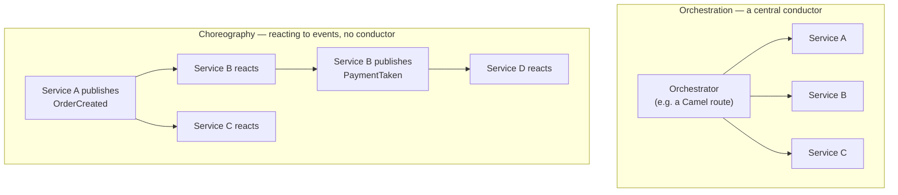
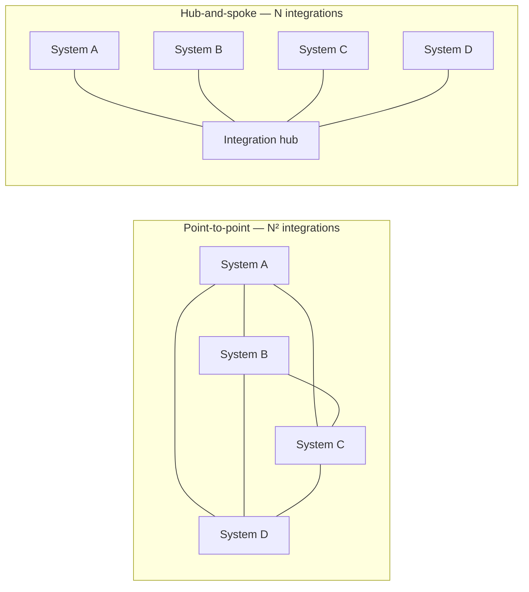

# Integration architecture fundamentals

Before any Camel-specific question, a good interviewer will check whether you actually think in integration *architecture* terms, or just know one tool's syntax. This page is the vocabulary layer everything else today sits on top of.

## The one-line hook

> **Every integration architecture decision is really one question asked repeatedly: does the sender need to know the outcome right now, or can it move on and find out later?**

That's the sync-vs-async question, and it underlies almost everything else on this page.

## Synchronous vs asynchronous — the first fork in every design

| | Synchronous (request-reply) | Asynchronous (fire-and-forget) |
|---|---|---|
| Sender behavior | Blocks, waits for a response before continuing | Sends and immediately continues; response (if any) arrives later, separately |
| Coupling in time | Both systems must be up and responsive *simultaneously* | Sender and receiver don't need to be available at the same moment |
| Best fit | The caller genuinely cannot proceed without the answer — a credit check before approving a loan | High-volume, high-tolerance-for-delay flows — order confirmations, analytics events, notifications |
| Failure mode | A slow or down downstream service directly stalls the caller | A downstream outage just means a backlog to drain later, not an immediate failure |

**Memorable hook:** *"Sync is a phone call — you're both on the line, together, right now. Async is a letter — you send it and get back to your day, trusting the queue to deliver it."*

The architect's job is rarely "pick one forever" — it's deciding, flow by flow, which one a specific business requirement actually demands, and defending that choice with the tradeoffs above rather than a blanket preference.

## Orchestration vs choreography

- **Orchestration**: a central process (often exactly what a Camel route *is*) explicitly calls each participant in sequence and knows the whole workflow. Easy to reason about and debug — the entire flow lives in one place — but that central orchestrator becomes a single point of both control and potential failure.
- **Choreography**: each service reacts to events published by others, with no single component aware of the entire flow. More resilient and loosely coupled, but genuinely harder to debug — "what's the current state of order #4521" requires reconstructing history from events scattered across many services, rather than reading one orchestrator's code.

**Memorable hook:** *"Orchestration is a conductor with a score, telling every musician when to play. Choreography is a group of dancers who've each learned their own steps and react to each other — nobody's holding the master script."*

## ESB vs API-led connectivity vs event-driven architecture

| Model | Core idea | Tradeoff |
|---|---|---|
| **Enterprise Service Bus (ESB)** | A centralized hub that every system integrates through — hub-and-spoke topology | Simplifies point-to-point sprawl into one place to manage, but the hub itself can become a bottleneck and a single point of failure if not architected for scale |
| **API-led connectivity** | Integration built as layered, reusable APIs (System APIs wrapping backends, Process APIs orchestrating business logic, Experience APIs tailored to specific consumers) | Promotes reuse and decouples consumers from backend complexity, at the cost of needing real API governance discipline to avoid layer-skipping and sprawl |
| **Event-driven architecture** | Systems publish and subscribe to events via a broker (Kafka, AMQ), with no central integration hub at all | Excellent decoupling and scalability, but demands mature schema management and monitoring, since there's no single place to watch a message's journey |

## Point-to-point vs hub-and-spoke topology

With **N systems**, point-to-point integration grows toward **N² connections** in the worst case — every new system potentially needs a custom integration with every existing one. A **hub-and-spoke** model (an ESB, or a well-designed event broker) turns that into roughly **N connections** — each system integrates once, with the hub. This single piece of math is the entire historical justification for why ESBs and integration platforms exist at all.

**Memorable hook:** *"Point-to-point integration cost grows with the square of your system count. That's not a style preference — it's the actual reason integration platforms got invented."*

## Real-world examples

1. **The nbn Australia iB2B platform itself was a hub-and-spoke B2B gateway** — exposing a defined set of Business Services that Access Seekers (external partners) consumed through a single B2B Gateway, rather than each partner integrating directly and separately with every underlying nbn OSS system. This is the N² vs N math playing out in a real, large-scale account.
2. **The TnD Microservices decomposition moving toward event-driven, Kafka/JMS-based communication** away from tighter point-to-point coupling — a genuine "why we chose choreography over a rigid orchestrated call chain" architecture story you can walk an interviewer through with real stakes (scalability, decoupling teams shipping independently).
3. **Choosing sync vs async for a customer's real-time eligibility or credit-check flow versus batch reporting data**, during Red Hat presales workshops — a defensible, business-requirement-driven tradeoff conversation rather than a technology-preference one.
