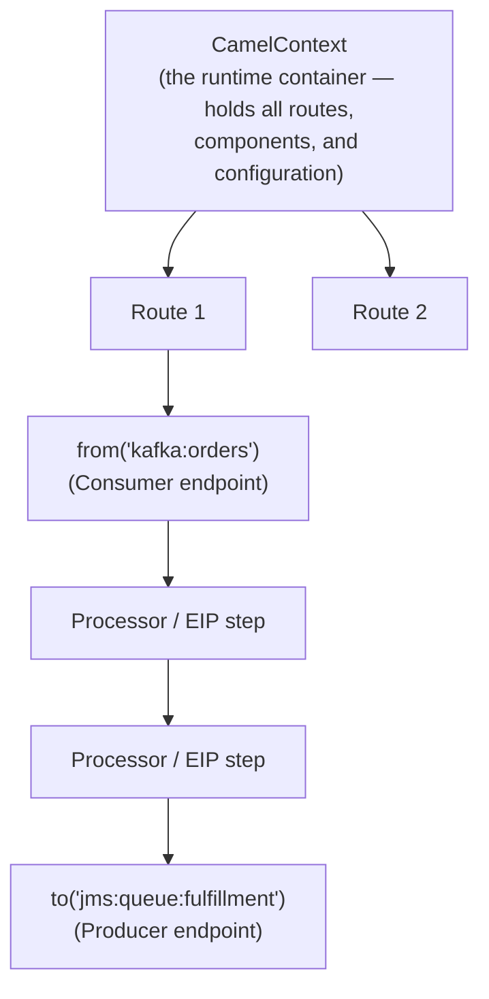

# Camel core architecture

Before any pattern-level question, an interviewer will check the fundamentals: can you actually describe what's running when a Camel application processes a message? This page is that mechanical foundation.

## The one-line hook

> **CamelContext is the runtime. A Route is a recipe. An Exchange is one order going through the kitchen. A Processor is one cook doing one step. A Component is a type of supplier Camel knows how to talk to.**

## The building blocks

### CamelContext

The **CamelContext** is the top-level runtime container — it holds every route, every registered component, and the overall configuration for a Camel application. In a Spring Boot app, this is typically auto-configured and injected for you; conceptually, it's the equivalent of "the whole Camel application is running" — start the context, and every route inside it becomes active.

### Route

A **Route** is a single, named chain of processing: it starts at a `from()` (a consumer endpoint — where messages enter), flows through a sequence of processing steps and EIPs, and ends at one or more `to()` calls (producer endpoints — where the message goes next). A Camel application is typically made up of many routes, each handling one integration flow.

### Exchange

The **Exchange** is the single most important object to be able to describe precisely: it's the container for one complete message exchange as it flows through a route. It holds:

- An **In message** (the request/incoming message)
- An **Out message** (the response, for request-reply exchanges — though modern Camel increasingly just mutates the In message in place)
- **Properties** — metadata about the exchange itself, scoped to the whole exchange rather than one message
- An **Exception**, if something went wrong during processing

### Message

A **Message** (In or Out) has a **body** (the actual payload), **headers** (metadata, like HTTP headers or JMS properties — often used to carry routing decisions), and **attachments**.

### Processor

A **Processor** is the simplest possible unit of work in Camel — a single interface (`process(Exchange exchange)`) that takes an Exchange and does something to it. Every EIP you'll learn on the next page — Content-Based Router, Splitter, Aggregator, all of them — is, underneath, implemented using this same primitive.

### Component and Endpoint

A **Component** is a factory for endpoints of one particular technology — `camel-kafka`, `camel-jms`, `camel-http`, `camel-file`, `camel-sql`, and hundreds more. An **Endpoint** is a specific, configured instance of that component, expressed as a URI: `kafka:orders?brokers=localhost:9092` is an endpoint — the `kafka:` scheme identifies the component, everything after it configures that specific connection.

**Memorable hook:** *"The component is the type of shop. The endpoint is a specific shop's exact address, with directions."*

## Message Exchange Patterns (MEPs) — this ties straight back to yesterday's fundamentals

Camel formalizes the sync-vs-async fork from the previous page as two Message Exchange Patterns:

| MEP | Behavior | Maps to |
|---|---|---|
| **InOnly** | Fire-and-forget — no response expected or waited for | Asynchronous, one-way messaging (e.g. publishing to a Kafka topic) |
| **InOut** | Request-reply — the caller waits for a response, populated as the Out message | Synchronous integration (e.g. an HTTP request expecting a response body) |

The MEP is often determined automatically by the endpoint technology (an HTTP consumer is naturally InOut; a JMS queue consumer is naturally InOnly), but it can be explicitly overridden when a route's actual behavior needs to differ from the technology's default.

## The DSLs — same routing logic, different syntax

| DSL | Style | When you'd choose it |
|---|---|---|
| **Java DSL** | Fluent builder style, real Java code (`from("...").choice()...`) | Full IDE support, type safety, complex conditional logic — the most common choice for serious applications |
| **XML DSL** | Declarative XML, often inside Spring configuration | Historically common in Spring-based, JBoss Fuse-era deployments; easier for some tooling to generate/visualize |
| **YAML DSL** | Declarative YAML | Increasingly common in cloud-native/Camel K deployments, where routes are often generated or templated |

**Memorable hook:** *"Different DSLs, same underlying route model — Camel doesn't care which syntax you wrote the recipe in, only that the recipe compiles to the same sequence of steps."*

## Real-world examples

1. **The nbn Australia iB2B platform's component mix** maps directly onto this model: JMS-family components (WMQ, AMQ) for queue-based messaging, HTTP/CXF-based components for SOAP and REST endpoints, and data format processors handling XML/XSLT transformation — each a different Component, wired together through Routes inside one CamelContext.
2. **The TnD Microservices platform's Kafka and JMS usage** is a clean InOnly example — publishing events for downstream services to consume asynchronously, decoupled in time exactly as described on the previous page.
3. **Whiteboarding a route live in a Red Hat customer workshop.** Being able to sketch `from("jms:queue:incoming").choice().when(...).to("http://serviceA").otherwise().to("http://serviceB")` and narrate CamelContext/Exchange/Processor in plain terms is a genuinely strong, concrete technical-credibility moment in a presales setting — and translates directly into interview credibility too.
