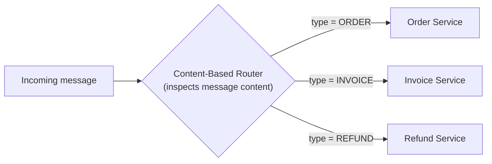
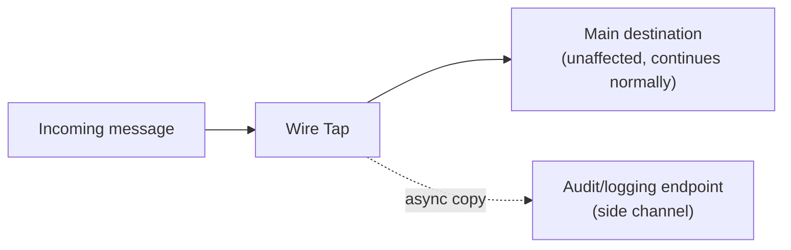
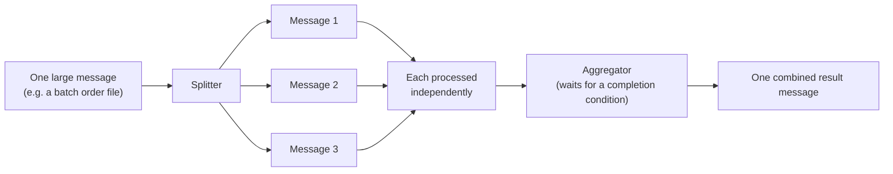

# The EIP catalog, deeply — which pattern solves which problem

This is the single most-tested category in real Camel interviews, based on current research into what's actually being asked. The trap interviewers set isn't "define pattern X" — it's "these three patterns all sound similar, which one actually fits this scenario, and why not the other two?"

## The one-line hook

> **Every EIP answers one specific question about a message's journey: which way does it go, does it get copied, does it get split apart, or does it get put back together?**

## Routing patterns — "which way does this message go?"

### Content-Based Router

Inspects a message's content (a header, a field in the body) and routes it to exactly **one** matching destination, decoupling the sender from needing to know which backend handles which message type. This is the most fundamental, most commonly used EIP — in Camel's Java DSL, this is a `choice().when()...otherwise()` block.

### Message Filter

A specialized Content-Based Router with only two outcomes: matches criteria → **pass through**; doesn't match → **discard**. There's no "otherwise" destination — non-matching messages simply don't continue.

**Memorable hook:** *"A Content-Based Router has many doors. A Message Filter has exactly one door and a trash can."*

## Distribution patterns — "does this message go to more than one place?"

This trio is the classic trap-question cluster — all three send a message toward multiple destinations, but the *mechanism* for deciding those destinations is different every time.

| Pattern | How the destination(s) are decided | Key trait |
|---|---|---|
| **Recipient List** | An expression evaluated on the message itself produces a list of recipients, all at once, up front | Destinations determined **once**, all known before sending |
| **Dynamic Router** | At **each step**, a routing function is called again to decide the *next* single destination — there's no fixed list at all | Destinations determined **iteratively**, one at a time, potentially based on results so far |
| **Routing Slip** | The message carries an **explicit, ordered list** of destinations (the "slip") baked into it, visited one after another | Destinations are **pre-defined and ordered**, carried by the message itself like an itinerary |

**Memorable hook:** *"Recipient List picks everyone at once from a phone book. Dynamic Router asks 'where next?' after every single stop. Routing Slip already has the itinerary printed and stapled to the message before it leaves."*

### Multicast

Sends a **copy** of the same message to multiple configured endpoints — often run in parallel — typically used when every recipient needs the *same* message (as opposed to Recipient List, where the list of who receives it is computed dynamically from the message content).

### Wire Tap

Sends an unobtrusive **copy** of a message to a separate location (commonly for auditing, logging, or compliance) while the original message continues completely undisturbed along its normal path. The defining trait: the main flow never knows the tap exists.

**Memorable hook:** *"Wire Tap is exactly what it sounds like — a phone tap. The call proceeds normally; someone else just gets a copy, silently."*

## Transformation & aggregation patterns — "does this message get split apart or combined?"

### Splitter and Aggregator — almost always discussed as a pair

- **Splitter**: breaks one message into many smaller ones (by a delimiter, an XML/JSON element, a line in a file) so each can be processed independently — often in parallel.
- **Aggregator**: the inverse — combines multiple related messages back into one, based on a **correlation ID** and a **completion condition** (a fixed count, a timeout, or a custom predicate deciding "we have everything we need now").

This pairing is sometimes called **Scatter-Gather** when the split messages are sent to different services in parallel and the results are gathered back together — a very common real pattern for "call three services and combine their answers."

### Claim Check

For very large payloads: instead of carrying the full payload through every step of a route, the Claim Check pattern **stores the large payload externally** (a database, object storage, a file system) and passes only a small **reference token** through the route itself. A later step retrieves the full payload using that token, exactly like checking a coat and getting a numbered ticket back. This is the direct answer to "how do you avoid running out of memory processing a multi-GB file" — you don't carry the multi-GB payload through the whole pipeline at all.

**Memorable hook:** *"Claim Check is a coat check counter. You don't carry your coat through the whole party — you carry a numbered ticket, and collect the coat when you actually need it."*

### Idempotent Consumer

Prevents processing the same message twice, using a repository of previously-seen message IDs to detect and skip duplicates. This pattern is important enough — and tested often enough — that it gets its own full page next on Reliability & exactly-once delivery, rather than being fully covered here.

## Real-world examples

1. **The nbn Australia iB2B Business Services gateway.** Its entire purpose — inspecting an incoming Business Service request and routing it to the correct backend OSS system — is a textbook, large-scale Content-Based Router, at genuine enterprise B2B-gateway scale.
2. **Wire Tap for compliance/audit logging in a financial-services or telecom customer platform.** A very realistic, high-value pattern to name directly given the regulated Thai enterprise accounts in your background — every transaction silently tapped to an audit trail without touching the main processing path.
3. **Splitter/Aggregator (Scatter-Gather) processing a batch file or fan-out call to multiple downstream services**, directly relevant to both the TnD Microservices' multi-service call patterns and the "process a multi-GB file without OOM" scenario research turned up — Splitter plus Claim Check together is a strong, complete answer to that exact question.
