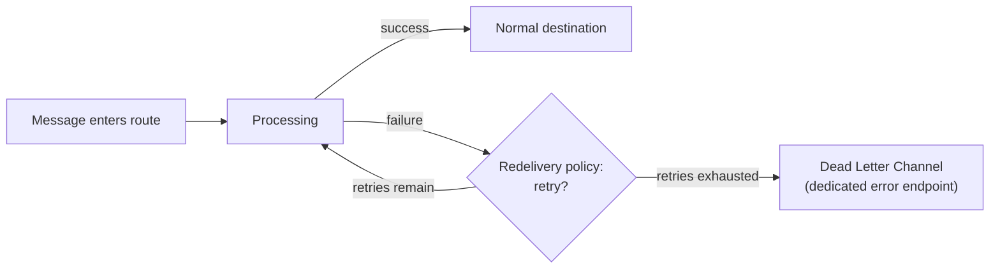
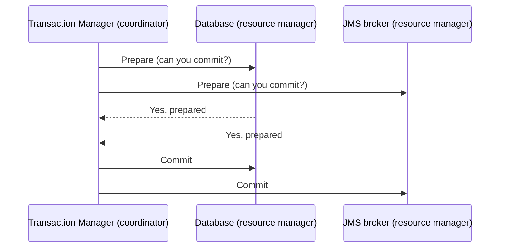

# Error handling & transactions

This page maps directly onto one of the most common senior-level scenario questions found in research: *"a database update and a JMS message both need to succeed together — how do you guarantee that?"* Getting there requires building up through Camel's error-handling model first.

## The one-line hook

> **Camel gives you three separate levers for failure: retry it (redelivery), route it somewhere else on failure (Dead Letter Channel), or wrap it in a real transaction so it either fully happens or fully doesn't (transacted routes / XA).**

## Dead Letter Channel

The **Dead Letter Channel** pattern: when a message fails processing and all configured redelivery attempts are exhausted, it's routed to a dedicated "dead letter" endpoint (often a specific queue, topic, or even a database table) instead of being silently lost or crashing the route. This is the standard, expected answer to "what happens to a message that keeps failing" — never "it just errors out."

## Redelivery policies — the tuning knobs

| Setting | What it controls |
|---|---|
| `maximumRedeliveries` | How many retry attempts before giving up and routing to the Dead Letter Channel |
| `redeliveryDelay` | Fixed wait time between attempts |
| `backOffMultiplier` (with `useExponentialBackOff`) | Each retry waits progressively longer — 1s, 2s, 4s, 8s... — instead of hammering a struggling downstream system at a fixed interval |
| `retryAttemptedLogLevel` / `logExhausted` | Controls visibility into retries for operational monitoring |

**Memorable hook:** *"Fixed-delay retries are like knocking on a stuck door at the exact same rhythm forever. Exponential backoff is knowing to wait longer each time — because if the door didn't open at 1 second, hammering it every 1 second isn't going to help, and might make things worse."*

## `doTry` / `doCatch` / `doFinally` — scoped, in-route exception handling

For handling exceptions at a specific point *within* a route (rather than globally), Camel's DSL offers a direct Java-try/catch equivalent: `doTry()...doCatch(SpecificException.class)...doFinally()...end()`. This is the right tool when different parts of the *same* route need genuinely different failure-handling logic, rather than one global policy.

## `onException()` — global, type-based exception handling

Configured at the route or CamelContext level, `onException(SomeException.class)` defines what happens *any time* that exception type occurs anywhere it's in scope — handled once, centrally, rather than repeated in every route. This is usually the better default over scattering `doTry`/`doCatch` everywhere, reserving the scoped version for genuinely route-specific exceptions.

## Transactions — from local to distributed

### Local transactions

A single route marked `transacted()`, backed by a Spring `PlatformTransactionManager`, ensures that operations within that route against **one single transactional resource** (one database, for instance) either all commit or all roll back together.

### The real challenge: two resources, one guarantee

The genuinely hard version of this — and the exact scenario research surfaced repeatedly — is when a route needs to **update a database AND send a JMS message**, with a guarantee that either *both* happen or *neither* does. A local transaction on just the database doesn't protect the JMS send; if the process crashes between the DB commit and the JMS send, you've silently lost the message (or vice versa).

**XA transactions** (the X/Open XA distributed transaction standard) solve this with a **two-phase commit (2PC)**: a transaction manager first asks every participating resource (the database, the JMS broker) to *prepare* — get ready to commit, but don't yet — and only issues the actual *commit* to all of them once every participant has confirmed it's ready. If any participant fails to prepare, the coordinator tells everyone to roll back instead, so nothing is left half-done.

**Memorable hook:** *"Two-phase commit is a coordinator asking 'is everyone ready?' before saying 'go' — nobody commits until everybody has already promised they can."*

### The honest tradeoff: XA is powerful, but expensive

XA transactions genuinely guarantee atomicity across resources, but at a real cost: they're slower (extra coordination round-trips), and they require every participating resource and driver to actually support XA. In modern, high-throughput architectures, many teams deliberately avoid XA in favor of the **outbox pattern** instead — writing the event to an "outbox" table in the *same* local database transaction as the business data change, then having a separate process reliably publish that outbox entry to JMS/Kafka afterward. This trades a small amount of eventual consistency for much better throughput and looser coupling — and previews the Saga pattern covered in full on Day 5.

**Memorable hook:** *"XA guarantees both happen together, at the cost of speed and tight coupling between resources. The outbox pattern accepts a tiny delay in exchange for much better throughput and no distributed transaction at all."*

## Real-world examples

1. **The exact "DB update + JMS message must succeed together" scenario from research.** The strongest answer names both real options — XA/2PC for a hard atomicity guarantee where the throughput cost is acceptable, or the outbox pattern where eventual consistency is acceptable in exchange for much better scalability — and explains *why* you'd choose one over the other for a given business requirement, rather than reflexively reaching for XA every time.
2. **Exponential backoff redelivery against a flaky legacy WebSphere backend**, directly relevant to your Marlo integration background — retrying at a fixed, aggressive interval against an already-struggling legacy system is a realistic way to make an outage worse, not better.
3. **Dead Letter Channel routing failed messages to a dedicated queue for manual review**, in a customer-facing high-volume flow — a concrete, defensible operational design decision that shows you think about the failure path as seriously as the happy path.
