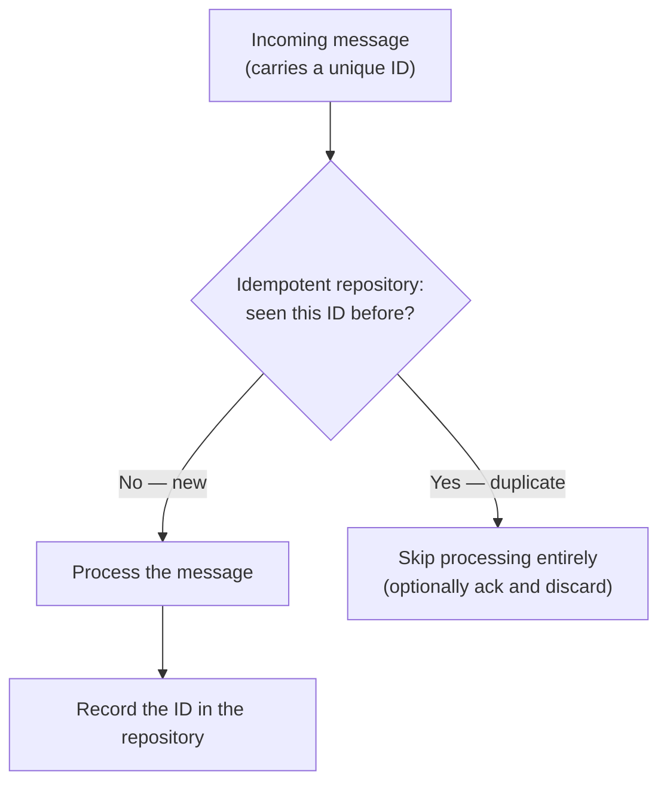

# Reliability & exactly-once delivery

This page answers the research-identified scenario that carries real financial stakes in a Thai banking or telecom context: *"duplicate processing causes financial loss — how do you prevent it?"*

## The one-line hook

> **True exactly-once delivery across independent systems doesn't really exist. What you can actually build is at-least-once delivery plus idempotent processing — which behaves like exactly-once from the outside.**

This is worth saying explicitly in an interview — it signals you understand the theoretical limit, not just the tool that papers over it.

## The delivery guarantee spectrum

| Guarantee | Behavior | Risk |
|---|---|---|
| **At-most-once** | Send once, never retry | Message can be **lost** on any failure |
| **At-least-once** | Retry until acknowledged success | Message can be **duplicated** (the ack itself can be lost even after the work succeeded, triggering a retry of already-completed work) |
| **Exactly-once** (in practice) | At-least-once delivery **plus** idempotent processing on the receiving end | Achieved as an *outcome*, not as a delivery mechanism — this is the honest, technically accurate framing |

**Memorable hook:** *"You can't make the network promise exactly-once. You can make your processing not care if it received the same thing twice — and that's what actually solves the problem."*

## The Idempotent Consumer pattern, in depth

The pattern itself is simple: before processing, check whether this message's unique identifier has already been seen; if so, skip it. The entire difficulty — and the part worth being precise about in an interview — is **where that "seen IDs" repository actually lives**.

### The repository choice is the real engineering decision

| Idempotent repository type | Fits | Fails when |
|---|---|---|
| **In-memory** (`MemoryIdempotentRepository`) | Local testing, single-instance toy examples | **Any scaled, multi-replica deployment** — each pod has its own memory, so a duplicate hitting a different replica wouldn't be caught at all, and a restart wipes the history entirely |
| **JDBC-based** | Production systems needing a durable, queryable dedupe record, often the same database already used for business data | Requires careful indexing/cleanup as the table grows; adds a DB round-trip to every message |
| **Distributed cache** (Hazelcast, Infinispan) | High-throughput systems needing fast, shared, cluster-wide dedupe state without hitting the primary database | Adds another distributed system to operate and reason about failure modes for |
| **Kafka-backed** | Systems already centered on Kafka, using a compacted topic as the durable dedupe log | Ties you specifically to Kafka's operational model |

**This directly connects back to Day 1:** a Camel service running as multiple Kubernetes pod replicas for scalability **cannot** safely use an in-memory idempotent repository — exactly the kind of connection an interviewer listening for depth will notice you making unprompted.

## Idempotency keys — the client-side half of the pattern

The repository only works if there's actually a stable, unique identifier to check in the first place. An **idempotency key** — a unique ID the *sender* generates and attaches to a request (a payment request ID, an order submission ID) — is what makes deduplication possible at all. Without one, "is this the same message?" often has no reliable answer, especially across a retry where the message content might be byte-identical but arrive as a genuinely separate delivery attempt.

## The outbox pattern, revisited concretely

Building on the previous page: the **outbox pattern** writes an event into an `outbox` table in the *same local database transaction* as the actual business data change — so the business change and "an event needs to be published" are atomic by definition, using an ordinary local transaction, no XA required. A separate poller (or change-data-capture process) then reads unpublished outbox rows and publishes them to Kafka/JMS, marking them published once confirmed. If that publisher crashes mid-way and re-publishes an already-published event, that's just an at-least-once duplicate — solved by the idempotent consumer on the *receiving* side, closing the loop.

## Kafka's own exactly-once semantics (EOS) — a specific, current detail

Since Kafka featured heavily in the research on senior-level scenario questions, it's worth knowing Kafka's own built-in mechanisms:

- **Idempotent producer**: each producer gets a unique producer ID, and every message gets a sequence number; the broker detects and silently drops duplicate sends from retries at the broker level, before they're even written twice.
- **Transactional writes**: allow a producer to write to multiple partitions/topics atomically, and coordinate with consumer offset commits so that a "read, process, write" cycle either fully commits or fully doesn't — this is what "exactly-once semantics" in Kafka specifically refers to, and it's scoped to Kafka-to-Kafka flows, not automatically extended to an external database or JMS broker touched in the same logic.

## Real-world examples

1. **The exact "duplicate processing causes financial loss" scenario from research.** The strongest possible answer: an idempotency key on the incoming request, an Idempotent Consumer backed by a durable, shared repository (JDBC or a distributed cache — explicitly *not* in-memory), combined with honest acknowledgment that true exactly-once delivery isn't real — this is at-least-once plus idempotency producing an exactly-once *outcome*.
2. **A Camel-based service scaled to multiple Kubernetes pod replicas** (a direct callback to Day 1) needing a shared idempotent repository instead of in-memory — a concrete, cross-topic answer that demonstrates the whole week's material connecting, not sitting in isolated silos.
3. **A high-throughput Kafka-centric pipeline** (like the TnD Microservices' Kafka/JMS usage) leaning on Kafka's own idempotent producer and transactional writes for the Kafka-to-Kafka portion of a flow, while still needing an application-level idempotent consumer wherever the flow crosses into a non-Kafka system like a database or external API.
