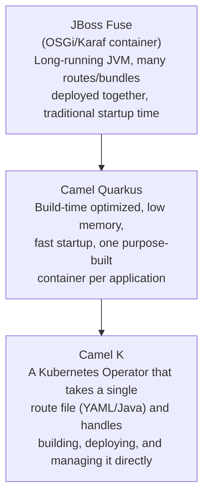

# Camel K / Camel Quarkus / cloud-native Camel

This page ties Day 2 directly back to Day 1 — Camel K, specifically, is a real, concrete instance of the Operator pattern you already built from first principles.

## The one-line hook

> **JBoss Fuse deployed Camel as one long-running JVM hosting many routes together. Camel Quarkus and Camel K each go further in the same direction: smaller, faster-starting, more disposable units — right down to a single route as a single Kubernetes-native deployment.**

## The evolution, as a ladder

### JBoss Fuse — the traditional model

Fuse runs Camel inside an **OSGi container (Karaf)** — a single long-running JVM that can host many separate route bundles simultaneously, with runtime hot-deployment of new bundles. This is well suited to a traditional, centrally-managed integration platform (the historical ESB deployment model), but it carries real weight: a heavier JVM footprint, slower startup, and a shared-runtime blast radius if the container itself has problems.

### Camel Quarkus — Kubernetes-native, fast, lightweight

**Quarkus** is a Java framework built specifically around **build-time processing** — dependency injection, configuration, and reflection metadata are resolved when the application is *built*, not at runtime — which enables both fast JVM startup and, more dramatically, compilation to a **GraalVM native image**: an actual native executable, not a JVM running bytecode, with startup times measured in milliseconds and dramatically lower memory footprint. Camel Quarkus runs Camel routes on top of this — the natural fit for deploying integration logic as an individual, independently-scalable Kubernetes microservice, exactly the shape Day 1's container/Kubernetes material assumes.

**Memorable hook:** *"A traditional JVM warms up like a car engine on a cold morning. A GraalVM native image starts like flipping a light switch — because most of the 'startup work' already happened at build time, not runtime."**

**The honest tradeoff:** native compilation trades a slower, heavier *build* (native image compilation genuinely takes longer, and some reflection-heavy libraries need extra configuration to work at all in native mode) for a much lighter, faster *runtime* — a good deal for something deployed and scaled many times, a poor one for something built once and rarely touched.

### Camel K — the Operator-driven layer on top

**Camel K** goes one step further: it's a **Kubernetes Operator** (the exact pattern from Day 1's OpenShift material — a controller watching a Custom Resource, here an `Integration` CRD) that takes a *single Camel route file* — often just YAML, sometimes a single Java file — and handles the entire rest of the journey: building a container image, deploying it to the cluster, and managing its lifecycle, all without the developer hand-writing a Dockerfile or Kubernetes manifests at all. The developer experience is deliberately minimal: `kamel run my-route.yaml`, and the Operator does the rest.

**Memorable hook:** *"Camel K is Day 1's Operator pattern, applied specifically to integration routes — you declare 'this route should exist,' and a controller reconciles the cluster toward that, exactly like the `KafkaCluster` custom resource example from Day 1's OpenShift material."*

## Choosing between them — a real sizing decision

| | Best fit |
|---|---|
| **JBoss Fuse** | An existing, stable legacy investment not actively being modernized, or genuinely centralized integration governance requirements that benefit from one shared runtime |
| **Camel Quarkus** | Purpose-built integration microservices, deployed and scaled independently on Kubernetes/OpenShift, where fast startup and low memory footprint matter (cost, scale-to-zero-style elasticity) |
| **Camel K** | Many small, independent integration routes where minimizing developer overhead (no hand-written Dockerfiles/manifests) matters more than fine-grained control over the deployment artifact |

## Real-world examples

1. **A Red Hat customer modernization conversation: migrating a JBoss Fuse-based integration monolith to Camel Quarkus (or Camel K) microservices on OpenShift.** This is close to a guaranteed real conversation from your Red Hat account experience, and the honest tradeoffs above (startup/footprint gains vs native-build complexity, or reduced deployment overhead vs less fine-grained control) are exactly what a credible modernization roadmap discussion sounds like.
2. **If the TnD Microservices decomposition were rebuilt today**, Camel Quarkus is close to the textbook natural fit — the same decomposition goal (independent, scalable, containerized services) that Camel Quarkus is architecturally built for.
3. **Explaining Camel K's Operator model as a direct, concrete instance of Day 1's Operator pattern** — this is a genuinely strong answer if an interviewer asks "give me a real example of an Operator" after the Day 1 material, connecting two days of preparation into one coherent, cross-referenced answer.
