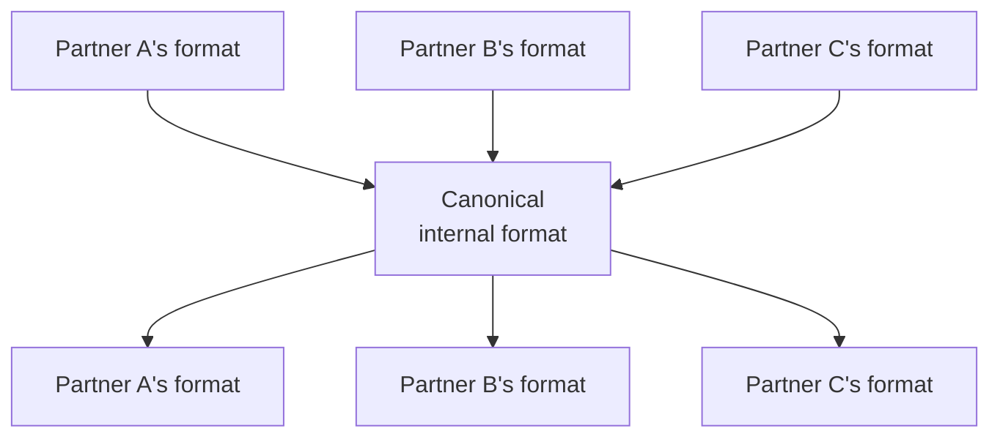

# B2B & legacy integration standards

Your actual resume lists this exact stack for the nbn Australia iB2B project — Java, Groovy, WebSphere, JBoss Fuse, Apache Camel, WMQ, AMQ, XML, XSLT, SOAP, REST, eBXML, SOA, DataPower. This page is, essentially, explaining your own project back to you at full technical depth — which means it's also exactly where a well-prepared interviewer who's read your resume is most likely to probe.

## The one-line hook

> **SOAP, eBXML, and EDI all exist for the same underlying reason: formal, strictly-contracted B2B exchange between organizations that don't trust each other's systems enough to integrate loosely — and that formality is still very much alive wherever real regulatory or financial stakes are involved.**

## SOAP — still alive because of what it forces you to do

**SOAP (Simple Object Access Protocol)** is an XML-based messaging protocol, almost always paired with a **WSDL (Web Services Description Language)** contract that formally, machine-readably defines every operation, input, and output a service supports. Combined with the **WS-\*** family of standards (WS-Security for message-level encryption/signing, WS-ReliableMessaging, and others), SOAP gives you strong, explicit, tooling-enforced contracts — genuinely valuable in regulated B2B contexts where "the schema silently changed and broke a partner integration" is a much bigger problem than in a typical internal REST API.

**Memorable hook:** *"REST hands you flexibility and trusts you to be disciplined. SOAP hands you a formal contract and enforces the discipline for you — which is exactly why regulated, cross-organization B2B integration still reaches for it."*

## eBXML — the B2B framework standard behind the iB2B platform's name

**eBXML (Electronic Business using eXtensible Markup Language)**, a joint UN/OASIS standard, is a full **B2B messaging and collaboration framework** — not just a message format, but a way of formally defining *how two organizations agree to exchange business documents at all*. Its core pieces:

- **Business Process Specification** — formally describes the business process being automated (e.g. the exact sequence of a service order and its acknowledgment)
- **Collaboration Protocol Agreement (CPA)** — a formal, machine-readable agreement between two specific trading partners about exactly how they'll exchange messages (endpoints, security, reliability requirements)
- **Messaging Service** — the actual transport and envelope for exchanging the business documents themselves

This is precisely the kind of standard a large telecom B2B gateway — like the actual **iB2B** platform on your resume — would be built around: nbn's iB2B exposing formally-specified Business Services to external Access Seekers is a direct, real-world instance of this exact model.

## EDI — older still, and still genuinely everywhere

**EDI (Electronic Data Interchange)** predates XML-based standards entirely — structured, often fixed-position or delimiter-based document formats (X12 in North America, EDIFACT more globally) for exchanging standard business documents (purchase orders, invoices, shipping notices) between trading partners. Despite its age, EDI remains deeply embedded in finance, logistics, retail, and healthcare, simply because of the sheer scale of existing trading-partner relationships built on it — ripping it out is often far riskier and more expensive than integrating around it.

**Memorable hook:** *"EDI isn't old because nobody modernized it. It's old because it's a decades-deep network of trading-partner agreements, and untangling that network is a much bigger project than any one company's integration platform."*

## XML/XSLT — the transformation layer holding all of this together

**XSLT (Extensible Stylesheet Language Transformations)** is the standard tool for transforming one XML document structure into another — the actual mechanism used to bridge, say, a partner's specific SOAP request schema into your internal canonical format, or vice versa. In a B2B gateway handling multiple trading partners, each with slightly different schema expectations, XSLT transformation is usually where a large share of the *real* integration logic lives — not in the routing, but in reconciling everyone's slightly different idea of what a "purchase order" document should look like.

## DataPower — a specialized XML/SOAP gateway appliance

**IBM DataPower**, explicitly named on your resume for the nbn work, is a purpose-built network appliance (hardware or virtualized) sitting at the edge of a B2B integration platform, handling — often at very high throughput and with dedicated hardware acceleration — **XML schema validation, XSLT transformation, WS-Security enforcement, and protocol bridging**, before traffic ever reaches the application-level Camel routes behind it. It exists because doing all of this validation/transformation/security work in general-purpose application code, at true B2B-gateway scale, is often far less efficient than a purpose-built appliance designed for exactly that job.

**Memorable hook:** *"DataPower is a bouncer and a translator standing at the door, checking IDs (schema validation, WS-Security) and converting the conversation into a language the house understands (XSLT), before anyone even gets to the actual application logic inside."*

## The Canonical Data Model — tying this back to Day 2's first page

Rather than writing a direct, custom transformation between *every pair* of trading-partner formats (the same N² problem from the integration fundamentals page), a **Canonical Data Model** defines one internal, standard representation — every incoming format transforms *into* the canonical model, and the canonical model transforms *out* to whatever each destination needs. This turns N² custom transformations into roughly 2N — the exact same mathematical justification as hub-and-spoke topology, just applied to data formats instead of network connections.

## Real-world examples

1. **The nbn Australia iB2B platform, in full.** This entire page is effectively your own resume's tech stack, explained at interview depth — SOAP/WSDL contracts and eBXML's formal Business Process Specifications and CPAs governing how Access Seekers integrated with nbn's OSS systems, DataPower handling XML/SOAP traffic at the gateway edge, and XSLT reconciling each partner's format against nbn's internal canonical model.
2. **A modern presales scenario: wrapping legacy EDI behind a modern REST API for a Thai logistics or banking customer**, using Kong (your current employer's product) as the modern API gateway at the edge and Camel/XSLT internally to bridge to the legacy EDI trading-partner relationships that can't realistically be replaced — a very plausible, very current architecture conversation.
3. **Justifying a Canonical Data Model investment to a customer skeptical of the upfront cost**, using the same N²-vs-2N math from the integration fundamentals page — a concrete, quantifiable argument rather than "it's best practice."
