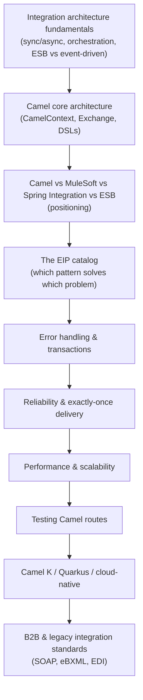

# Day 2 — Apache Camel & Enterprise Integration Patterns

## Why this day matters

Your resume shows 6+ years of integration work at Marlo (nbn Australia), built on Apache Camel and JBoss Fuse — real B2B platform work (iB2B), not a weekend tutorial. An interviewer who's done their homework won't ask "what is Camel." They'll ask the questions that only someone who's actually run this in production can answer well:

> "You've got 100,000 messages a minute coming off Kafka and you need to call three downstream services for each one. Walk me through it. ...Now — what happens if one of those downstream calls is slow? What happens if the same message gets delivered twice and it's a financial transaction?"

Day 2 is built around exactly that shape of question — not "define an EIP," but "which pattern solves this specific production problem, and why."

## The mental model for the whole day

Today climbs from **why integration architecture looks the way it does**, through **Camel's own mechanics**, through **the pattern catalog that solves real production problems**, up to **how Camel actually runs on the cloud-native stack you built on Day 1**, closing with the **B2B/legacy standards** that were the actual substance of your nbn Australia work.

## Today's pages (10-hour day)

| # | Page | Approx. time |
|---|---|---|
| 1 | [Integration architecture fundamentals](01-integration-fundamentals.md) | 50 min |
| 2 | [Camel core architecture](02-camel-core-architecture.md) | 50 min |
| 3 | [Camel vs MuleSoft vs Spring Integration vs ESB](03-camel-vs-alternatives.md) | 40 min |
| 4 | [The EIP catalog, deeply](04-eip-catalog.md) | 70 min |
| 5 | [Error handling & transactions](05-error-handling-transactions.md) | 60 min |
| 6 | [Reliability & exactly-once delivery](06-reliability-exactly-once.md) | 50 min |
| 7 | [Performance & scalability](07-performance-scalability.md) | 55 min |
| 8 | [Testing Camel routes](08-testing-camel-routes.md) | 40 min |
| 9 | [Camel K / Quarkus / cloud-native Camel](09-camel-k-quarkus-cloud-native.md) | 45 min |
| 10 | [B2B & legacy integration standards](10-b2b-legacy-integration.md) | 50 min |
| 11 | [Interview Q&A drill](11-interview-qa.md) | 70 min, done cold, last |

## Real-world anchor for today

Your nbn Australia work at Marlo is the anchor for nearly every page today — the **iB2B platform** (Apache Camel, JBoss Fuse, WMQ/AMQ, XML/XSLT, SOAP/REST, eBXML, SOA, DataPower) is a textbook enterprise integration deployment, and the **TnD Microservices** decomposition (Kafka, JMS, Docker, Kubernetes, AWS) is exactly the kind of high-throughput, distributed scenario the research above shows senior interviewers actually probing. Where a topic doesn't map directly to your project history (the cloud-native Camel K/Quarkus page, for instance), it connects instead to your Red Hat Solution Architect experience positioning integration platforms for customers.
