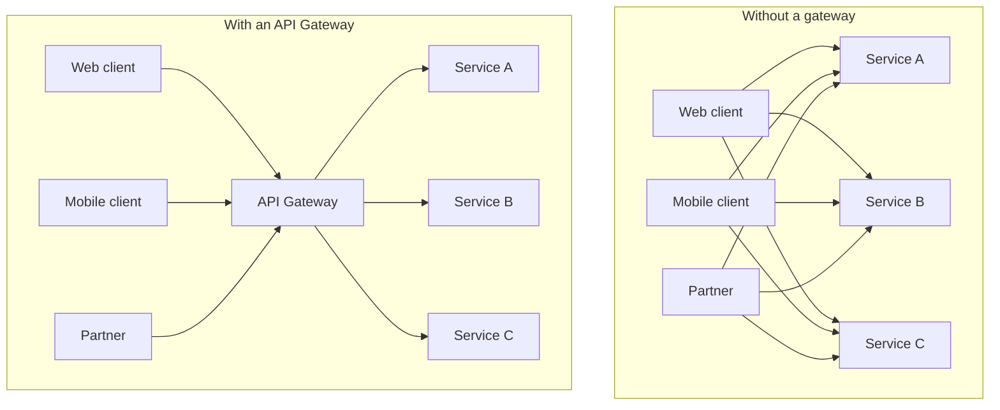

# The API Gateway pattern & why it exists

## The one-line hook

> **An API Gateway exists so that external clients integrate with one stable front door, instead of every client needing to know about, trust, and separately secure every backend service behind it.**

## The problem, in the same terms as Day 2

Day 2's integration fundamentals page showed that point-to-point integration between N systems grows toward N² connections. The exact same math applies to **client-facing** traffic: if a web app, a mobile app, and a partner integration each call your microservices directly, you get **(number of clients) × (number of services)** direct relationships — every client needs to know every service's address, handle its own auth against each one, and absorb every internal refactor as a breaking change.

## What an API Gateway actually does

| Responsibility | What it means in practice |
|---|---|
| **Routing** | Maps an external-facing path/host to the correct internal backend service |
| **Authentication & authorization** | Centralizes identity verification and access control so individual services don't each reimplement it |
| **Rate limiting & throttling** | Protects backend services from being overwhelmed, and enforces fair usage per client (deep dive later today) |
| **Protocol translation** | Bridges, for example, an external REST/JSON call to an internal gRPC service, or vice versa |
| **Response aggregation/composition** | Combines results from multiple backend calls into one response, so the client makes one request instead of several |
| **Observability** | A single, consistent point to collect metrics, logs, and traces for all external traffic |

**Memorable hook:** *"A gateway isn't just a router with extra steps — it's the one place where cross-cutting concerns (auth, rate limiting, observability) get enforced consistently, instead of trusting every individual service to implement them correctly and identically."*

## The Backend for Frontend (BFF) refinement

A single, one-size-fits-all gateway can become awkward when very different client types (a rich mobile app vs. a thin web widget vs. a partner integration) genuinely need different response shapes, aggregation logic, or performance characteristics. The **Backend for Frontend** pattern addresses this by running a **separate, purpose-built gateway/aggregation layer per client type**, each calling into the same underlying services but shaping and composing the response differently for its specific consumer.

**Memorable hook:** *"One gateway trying to please every client type eventually pleases none of them well. BFF says: give the mobile app its own front door, shaped exactly for what the mobile app needs, and give the partner integration a different one."*

## Real-world examples

1. **The nbn Digital Products mobile apps.** A mobile client calling directly into multiple backend OSS systems (as the underlying architecture involved) is exactly the "without a gateway" diagram above — a gateway or BFF layer centralizing auth, aggregation, and a stable API surface independent of backend churn is the textbook fix, and a realistic detail to bring into a discussion of that project.
2. **Kong's core value proposition, described in your own current role.** This entire page is essentially "what Kong Gateway sells" — being able to explain the pattern in first principles, not just product features, is what separates "I use Kong" from "I understand why API gateways exist as a category."
3. **The TnD Microservices decomposition needing a stable external contract.** As that platform's internal services were decomposed and evolved, an API gateway layer is what would let external Access Seekers or partner systems keep a stable integration point, insulated from internal refactors — a direct, defensible architecture decision tying back to Day 2's B2B integration material.
