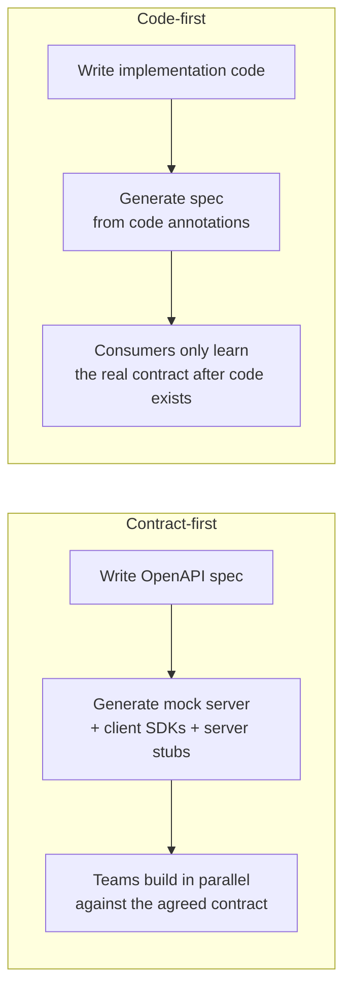

# OpenAPI-first / contract-first API design

## The one-line hook

> **Contract-first means the API specification is the first thing written, and everything else — implementation, documentation, gateway configuration, even mock servers for other teams — is generated from or verified against it. Code-first means the spec is an afterthought, generated from whatever the code happened to end up looking like.**

## Contract-first vs code-first

| | Contract-first | Code-first |
|---|---|---|
| What's authoritative | The OpenAPI specification document | The implementation code |
| When consumers see the contract | Before implementation begins | Only after code (and often the API itself) already exists |
| Parallel team development | Enabled — frontend/mobile/partner teams build against a generated mock immediately | Blocked or awkward — consumers wait on the backend team, or work against a moving target |
| Design discipline | Forces thinking about the consumer's experience before implementation details leak in | Implementation convenience easily shapes the API's actual surface |
| Drift risk | Requires contract testing to keep the spec and implementation honest | The spec, by construction, always matches the code — but the *code* may never have been well-designed for consumers |

**Memorable hook:** *"Code-first documents what you built. Contract-first designs what your consumers actually need, and holds the implementation accountable to it."*

## The OpenAPI Specification (OAS)

**OpenAPI** (formerly Swagger) is the standardized, machine-readable format — YAML or JSON — for describing a REST API's endpoints, request/response schemas, authentication requirements, and error responses. Because it's machine-readable, an OpenAPI document isn't just documentation — it's an artifact tooling can act on directly: generating mock servers, generating client SDKs in multiple languages, generating server-side stubs, and — directly relevant to this whole day — **auto-configuring an API gateway's routes and validation rules straight from the spec**.

## Contract testing — keeping the promise honest over time

A written contract is only useful if the real implementation actually honors it. **Contract testing** (tools like Pact implement this as "consumer-driven contracts") verifies that a provider's actual behavior matches what consumers expect, catching breaking changes *before* they reach production — rather than a consumer discovering a break only when their integration fails live. This is the direct, practical answer to "how do you prevent an API change from silently breaking a partner integration."

**Memorable hook:** *"A contract without contract testing is just a promise nobody's checking. Contract testing is the mechanism that catches the moment a provider quietly stops keeping that promise."*

## API design governance at scale

When many teams are each producing their own APIs, unchecked contract-first design still produces inconsistency — one team's `userId`, another's `user_id`, another's `id`. **Spec linting tools** (Spectral is the common example) enforce organization-wide API style rules automatically against every OpenAPI document, the same governance instinct behind the Canonical Data Model from Day 2, applied to REST API design instead of B2B message formats.

## The direct connection to today's Kong material

An OpenAPI specification isn't just a design-time artifact — **Kong (and API gateways generally) can import an OpenAPI document directly to auto-generate Services and Routes**, turning the design-time contract into live gateway configuration without hand-writing it twice. This is the concrete link between this page and the Kong architecture page immediately following it.

## Real-world examples

1. **A modern evolution of the WSDL discipline from Day 2's B2B material.** SOAP's WSDL contract was, in its era, exactly this same idea — a formal, machine-readable contract enforced before and during integration. OpenAPI is the REST-era equivalent; being able to draw that line explicitly shows real continuity of understanding across "old" and "new" integration styles, not two disconnected skill sets.
2. **The nbn Digital Products mobile/backend parallel development problem.** If that project's mobile and backend teams had a contract-first OpenAPI spec agreed upfront, the mobile team could have built against a generated mock server immediately, rather than waiting on backend completion — a credible, retrospective "what I'd do differently with today's tooling" answer.
3. **Kong's OpenAPI import capability, directly relevant to your current CSM role.** Guiding a customer through bootstrapping Kong Services/Routes from an existing OpenAPI spec — rather than hand-configuring each route — is both a real day-to-day capability and a strong, concrete example to have ready.
