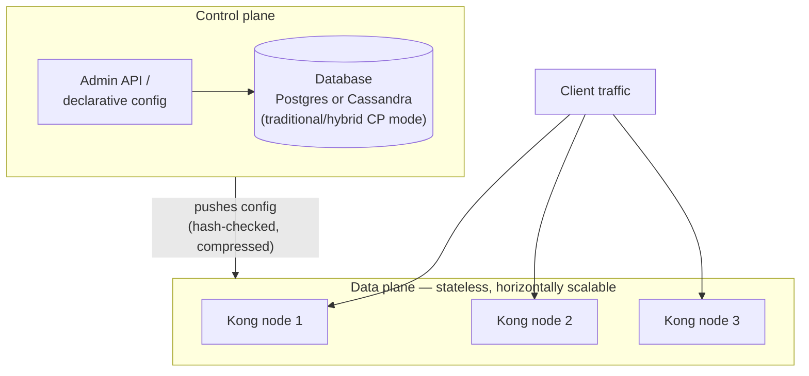

# Kong architecture deep dive

This is your own product, so this page deserves the most time today — a well-prepared interviewer will expect real fluency here, not textbook definitions.

## The one-line hook

> **Kong's entire architectural story is the same separation Day 1 and Day 2 kept surfacing all week: a stateless thing that handles traffic, and a separate thing that manages configuration and never sits in the request path.**

## The base: Nginx/OpenResty and Lua

Kong is built on top of **Nginx**, extended via **OpenResty** (which embeds **LuaJIT** into Nginx), letting Kong implement its routing, plugin execution, and traffic-handling logic in Lua on top of Nginx's battle-tested event-driven request handling — rather than building a proxy engine from scratch.

## Data plane vs control plane

| | Data plane | Control plane |
|---|---|---|
| **Job** | Proxies real client traffic — routing, plugin execution, upstream calls | Manages configuration — Services, Routes, Plugins, Consumers |
| **State** | Stateless (in hybrid/DB-less mode) — safe to scale horizontally behind a load balancer | Holds configuration state, typically backed by a database |
| **In the request path?** | Yes — every request flows through it | **No** — exactly the same architectural principle as a service mesh's control plane from later today, and conceptually similar to how Kubernetes' control plane isn't in the pod-to-pod traffic path either |
| **Interface** | N/A — traffic in, traffic out | Admin API (REST) or declarative YAML/JSON config |

**Memorable hook:** *"If the control plane goes down, existing traffic keeps flowing — data plane nodes already have their configuration cached locally and don't need to ask the control plane per request. Only *new* config changes stall."*

## Deployment modes — the real architectural decision

| Mode | How it works | Fit |
|---|---|---|
| **Traditional (DB mode)** | Every Kong node connects directly to a shared database (Postgres or Cassandra); admin and proxy responsibilities aren't separated | Simple setups; tightly couples every node's health to database availability |
| **DB-less mode** | Configuration loaded from a declarative YAML/JSON file into memory — no database dependency at all | Fast, simple, GitOps-friendly (config lives in version control) — but no separate control plane pushing live updates |
| **Hybrid mode** | **Control plane** nodes (with a database) manage configuration; **data plane** nodes run DB-less, receiving configuration pushed from the control plane | The recommended production pattern — data planes stay stateless and horizontally scalable, and database load/availability concerns are isolated away from the traffic-serving path entirely |
| **Konnect (Kong's SaaS control plane)** | A hosted, multi-tenant control plane, paired with dedicated, single-tenant data planes deployed anywhere — cloud, on-prem, hybrid | Kong's own recommended modern architecture — centralizes governance while keeping data planes isolated per environment/tenant, directly solving the "noisy neighbor" problem of sharing data planes across tenants in high-traffic environments |
| **Federated model** (on-prem Enterprise alternative) | A more complex on-prem approximation of the Konnect model, combining enterprise features with network segregation | Kong's own guidance is explicit: this isn't generally recommended given its operational complexity — Konnect (or hybrid mode) is the superior default |

## How configuration actually reaches data planes

In hybrid mode, the control plane calculates a **hash of the current configuration**, and when it changes, pushes the new config (JSON-encoded, gzip-compressed) to every connected data plane node — modern Kong versions use an RPC-based sync mechanism (Sync V2), falling back to a legacy WebSocket-based push for older data plane versions. The control plane also performs **compatibility checks**, stripping or transforming configuration fields a given data plane's version doesn't understand yet — which is exactly why data planes can run a slightly older Kong version than the control plane during a rolling upgrade without breaking.

## Scalability and HA, concretely

- **Data plane scaling** is straightforward precisely because nodes are stateless: add more nodes behind a load balancer, exactly the same principle as Day 1's horizontal pod scaling on Kubernetes.
- **Database HA** (for hybrid/traditional control planes) depends on the backend: **Postgres** typically needs an explicit master-replica setup with automated failover tooling (Patroni, PgBouncer), while **Cassandra** is natively peer-to-peer and distributed, tolerating node failure without a separate failover mechanism — a real, defensible tradeoff conversation for a customer choosing between them.

## Real-world examples

1. **Guiding a customer's migration from traditional DB-mode to hybrid mode**, directly relevant to your current CSM role — a very plausible real health-check or expansion conversation, with a concrete technical justification (isolating the data path from database availability, enabling independent data-plane scaling).
2. **Konnect's multi-tenant control plane, single-tenant data plane model solving the noisy-neighbor problem** for a large enterprise account with many independent teams or environments — directly maps onto the reality of managing ~23 enterprise accounts, each likely with different isolation needs.
3. **Explaining why Kong data planes are deliberately stateless**, tying directly back to Day 1's Kubernetes horizontal scaling material — a genuinely strong cross-day answer if asked generically "how do you design for horizontal scalability."
