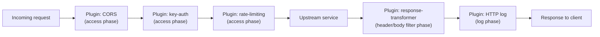

# Kong plugins & declarative config

## The one-line hook

> **A Kong plugin is Lua code that hooks into a specific phase of the request/response lifecycle — and every plugin attached to a route runs as a chain, in a defined order, not as independent, isolated add-ons.**

## The plugin execution model

Kong plugins hook into specific **request/response lifecycle phases** inherited from the underlying Nginx/OpenResty processing model — commonly an `access` phase (before the request reaches the upstream service, where auth and rate limiting typically run), and `header_filter`/`body_filter`/`log` phases (as the response comes back). Multiple plugins attached to the same route execute as an ordered **chain**, each seeing (and able to modify) the request or response as it passes through.

**Memorable hook:** *"Plugins aren't a pile of independent features — they're a pipeline. The order they run in is itself part of the design, not an implementation detail you can ignore."*

## Plugin scope — where a plugin applies, and the precedence that matters

Plugins can be attached at different scopes, and Kong resolves overlapping configuration by precedence:

| Scope | Applies to |
|---|---|
| **Global** | Every request through every route |
| **Service** | Every route under a specific Service |
| **Route** | One specific route only |
| **Consumer** | A specific authenticated client, layered on top of whatever service/route-level plugins already apply |

A more specific scope (route or consumer) generally overrides or adds to a broader one (global or service) for the same plugin type — a genuinely common source of real production confusion when a route-level override silently changes behavior someone expected to be enforced globally.

## Plugin categories, at a glance

| Category | Examples | Purpose |
|---|---|---|
| **Authentication** | key-auth, JWT, OAuth2, LDAP | Verifying who's calling |
| **Security** | CORS, bot-detection, IP restriction | Protecting against unwanted or malicious traffic |
| **Traffic control** | rate-limiting, request-size-limiting, proxy-caching | Protecting backend capacity and enforcing usage policy |
| **Transformations** | request-transformer, response-transformer, correlation-id | Reshaping traffic in flight — conceptually the same job Camel's Message Translator EIP does, just at the gateway edge instead of in application code |
| **Logging/observability** | Prometheus, Datadog, HTTP log, OpenTelemetry/Zipkin | Feeding metrics/traces/logs to external systems |
| **Serverless** | function execution plugins | Running custom logic (including Lua functions) directly in the request pipeline |

## Custom plugin development

When a built-in plugin doesn't cover a customer's specific requirement — a bespoke compliance header, a proprietary auth scheme, a custom audit trail — Kong supports writing **custom plugins in Lua**, hooking into the same lifecycle phases as built-in plugins. This is genuinely relevant to a CSM/SA role: helping a customer scope whether their requirement needs a custom plugin, or whether an existing plugin combination already covers it, is a real, recurring conversation.

## Declarative configuration and the `deck` CLI — Kong as code

Beyond the Admin API's imperative, call-by-call configuration, Kong supports **declarative configuration**: the entire desired state of Services, Routes, Plugins, and Consumers expressed in one YAML or JSON file, which Kong then reconciles itself toward — the same declarative philosophy as Kubernetes itself. The **`deck`** CLI tool is the practical tool for this workflow:

- `deck dump` — export a running Kong instance's current configuration to a declarative file
- `deck diff` — show exactly what would change if a given file were applied
- `deck sync` — apply a declarative file's desired state to a running instance

This turns Kong configuration into genuine **infrastructure as code** — version-controlled in Git, code-reviewed like any other change, and promoted consistently across dev/staging/production environments via CI/CD, rather than manually replicated Admin API calls that can silently drift between environments.

**Memorable hook:** *"`deck` does for Kong config exactly what `kubectl apply` does for Kubernetes manifests — describe the desired state, let the tool reconcile reality toward it."*

## Real-world examples

1. **Helping a customer scope a custom compliance/audit plugin requirement**, directly relevant to your current CSM role — conceptually similar to Day 2's Wire Tap pattern (a silent side-channel copy for compliance), just implemented at the gateway edge in Lua instead of in a Camel route.
2. **Establishing a GitOps workflow with `deck` across a customer's dev/staging/production Kong environments** — a concrete, current, high-value piece of guidance directly applicable to real account work, and a strong technical-credibility answer to "how would you help a customer manage API configuration at scale."
3. **Diagnosing an unexpected plugin behavior caused by scope precedence** — a route-level override silently superseding an expected global policy is a realistic, specific troubleshooting scenario that shows genuine operational familiarity, not just feature knowledge.
