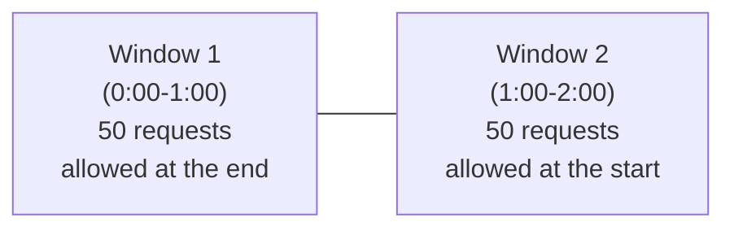
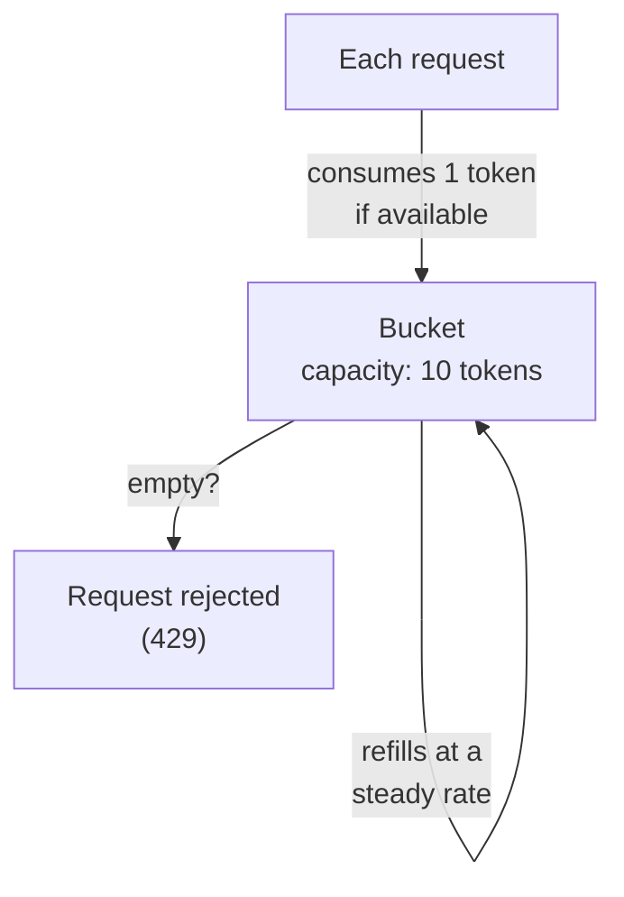

# Rate limiting algorithms

## The one-line hook

> **Every rate limiting algorithm is a different tradeoff between memory cost, precision, and whether it allows bursts — there's no universally "best" one, only the right fit for a specific traffic pattern.**

## Fixed window counter — the simplest, and its real flaw

Divide time into fixed intervals (say, one-minute windows), count requests per client in each window, block once the limit is hit, reset at the next window boundary.

**The boundary burst flaw**, worth naming precisely: if a client sends 0 requests for the first 50 seconds of a window, then fires 100 requests in the last 10 seconds, the window resets and they can immediately fire another 100 in the first 10 seconds of the *new* window — effectively 200 requests in a 20-second span, double the intended limit, entirely legally within the algorithm's own rules.

**Memorable hook:** *"Fixed window doesn't actually limit the rate — it limits the count per arbitrary clock interval, and clever clients can straddle the boundary to burst right through it."*

## Sliding window log — precise, but expensive

Store the **timestamp of every individual request**, and on each new request, count how many stored timestamps fall within the trailing window (e.g. the last 60 seconds), sliding continuously rather than resetting at fixed boundaries. This closes the boundary-burst flaw completely — but the memory cost is real: you're storing a growing, unbounded list of timestamps per client.

## Sliding window counter — the practical middle ground

A weighted blend of the current and previous fixed windows' counts, weighted by how far into the current window the request falls — for example, if you're 25% into the current window, count 75% of the previous window's total plus 100% of the current window's count so far. This approximates the sliding window log's precision at close to fixed window's memory cost (two counters per client, not a growing list).

## Token bucket — the industry favorite, and why

A bucket holds up to a maximum number of tokens; each request consumes one token if available, and tokens refill continuously at a defined rate. The bucket starts full, so a client that's been idle can legitimately burst up to the bucket's full capacity — then must slow to the refill rate once drained.

**Why it's genuinely the most widely used in production (Kong, AWS, Stripe, and others):** it's memory-efficient — you only need to store two numbers per client (current token count and the timestamp of the last request), with the actual token count calculated lazily on each request rather than needing a background refill process — and it naturally supports the realistic traffic pattern of "mostly steady, occasionally bursty," which a fixed window either over- or under-serves.

**Memorable hook:** *"Token bucket is the only algorithm here that treats bursting as a legitimate, designed-for behavior instead of an edge case to guard against — which is exactly why real production APIs (Stripe, AWS) use it."*

## Leaky bucket — token bucket's stricter cousin

Requests fill a bucket, but the bucket **drains (processes requests) at a constant, fixed outflow rate** regardless of how fast it filled — smoothing bursty input into perfectly steady output, rather than token bucket's "allow the burst through, then throttle." This is the right choice when the concern is protecting a downstream system that genuinely cannot handle *any* burst, not just an average-rate concern.

**Memorable hook:** *"Token bucket lets a burst through and then slows down. Leaky bucket never lets a burst through at all — it smooths everything to one steady drip, no matter how it arrived."*

## Distributed rate limiting — the part that actually matters in production

None of the algorithms above work correctly if each gateway/service instance tracks its own counters independently — with **N horizontally-scaled instances**, a client could get **N times** the intended limit simply by having requests load-balanced across different nodes, each unaware of what the others have already counted. The fix is centralizing rate-limit state in a **shared, fast store — Redis is the standard choice** — so every node checks and increments against the same counters, regardless of which node actually receives a given request.

**This is exactly how Kong's own rate-limiting plugin works**: backed by Redis for distributed state management, ensuring a consistent quota is enforced across every data plane node, not per-node — a direct, product-specific detail worth having ready.

## Real-world examples

1. **Kong's rate-limiting plugin's Redis-backed distributed state**, directly relevant to your current role — being able to explain *why* Redis is necessary (not just that it's used) demonstrates real architectural understanding, not memorized product trivia.
2. **Protecting a legacy backend that can't easily be scaled** — a system in the spirit of the legacy Amdocs billing platform or WebSphere-era services from your Marlo/True IT background — with token bucket or leaky bucket rate limiting at the gateway edge, shielding a system that has hard capacity limits from being overwhelmed by modern, bursty client traffic.
3. **A regulated financial-services customer needing precise, auditable rate enforcement** versus a lower-stakes customer being perfectly well served by token bucket's memory efficiency — a genuine, defensible "it depends on the customer's actual requirements" architecture conversation rather than a one-size-fits-all recommendation.
