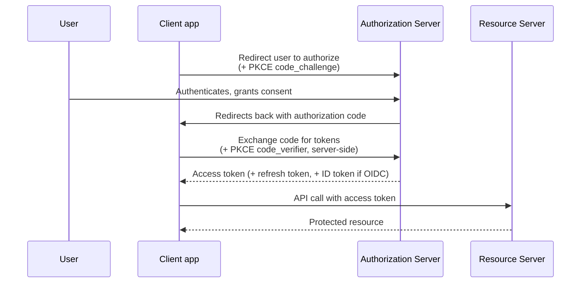

# OAuth2 & OIDC deep dive

## The one-line hook

> **OAuth2 answers "can this app do this on my behalf?" — authorization. OIDC, built on top of OAuth2, answers "who is this person, actually?" — authentication. Confusing the two is one of the most common real mistakes in API security design.**

## OAuth2 is authorization, not authentication

OAuth2's core roles:

| Role | What it is |
|---|---|
| **Resource Owner** | The user who owns the data/resource |
| **Client** | The application requesting access on the user's behalf |
| **Authorization Server** | Issues tokens after the resource owner grants consent |
| **Resource Server** | The API that holds the protected resource, and validates tokens presented to it |

OAuth2 grants a **client** limited, scoped permission to access a **resource** on a user's behalf — it was never designed to tell the resource server *who the human actually is*, only that some client has been granted some specific permission. This gap is exactly why **OpenID Connect (OIDC)** exists — layering an actual identity/authentication mechanism on top of OAuth2's authorization machinery.

## The Authorization Code flow with PKCE — the flow that matters most

The **Authorization Code flow** is considered the most secure for real applications because the actual access token **never passes through the browser** — only a short-lived authorization code does, and the code-to-token exchange happens server-to-server, keeping any client secret off the client side entirely. **PKCE (Proof Key for Code Exchange)** extends this flow to be safe even for clients that *can't* keep a secret at all (mobile apps, single-page apps) — the client generates a random `code_verifier`, sends a hashed `code_challenge` upfront, and must present the original verifier at token exchange time, so a stolen authorization code alone is useless to an attacker without the verifier.

**The Implicit flow, by contrast, is now considered deprecated** (formally removed in OAuth 2.1) — it returned the access token directly in the browser redirect, with no code-exchange step, making it inherently more exposed.

**Client Credentials flow**, for comparison, is the machine-to-machine case: no user or browser involved at all — a service authenticates directly with its own credentials to get a token representing *itself*, not any user.

## Scopes — the principle of least privilege, made explicit

A **scope** (`read:profile`, `write:orders`) is a string the client requests, presented to the user on the consent screen, that limits exactly what the issued token is permitted to do. Good API design requests the *minimum* scopes actually needed — not broad, all-access tokens "just in case."

## OIDC — OAuth2 plus an identity layer

OIDC adds an **ID Token** — a JWT specifically containing identity claims about the authenticated user (`sub`, `name`, `email`, and others) — alongside whatever access token OAuth2 already issues. The client validates this ID token's signature and claims to establish who the user actually is, which is the mechanism behind essentially every "Sign in with X" button and enterprise SSO integration.

## JWT structure and real security pitfalls

A **JWT (JSON Web Token)** has three parts: `header.payload.signature` — the header names the signing algorithm, the payload carries claims, the signature cryptographically proves the token hasn't been tampered with.

**Two pitfalls worth naming precisely, since they're genuinely common real vulnerabilities:**

- **The `alg: none` attack**: an attacker takes a valid JWT, modifies the payload, and changes the header's algorithm to `none`. A poorly implemented verifier that blindly trusts the token's own `alg` header will accept it without checking any signature at all. **The fix**: server-side validation must never trust the `alg` header from the token itself — always validate against a pre-configured allowlist (e.g., only `RS256`) and reject anything else outright.
- **Refresh token theft**: **refresh token rotation** issues a brand-new refresh token every time the old one is used to get a new access token, immediately invalidating the old one. If an attacker has stolen a refresh token and uses it, the legitimate client's next attempt to use its now-superseded token fails — a clear, detectable signal of theft, rather than an attacker being able to silently ride along indefinitely on a stolen long-lived token.

**Memorable hook:** *"Never trust what the token claims about itself — the `alg` header, in particular, is data from the attacker's own forged message, not a security decision to honor."*

## SSO architecture — two levels of session, not one

Single sign-on (via OIDC, or SAML in more traditional enterprise environments) works through **two separate session layers**: a centralized **IdP (Identity Provider) session**, and independent **application sessions** at each individual service provider. A user authenticating at App A creates both an IdP session and an App A session; visiting App B for the first time, the IdP detects the existing IdP session cookie and redirects back with an authorization code immediately — no re-login — while App B still creates its own independent application session.

## Real-world examples

1. **Configuring Kong's OAuth2/OIDC plugins for enterprise customers**, directly relevant to your current CSM role — a realistic, recurring conversation about which flow fits a given customer's client type (server-side app, mobile app, machine-to-machine service).
2. **The nbn Digital Products mobile apps needing Authorization Code flow with PKCE**, not Implicit flow — a defensible, specific, technically correct architecture decision for a native mobile client, and a strong way to connect this page back to a real project from your resume.
3. **Explaining refresh token rotation to a customer's security team** during a Red Hat or Kong onboarding/presales conversation — a concrete, credible security detail that goes beyond "we support OAuth2," showing you understand *why* the mechanism matters.
