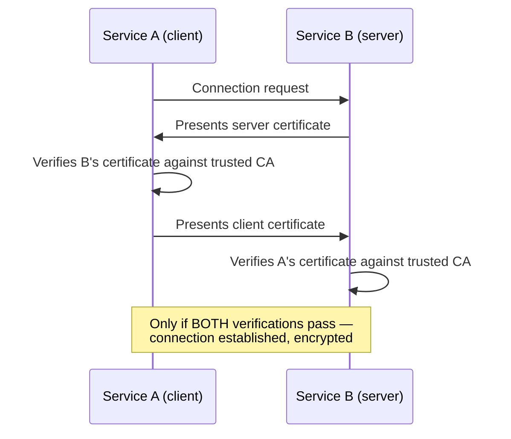

# mTLS & service-to-service security

## The one-line hook

> **Regular TLS proves the server is who it claims to be. Mutual TLS (mTLS) proves both sides are who they claim to be — and you've already built the exact mechanism behind it once this week, on Day 1, just applied to Kubernetes control plane components instead of application services.**

## How mTLS actually works

Ordinary HTTPS verifies only the server — your browser confirms it's really talking to `example.com`. **mTLS goes further: the client also presents a certificate, issued by a trusted Certificate Authority, and the server verifies it too.** Only once both sides have proven their identity does the connection proceed. This gives you three things simultaneously: **authentication** (each side really is who it claims), **encryption** (the channel itself is encrypted), and **integrity** (data can't be tampered with in transit).

**The direct callback to Day 1:** this is *exactly* the mechanism Day 1's "Kubernetes the hard way" page covered — every control plane component (API server, kubelet, scheduler) authenticates every other component using certificates signed by one Certificate Authority, with nothing trusted by default. mTLS for microservices is the same idea, just applied to your own application services instead of Kubernetes' internal components.

## Where mTLS fits, and where it doesn't

| Fits well | Doesn't fit well |
|---|---|
| Internal microservices in a zero-trust network | Public-facing, consumer-facing APIs — you can't issue every random internet client a private certificate |
| High-security regulated APIs (banking, healthcare) | Anywhere convenience for a large, uncontrolled client population matters more than machine-level cryptographic identity |
| B2B integrations where a specific partner is issued a client certificate | Situations needing fine-grained, user-level authorization — mTLS proves *machine* identity, not *user* identity |

**Memorable hook:** *"mTLS answers 'which machine is this,' not 'which user is this.' Confusing the two is exactly the same mistake as confusing OAuth2 authorization with OIDC authentication from the previous page."*

## Service meshes make mTLS operationally viable at scale

Manually issuing, rotating, and verifying certificates for every service-to-service call across a large microservices fleet is genuinely painful — which is precisely why **service meshes like Istio and Linkerd automate mTLS**: a sidecar proxy injected alongside each service handles certificate issuance, rotation, and verification transparently, so application code never has to touch a certificate directly. This is a direct preview of the API Gateway vs Service Mesh page later today — automated mTLS is one of the concrete, load-bearing reasons a service mesh earns its operational complexity.

## The alternative: JWT-based service authentication

Without a service mesh handling this automatically, a common alternative is **JWT-based service authentication**: each service has its own service account, obtains a JWT from a centralized token service, and presents that JWT (in the Authorization header) on calls to other services — the receiving service validates the JWT and checks the claimed service identity against an access control list. Less operationally automatic than mesh-managed mTLS, but requires no sidecar infrastructure at all.

## The token propagation pattern — combining machine and user identity

A genuinely important, often-overlooked detail: when a user's request flows through multiple services, each downstream service typically needs to know **both** which service is calling it **and** which end user the request is ultimately for. The clean pattern is **two tokens, not one**:

- A **service token** (mTLS certificate, or a service JWT) proving *service* identity — "am I willing to accept requests from this calling service at all?"
- A **user token** (typically the OIDC-issued token from the previous page) passed through the entire call chain unmodified, proving *user* identity — "is this specific user authorized for this specific operation?"

Each service in the chain validates both independently, rather than either re-authenticating the user at every hop (wasteful and often impossible without the original credentials) or trusting service identity alone (which tells you nothing about user-level authorization).

**Memorable hook:** *"One token can't honestly answer two different questions. Service identity and user identity are separate facts, and the token propagation pattern keeps them as two separate tokens instead of awkwardly conflating them into one."*

## Real-world examples

1. **The explicit connection to Day 1's Kubernetes-the-hard-way material.** Being able to say outright, "this is the same mTLS mechanism I described for Kubernetes control plane components on Day 1, just applied to application services" is a genuinely strong, memorable answer if an interviewer asks you to explain mTLS from scratch — it shows the week's material connecting, not sitting in isolated silos.
2. **Securing internal service-to-service calls on a platform like TnD Microservices**, where a service mesh's automated mTLS would be the natural fit for internal zero-trust communication between the decomposed services.
3. **A regulated Thai banking customer requiring mTLS for internal microservices communication**, combined with OIDC-issued user tokens propagated through the call chain for full end-to-end identity context — a realistic, technically complete answer for exactly the kind of regulated-industry account context in your background.
