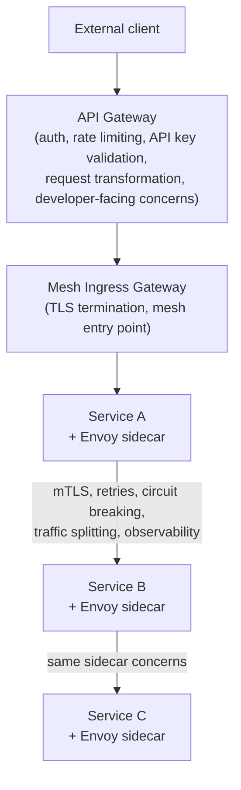

# API Gateway vs Service Mesh

This is close to a guaranteed architecture question, and the naive answer is actually wrong in a specific, checkable way — worth getting exactly right.

## The one-line hook

> **"API Gateway is north-south, Service Mesh is east-west" is the answer most people give, and it's a myth. Both can technically handle either traffic direction. The real distinction is purpose: a gateway treats services as products; a mesh treats them as infrastructure.**

## Why the traffic-direction framing is actually wrong

An API Gateway *can* manage internal service-to-service traffic through internal gateways applying governance and versioning. A service mesh's ingress gateway (Istio's Ingress Gateway, for instance) *can* handle external, client-facing traffic entering the mesh. Traffic direction genuinely doesn't cleanly separate the two categories — which is exactly why leading with that framing in an interview is a subtle red flag that you've memorized a simplification rather than understood the real distinction.

## The real distinction: purpose, not direction

| | API Gateway | Service Mesh |
|---|---|---|
| **Treats services as** | Products — with user governance, access control, monetization, developer-facing lifecycle management | Infrastructure — business-agnostic, understanding "service instances" and "failure rates," never "customers" or "billing tiers" |
| **Core concerns** | Authentication, API key validation, rate limiting, request/response transformation, protocol translation, developer portal | mTLS, retries with backoff, circuit breaking, load balancing, fine-grained observability between services |
| **Awareness of business context** | Yes — usage plans, monetization tiers, partner-specific policies | No — deliberately business-agnostic infrastructure |

**Memorable hook:** *"A gateway asks 'is this client allowed to call this API, and how do we bill/govern that?' A mesh asks 'is this network call between two services going to succeed, securely and reliably?' — genuinely different questions, regardless of which direction the traffic happens to be flowing."*

## The layered architecture in practice

This is the realistic, production-grade layering: the **API Gateway handles the "business" layer** of API management for external consumers, while the **service mesh handles the "infrastructure" layer** of service-to-service communication once traffic is inside the mesh.

## Why NOT to use only one or the other

**Using only an API Gateway for everything, including internal service-to-service calls**, reintroduces exactly the N² problem from Day 2's integration fundamentals and this morning's API Gateway fundamentals page: with 50 services each potentially calling 10 others, routing every one of those 500 internal paths through one central gateway makes it both a bottleneck and a single point of failure, and adds a real network hop's worth of latency to every internal call that didn't need to go through a central chokepoint at all.

**Using only a service mesh for everything, including external client management**, misses genuine gateway-specific capabilities a mesh was never designed for: no API key management or usage plans, no developer portal for external partners, no request/response *body* transformation (a mesh's routing config can typically modify headers, not reshape payloads), and no protocol translation between, say, external REST and internal gRPC.

**Memorable hook:** *"Trying to make one tool do both jobs doesn't just add complexity — it actively breaks specific things the other tool was purpose-built to solve."*

## The sidecar pattern — a direct callback to Day 1

A service mesh's data plane is typically implemented via the **sidecar pattern**: an Envoy proxy container running alongside each service instance, handling mTLS, retries, circuit breaking, and observability so application code stays focused purely on business logic. In Kubernetes, this sidecar runs as a second container **in the same pod**, sharing the pod's network namespace — which is exactly the mechanism Day 1's container networking page described using Kubernetes' invisible "pause" container: every container in a pod already shares one network namespace, and the Envoy sidecar takes advantage of that same sharing to transparently intercept every request in and out of the real application container.

**The state of the art is already moving past sidecars in some cases**: Istio's newer **Ambient Mesh** mode replaces per-pod sidecars with shared per-node proxies, reducing the resource overhead of running a full sidecar for every single pod — worth knowing as a current detail, even if the sidecar model remains the more common production pattern today.

## Control plane / data plane, once more — the same principle as Kong

Istio's architecture mirrors exactly the Kong control-plane/data-plane split from earlier today: **Pilot** (Istio's control plane) distributes routing rules, traffic policies, and mTLS certificates to every Envoy sidecar, but — critically, the same principle as Kong's control plane — **the control plane is never on the actual request path**. Every real request flows through the Envoy data plane proxies directly; the control plane only pushes configuration.

## Kong Mesh — where your own employer straddles this exact line

Directly relevant to your current role: **Kong Mesh** is Kong's own Envoy-based service mesh offering, extending Kong Gateway with genuine Layer 7 service mesh capabilities — mTLS, traffic splitting for canary releases, and mesh-wide observability. This is concrete, current proof of the broader industry trend research surfaced: API gateways are absorbing mesh-like features, and service meshes are absorbing gateway-like features, even as the underlying *purposes* remain genuinely distinct. Being able to name this — using your own employer's product roadmap as the example — is a strong, specific, hard-to-fake answer.

## Real-world examples

1. **Kong Mesh as direct, current evidence that the API-Gateway-vs-Service-Mesh boundary is blurring** — a genuinely strong answer precisely because it's your own company's actual product strategy, not a generic industry observation.
2. **If the TnD Microservices platform were architected today**: an API Gateway (Kong, in your current context) handling external/partner-facing governance in the spirit of the original nbn iB2B model, paired with a service mesh handling internal resilience between the decomposed services — a complete, end-to-end answer to "how would you architect this."
3. **The N² routing problem, reused from Day 2**, applied specifically to explain why routing all internal service-to-service traffic through one central API gateway is an architecture mistake, not just a scalability nice-to-have — a genuinely strong cross-day, quantitative answer.
