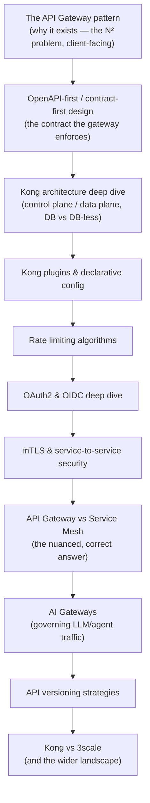

# Day 3 — API Management & Gateway Architecture

## Why this day matters

Kong is your current employer, and API gateway architecture sits at the exact intersection of your Red Hat presales background (3scale) and your present Kong CSM role managing ~23 enterprise accounts. An interviewer who's read your resume has an obvious, almost irresistible question available:

> "You work at Kong today. Walk me through how a Kong deployment is actually architected — control plane, data plane, plugins, all of it. ...And now tell me honestly: when would a customer need a service mesh instead of, or alongside, what you're selling them?"

That second question is the trap — it rewards someone who understands the real boundaries of their own product, not just its features. Day 3 is built to answer both halves convincingly.

## The mental model for the whole day

Today climbs from **why an API gateway exists at all**, through **the contract it enforces**, through **Kong's own architecture and mechanics**, through **the security and traffic-control concerns every gateway conversation eventually reaches**, out to **where a gateway's authority actually ends** (service mesh), forward to **the newest frontier** (AI Gateways — directly relevant given the AWS job description's AI Agents gap), and closes with a **direct competitive positioning** exercise pulling together your Red Hat and Kong experience.

## Today's pages (10-hour day)

| # | Page | Approx. time |
|---|---|---|
| 1 | [The API Gateway pattern & why it exists](01-api-gateway-pattern-fundamentals.md) | 40 min |
| 2 | [OpenAPI-first / contract-first API design](02-openapi-contract-first-design.md) | 45 min |
| 3 | [Kong architecture deep dive](03-kong-architecture-deep-dive.md) | 60 min |
| 4 | [Kong plugins & declarative config](04-kong-plugins-declarative-config.md) | 45 min |
| 5 | [Rate limiting algorithms](05-rate-limiting-algorithms.md) | 45 min |
| 6 | [OAuth2 & OIDC deep dive](06-oauth2-oidc-deep-dive.md) | 55 min |
| 7 | [mTLS & service-to-service security](07-mtls-service-to-service-security.md) | 40 min |
| 8 | [API Gateway vs Service Mesh](08-api-gateway-vs-service-mesh.md) | 55 min |
| 9 | [AI Gateways](09-ai-gateways.md) | 40 min |
| 10 | [API versioning strategies](10-api-versioning-strategies.md) | 35 min |
| 11 | [Kong vs 3scale (and the wider landscape)](11-kong-vs-3scale-competitive-landscape.md) | 40 min |
| 12 | [Interview Q&A drill](12-interview-qa.md) | 70 min, done cold, last |

## Real-world anchor for today

Your **current Kong Senior Technical CSM role** is the strongest anchor of the whole week — you're not reasoning about a hypothetical product, you're describing what you actually work in daily across ~23 enterprise accounts. Where a topic reaches further back, your **Red Hat 3scale exposure** and **nbn Australia SOAP/REST/eBXML work** (Day 2's anchor) both connect naturally, especially for the contract-first design and competitive-positioning pages. The **TnD Microservices** Kubernetes/AWS work from Days 1–2 is the natural anchor for the Service Mesh page.
