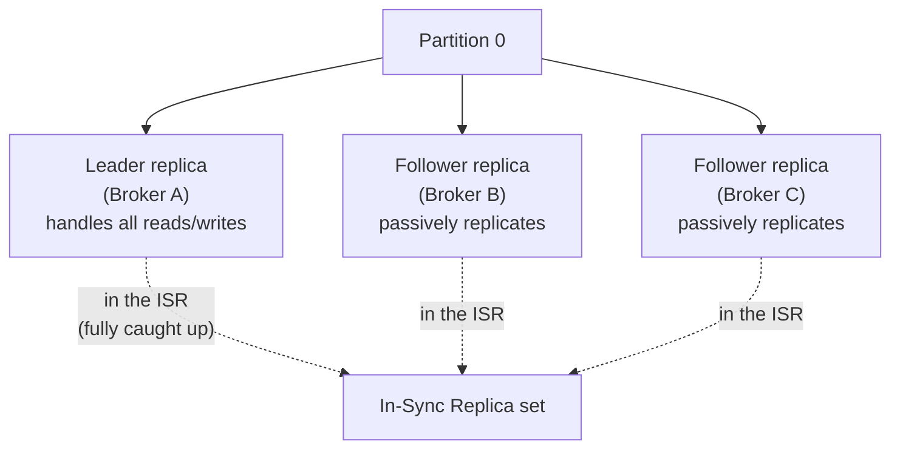

# Kafka internals deep dive

Given how central Kafka is to your project history, this is the page most likely to get chased down to genuine mechanism-level detail — not "what is a topic," but "walk me through exactly what happens when a broker fails mid-write."

## The one-line hook

> **Kafka is a distributed, partitioned, replicated commit log — every other Kafka concept is a consequence of that one sentence, not a separate fact to memorize.**

## Topics and partitions — the unit of parallelism

A **topic** is a named, append-only log. It's split into **partitions**, each an ordered, immutable sequence of records distributed across different brokers — this is what lets Kafka scale horizontally: more partitions, spread across more brokers, means more parallel throughput than any single machine could sustain alone.

**Two guarantees worth stating precisely, because they're a common trap:**

- Kafka guarantees ordering **only within a single partition** — there is no ordering guarantee *across* partitions of the same topic.
- Messages with the same **key** always land on the same partition (via a deterministic hash), which is exactly how you get ordering guarantees *per entity* — all events for order #4521, say, land on one partition and are processed in order, even though other orders' events may be interleaved across other partitions.

**Memorable hook:** *"Kafka doesn't promise your topic is ordered. It promises your partition is ordered — and your key is what decides which partition a given entity's events all end up on."*

## Replication, leaders, and ISR — how Kafka survives a broker dying

Each partition has a **replication factor** (commonly 3) — one **leader** replica handling all reads and writes (Kafka 2.4+ allows consumer reads from followers for latency optimization, but writes always go to the leader), and follower replicas passively replicating the leader's log.

The **In-Sync Replica (ISR) set** is the list of replicas fully caught up with the leader within a defined time window. This matters enormously at failover: **only an ISR member is allowed to become the new leader** by default, specifically to prevent data loss — promoting a replica that was behind would silently drop whatever writes it missed.

**The real tradeoff, worth stating precisely**: if **unclean leader election** is disabled (the safer default), and every ISR member is unavailable, Kafka will **wait** rather than promote a non-ISR ("dirty") replica — prioritizing consistency over availability. Enabling unclean leader election flips that: the cluster stays available by promoting a replica that might be missing recent data. This is the concrete mechanism behind the well-known claim that **"Kafka is always available, sometimes consistent"** — and a good interviewer might push back on a version of that claim that's too absolute, since it's actually a configurable tradeoff, not a fixed property.

## KRaft — replacing ZooKeeper

Historically, Kafka relied on **ZooKeeper** for cluster coordination and metadata (broker liveness, leader election, topic/partition configuration). **KRaft (Kafka Raft)** replaces this by incorporating metadata management directly into the Kafka brokers themselves, using a Raft-based controller quorum — removing the "split-brain" risk of coordinating two genuinely separate distributed systems, simplifying operations, and allowing clusters to scale to far more partitions than ZooKeeper-based coordination could comfortably support.

## The `acks` setting — the actual durability/latency dial

| `acks` value | Behavior | Tradeoff |
|---|---|---|
| `0` | Producer doesn't wait for any acknowledgment | Lowest latency, real risk of silent message loss |
| `1` | Producer waits for the **leader** to acknowledge | Balanced — but a message can still be lost if the leader fails before followers replicate it |
| `all` | Producer waits for the **full ISR** to acknowledge | Strongest durability, highest latency — the correct choice when message loss is genuinely unacceptable |

**Memorable hook:** *"`acks=0` is shouting into a room and walking away. `acks=1` is waiting for one person to say they heard you. `acks=all` is waiting for everyone in the room to confirm — slower, but you actually know it landed."*

## Retention vs. log compaction — two fundamentally different cleanup strategies

| | Time/size retention | Log compaction |
|---|---|---|
| **Deletes based on** | Age or total size | Duplicate keys — keeps only the latest value per key |
| **Result** | A rolling window of recent history | The current state of every key, like a changelog |
| **Fits** | Event logs, audit trails | CDC topics, event sourcing, anywhere you only care about "what's the latest value for this entity right now" |
| **Deletion mechanism** | Old segments dropped wholesale | A **tombstone** (null value) marks a key for removal during the next compaction pass |

**Memorable hook:** *"Retention is a rolling log file — old pages fall off the back. Compaction is a key-value store — it forgets history but never forgets the current answer for a given key."*

## Why Kafka is fast — the mechanics, not the marketing

- **Sequential disk I/O**: writes are always appended to the end of the log, avoiding the random-seek penalty that dominates traditional disk-based systems.
- **Zero-copy I/O**: when serving data to consumers, Kafka can hand data directly from the OS page cache to the network socket without copying it through application-level buffers first — a real, specific mechanism, not just "it's optimized."
- **OS page cache**: Kafka deliberately relies on the operating system's own disk caching rather than reimplementing an in-process cache, keeping recently-written data fast to re-read without extra application memory overhead.
- **Batching and compression**: producers batch records and compress them before sending, amortizing network overhead across many messages at once.

## Consumer groups and rebalancing

A **consumer group** is a set of consumers jointly consuming a topic's partitions, with each partition assigned to exactly one consumer within the group at a time — this is what lets you scale consumption horizontally, up to the partition count. When a consumer joins or leaves the group, a **rebalance** redistributes partition ownership among the remaining consumers. Kafka's default delivery is **at-least-once**: if a consumer crashes after processing a message but before committing its offset, that message will be reprocessed on restart — which is exactly why Day 2's idempotent consumer material matters just as much here as it did for Camel.

**Partition sizing, concretely**: calculate desired throughput (T) and the throughput a single consumer can sustain (c); partition count should be at least T/c, commonly over-provisioned 2-3x to leave room for future growth without a disruptive repartitioning exercise later.

## Real-world examples

1. **Sizing Kafka partitions and choosing `acks` settings for the TnD Microservices platform.** A financial or state-changing event stream would justify `acks=all` despite the latency cost; a high-volume analytics or telemetry stream might reasonably accept `acks=1` for better throughput — a genuine, defensible tradeoff conversation grounded in your actual project.
2. **Explaining "Kafka is always available, sometimes consistent" precisely**, including the unclean leader election knob that actually controls it — a stronger, more nuanced answer than repeating the slogan itself.
3. **Diagnosing a consumer lag spike or rebalancing storm** in a production consumer group — a very realistic operational scenario, and a chance to demonstrate you understand rebalancing isn't free, it has a real cost every time group membership changes.
