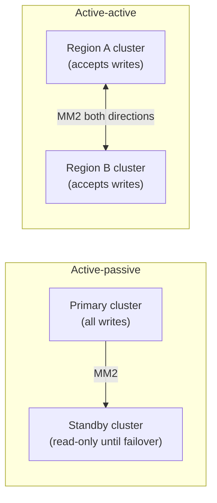

# Kafka geo-replication & multi-datacenter DR

## The one-line hook

> **MirrorMaker doesn't give you a magic distributed Kafka cluster spanning regions — it's just another Kafka consumer-and-producer pipeline, which means it inherits all of Kafka's normal replication lag characteristics, including the fact that your recovery point is never truly zero.**

## Why geo-replication matters beyond "disaster recovery"

- **Disaster recovery** — surviving the loss of an entire region or data center, not just a single broker.
- **Regional latency reduction** — serving reads from a cluster physically close to consumers, rather than every request crossing a region boundary.
- **Regulatory data residency** — some data may be legally required to remain within a specific country's borders, a genuinely live constraint in regulated Thai financial and government contexts, meaning a geo-replication design has to account for *what's allowed to cross a border at all*, not just how to replicate it efficiently.

## MirrorMaker 2 (MM2) — how it actually works

MirrorMaker 2 is built on the **Kafka Connect** framework — it's fundamentally a specialized connector that consumes from a source cluster and produces to a target cluster, handling several concerns beyond just copying bytes:

- **Topic renaming/prefixing** — topics replicated from a source cluster are typically prefixed with the source cluster's name (e.g. `us-west.orders`) to avoid naming collisions when multiple clusters replicate into one target.
- **Consumer offset translation** — this is the genuinely hard part, covered in detail below.
- **ACL and configuration synchronization** — keeping access control and topic configuration consistent across clusters, not just the data itself.

**Memorable hook:** *"MirrorMaker isn't a special replication protocol — it's an ordinary Kafka consumer reading from one cluster and an ordinary Kafka producer writing to another, wearing a trench coat."*

## Active-passive vs active-active topologies

| | Active-passive | Active-active |
|---|---|---|
| **Writes accepted** | Only at the primary | At every region |
| **Consistency model** | Simpler — one source of truth at any given time | Harder — the same key can be written differently in two regions simultaneously, requiring conflict resolution |
| **Failover** | Requires a cutover process, with some downtime | No cutover needed — but only because the complexity was paid for upfront in conflict handling |
| **Local write latency** | Regions far from the primary pay a latency cost for writes | Every region gets low-latency local writes |

**Memorable hook:** *"Active-passive defers the hard problem to failover day. Active-active pays for the hard problem — conflict resolution — every single day, in exchange for never having a failover day at all."*

## The consumer offset translation problem — the detail that actually trips people up

Kafka consumer offsets are **specific to the cluster they were committed against** — "I'm at offset 4,521 in partition 3" only means something within that one cluster's own partition numbering and history. If consumers need to fail over from cluster A to cluster B, offset 4,521 in cluster A's copy of a topic is **not guaranteed to be the same message** as offset 4,521 in cluster B's replicated copy, since replication timing and any intermediate reprocessing can shift things. MM2's offset translation feature specifically addresses this, maintaining a mapping so failed-over consumers can resume from the *semantically* correct position in the target cluster, not just an offset number that happens to match.

**Memorable hook:** *"An offset is an address in one specific cluster's own history. Failing over consumers without offset translation is like handing someone a house number from the wrong street and expecting them to find the right house."*

## RPO is bounded by replication lag, not zero

Because MM2 is an ordinary asynchronous consume-and-produce pipeline, there is always some replication lag between the source and target clusters — meaning your actual **Recovery Point Objective (RPO)** after a regional failure is bounded by however far behind replication was at the moment of failure, not a theoretical zero. A credible DR design states this honestly, with a measured or estimated lag figure, rather than implying geo-replication makes data loss impossible.

## Real-world examples

1. **A Thai financial services or government customer with data residency requirements.** Directly relevant to your Red Hat/Kong regulated-industry account experience — a credible architecture conversation has to start with which data is even legally allowed to leave the country, before any replication topology decision is made at all.
2. **Designing active-passive DR for the TnD Microservices platform's Kafka usage**, with an explicit, honestly-stated RPO bounded by real replication lag — a defensible, concrete DR story rather than a vague "we replicate everything" claim.
3. **Walking through the consumer offset translation problem during an actual regional failover exercise** — a specific, hands-on-sounding operational detail that shows genuine understanding of geo-replication's real complexity, beyond "just point MirrorMaker at both clusters."
