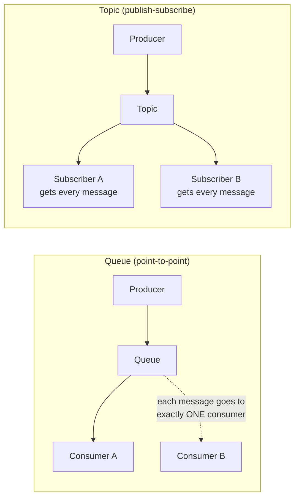
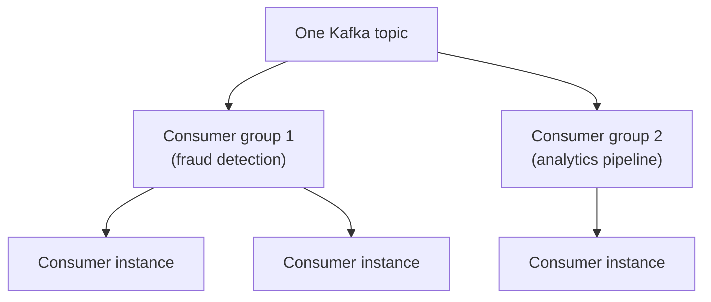

# ActiveMQ/IBM MQ vs Kafka: queue vs topic semantics

This maps directly onto your own resume — WMQ/AMQ at Marlo, Kafka at the TnD Microservices platform. You've lived both models; this page just makes the underlying distinction precise enough to defend in an interview.

## The one-line hook

> **A Kafka topic can behave like a queue, or like a pub-sub topic, or like both simultaneously — depending entirely on how many consumer groups you point at it. Traditional JMS brokers make you choose the destination type upfront; Kafka makes the choice at consumption time.**

## Queue vs Topic — the traditional JMS distinction

| | Queue (point-to-point / ANYCAST) | Topic (publish-subscribe / MULTICAST) |
|---|---|---|
| **Delivery** | Each message delivered to exactly **one** consumer | Each message delivered to **every** subscriber |
| **Use case** | Work distribution — competing consumers sharing a workload | Broadcasting an event to multiple independent interested parties |

Both ActiveMQ and IBM MQ fully implement this JMS destination model, and consumers explicitly choose which type of destination they're binding to.

## How Kafka collapses both into one mechanism — the unifying insight

Kafka doesn't have a separate "queue" concept at all — it only has **topics with partitions**, consumed through **consumer groups**:

- Point a **single consumer group** (with multiple consumer instances) at a topic, and each message goes to exactly one consumer within that group — this **behaves like a queue**, competing-consumers style.
- Point **multiple separate consumer groups** at the same topic, and each group independently receives its own full copy of every message — this **behaves like pub-sub**, since every group is, in effect, its own independent subscriber.

**Memorable hook:** *"JMS brokers ask you to pick queue or topic when you create the destination. Kafka asks you nothing upfront — the same topic is a queue to one consumer group and a topic to another, simultaneously, depending purely on how many groups are consuming it."*

## The retention/delivery model difference — reused from earlier today

Traditional JMS brokers typically perform a **destructive read**: once a message is successfully consumed (and acknowledged), it's removed from the queue. Kafka, as covered on the internals page, **retains messages for a configured period regardless of consumption**, which is precisely what enables replay — a consumer (or a brand-new one) can rewind and reprocess history, something a traditional queue's destructive-read model doesn't support at all.

## Per-message features MQ has that Kafka doesn't

JMS brokers offer genuinely finer per-message control that Kafka's simpler pull/offset model doesn't provide out of the box: **message priority** (some messages jump the queue), **per-message TTL**, **scheduled/delayed delivery**, and mature **redelivery policies**. This is a real, honest tradeoff — not a case where one system is strictly better.

## IBM MQ specifically — the enterprise/compliance angle

IBM MQ (formerly WebSphere MQ) is positioned specifically for **mission-critical, transactional workloads** — banking transaction processing being the canonical example — backed by enterprise-grade security: TLS encryption, pluggable authentication, role-based access control, and granular permissions down to the individual queue or topic level, built to satisfy compliance requirements in exactly the kind of regulated environment common in Thai financial services.

## When each genuinely wins

| Scenario | Better fit |
|---|---|
| Guaranteed, ordered, exactly-once-feeling processing of individual high-value transactions (banking, billing) | **IBM MQ / ActiveMQ** — mature per-message guarantees, strong compliance posture |
| High-throughput event streaming, replay, and feeding multiple independent downstream consumers (analytics, fraud detection, audit) from one event stream | **Kafka** — retention/replay and the multi-consumer-group pattern above |
| An existing Java enterprise shop already deeply invested in JMS | **ActiveMQ** — genuine drop-in compatibility |
| A greenfield, cloud-native, high-scale microservices platform | **Kafka** — the more natural default absent a specific legacy constraint |

## Real-world examples

1. **The nbn iB2B platform's WMQ/AMQ usage versus the TnD Microservices platform's Kafka usage** — this is the single strongest, most authentic material on this page, since you've genuinely worked with both models on real production systems, not just studied them abstractly. The iB2B platform's point-to-point, guaranteed-delivery B2B transaction processing is a textbook MQ fit; TnD's event-driven microservices decomposition is a textbook Kafka fit.
2. **Recommending IBM MQ for a Thai bank's core transaction processing workload**, given its compliance posture and mature per-message delivery guarantees — a realistic, defensible Red Hat/Kong presales scenario.
3. **A single Kafka topic simultaneously feeding a real-time fraud detection service and a separate analytics pipeline**, using two independent consumer groups — a clean, concrete example of the "one topic, multiple behaviors" insight that's the intellectual core of this whole page.
