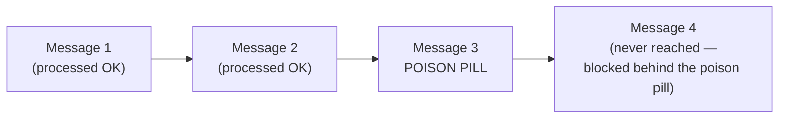

# Dead Letter Queue & poison-pill patterns

Day 2 covered the Dead Letter Channel pattern in Camel specifically. This page generalizes it across messaging systems — and covers a Kafka-specific gotcha that catches people who assume Kafka behaves like a traditional broker here.

## The one-line hook

> **A "poison pill" is a message that will never succeed no matter how many times you retry it — and in an ordered, partition-based system like Kafka, a single poison pill can silently block every message behind it, not just itself.**

## What makes a message a poison pill

A poison pill is a message that **fails deterministically** — malformed data, an unexpected schema, a payload that triggers a specific bug — meaning retrying it produces the exact same failure every time, as opposed to a transient failure (a momentary network blip, a downstream service briefly unavailable) that a retry might genuinely resolve.

**Memorable hook:** *"A transient failure is worth retrying because the world might be different next time. A poison pill fails because of what the message *is* — the world isn't going to change, so retrying it is just delaying the inevitable."*

## The generalized Dead Letter Queue pattern

Regardless of the underlying broker, the pattern is the same shape as Day 2's Dead Letter Channel: attempt processing, retry transient-looking failures with backoff, and once retries are exhausted (or the failure is clearly deterministic), route the message to a separate **Dead Letter Queue (DLQ)** instead of blocking or silently dropping it — giving operations a concrete place to investigate.

## The Kafka-specific gotcha: no automatic dead-lettering

Traditional JMS brokers (and Camel's own Dead Letter Channel) typically provide **built-in** dead-letter routing as a broker or framework feature. **Kafka does not** — there's no native "move this to a dead letter topic" mechanism at the consumer level. Implementing it is an **application-level responsibility**: catch the processing exception, explicitly produce the failed message to a separate topic (conventionally named something like `orders.DLQ`), and only then commit the offset to move past it. Skip this, and a failing consumer either crashes repeatedly or — worse — silently commits past a message it never actually processed successfully.

**The one place Kafka *does* offer this natively**: **Kafka Connect** (the framework underneath Debezium, covered later today) has built-in dead letter queue support via the `errors.deadletterqueue.topic.name` configuration — a specific, current product detail worth knowing given CDC's reliance on Kafka Connect.

## Head-of-line blocking — the risk that's unique to ordered, partitioned systems

Because Kafka guarantees ordering **within a partition**, a consumer generally cannot skip past a failing message without breaking that ordering guarantee for everything behind it. If a poison pill sits at a given offset and the consumer keeps retrying and failing on it, **every subsequent message in that partition is stuck waiting**, even though those later messages might have processed perfectly fine on their own. This is a materially different failure mode than a traditional queue, where an individual problem message can more often be set aside without blocking unrelated messages behind it.

**Memorable hook:** *"In Kafka, a poison pill doesn't just poison itself — it's a roadblock on the one road every message behind it has to travel, because the partition's ordering guarantee doesn't let you drive around it."*

The practical fix is exactly the application-level DLQ pattern above: detect the deterministic failure, explicitly route that one message to a DLQ, and **advance the offset past it deliberately** — unblocking everything queued up behind it, at the acknowledged cost of that one message being handled out of band.

## Retry-before-dead-letter discipline

The same redelivery discipline from Day 2 applies here: retry genuinely transient-looking failures with **exponential backoff** first, and only dead-letter once retries are exhausted or the failure is clearly deterministic (a schema validation failure, for instance, is never going to resolve itself on retry — dead-lettering it immediately, without wasting retry cycles, is the right call).

## DLQ operational discipline — the part people skip

A DLQ that nobody monitors or reprocesses is just a slower, quieter way of losing data. Real operational discipline means: **monitoring DLQ depth as a first-class metric** (a growing DLQ is a real incident, not background noise), and having an actual **defined reprocessing workflow** — a way to inspect, fix, and replay DLQ messages back into the main flow once the underlying issue is resolved, rather than letting the DLQ become a graveyard nobody looks at again.

## Real-world examples

1. **A malformed message from a legacy WMQ/AMQ bridge breaking a Kafka Connect/CDC pipeline** — a realistic integration edge case connecting your legacy Marlo background to modern CDC tooling, and a good example of exactly where Kafka Connect's built-in DLQ support earns its keep.
2. **Diagnosing a "stuck consumer" incident where lag suddenly stops decreasing on exactly one partition, while others keep draining normally** — directly explained by head-of-line blocking, and a genuinely strong, specific troubleshooting story that shows real operational depth rather than a textbook definition.
3. **Advising a Kong customer on DLQ discipline for malformed webhook/event payloads** feeding into a downstream event pipeline — a plausible extension of your current CSM role into the messaging layer sitting behind the API gateway you already work with daily.
