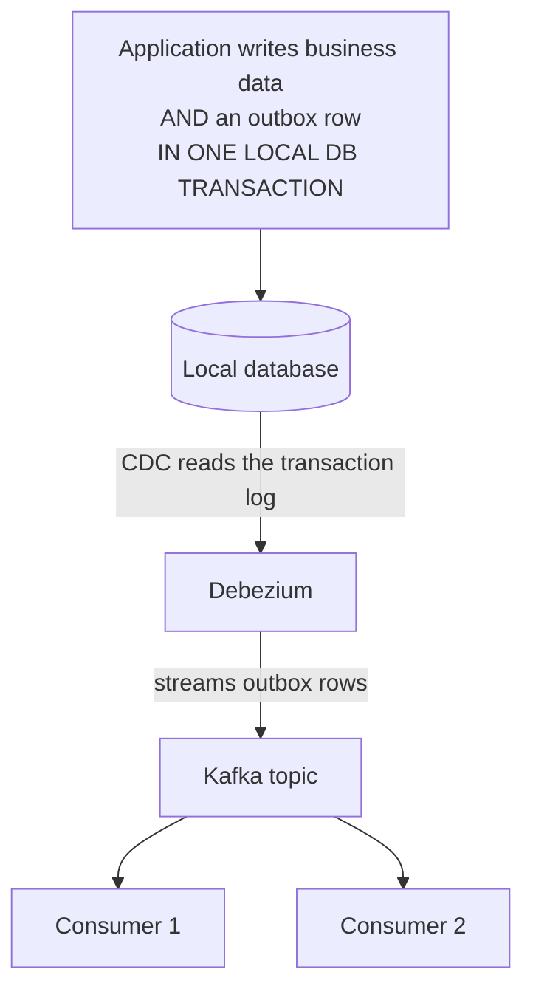

# The Outbox pattern, fully realized

Day 2 previewed the outbox pattern as an alternative to XA transactions. This page gives you the complete, concrete implementation — including the piece that makes it genuinely elegant in practice: using CDC as the relay mechanism, instead of hand-building one.

## The one-line hook

> **The dual-write problem is trying to atomically do two things that have no shared transaction. The outbox pattern's actual trick is turning that into ONE thing — a single local database write — and using CDC to make "publish the event" someone else's problem entirely.**

## The dual-write problem, precisely

If a service needs to both update its own database **and** publish an event to Kafka, and it does these as two separate, independent writes, there's a real window where the process can crash between them — updating the database but never publishing the event, or (less commonly, but still possible) publishing an event for a database write that then fails to commit. Two independent writes to two independent systems have no shared transaction to make them atomic together.

## The outbox pattern's actual mechanism

The trick: instead of trying to atomically write to two *different* systems, write to **one** — an `outbox` table in the *same* local database, in the *same* local transaction as the actual business data change. An ordinary, single-resource database transaction (no XA, no two-phase commit) already guarantees both writes succeed or both roll back together, because they're the same kind of write to the same database.

That solves "did the business change and the intent-to-publish happen atomically" — but there's still a second half: something needs to actually get that outbox row out to Kafka.

## The relay — and why CDC is the modern, correct way to build it

Early outbox implementations hand-built a **poller**: a separate process that periodically queries the outbox table for unpublished rows, publishes them, and marks them published. This works, but it's a custom piece of infrastructure you now own and operate.

**The elegant modern version**: point **CDC (Debezium, from the previous page) directly at the outbox table itself**. Debezium reads the outbox table's own transaction log entries — the same log-based capture mechanism covered earlier — and streams new outbox rows to Kafka automatically, with no custom polling code at all. The relay isn't something you build; it's something CDC already does generically.

**Memorable hook:** *"A hand-built poller is a relay you have to write, test, and operate yourself. CDC on the outbox table is a relay that already exists — you're just pointing an existing, battle-tested tool at one specific table."*

## Why CDC on the *outbox* table specifically, not the raw entity tables

A deliberate, important design choice: CDC captures the **outbox** table's structure — a purpose-built event schema — rather than capturing raw entity tables directly. If you CDC'd your actual business tables directly, every downstream consumer would be coupled to your internal database schema, and any internal refactor (renaming a column, restructuring a table) would become a breaking change for every external consumer. The outbox table acts as a deliberate, stable, decoupled contract — the same architectural instinct as Day 3's API versioning discipline, just applied to event schemas instead of REST endpoints.

## What guarantee you actually get — stated precisely

The outbox pattern guarantees **atomicity of the local write** — the business change and the "an event needs to happen" record are never inconsistent with each other. It does **not** give you full ACID across the whole flow: propagation to Kafka is still asynchronous, so the overall system is **eventually consistent** — there's a real, if typically short, window where the database has changed but downstream consumers haven't been notified yet. This is the honest framing Day 2 gestured at; now it's precise.

Because the relay (CDC, or a hand-built poller) delivers **at-least-once**, downstream consumers still need to be idempotent — directly reusing Day 2's idempotent consumer material, not a new concept.

## Housekeeping and the backfill problem

- **Cleanup**: outbox rows aren't needed forever once safely propagated — a periodic cleanup process removes rows older than what any consumer could still need, keeping the table from growing unbounded.
- **Backfilling**: the first time CDC is turned on, or if a downstream system needs the *current full state*, not just future changes, a naive full-table dump risks missing concurrent updates happening during the scan. The standard solution — implemented by Debezium and Flink CDC — is **watermark-based incremental snapshotting**: stepping through the existing dataset in ordered chunks while simultaneously consuming live change events, discarding a backfilled row if a live update for the same record already arrived in the same chunk, so concurrent writes during the backfill can't silently get overwritten by stale snapshot data.

## Real-world examples

1. **The complete, concrete answer to Day 2's "DB update + JMS message must succeed together" scenario.** Rather than reaching for XA (real coordination overhead) or a hand-built outbox relay (real operational ownership), the full answer is: outbox table in the same local transaction, CDC via Debezium as the relay, idempotent consumers downstream — a complete, current, defensible architecture.
2. **A TnD Microservices-style service needing to reliably notify other services of its own data changes** — the outbox-plus-CDC pattern is exactly the mechanism that would make that reliable without a custom relay process to build and operate.
3. **Isolating downstream consumers from internal schema changes** by CDC'ing only the outbox table, never raw entity tables directly — a concrete architecture decision protecting external consumers from internal refactors, echoing the same contract-stability instinct from Day 3's API versioning page.
