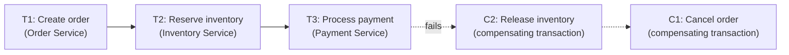

# The Saga pattern, full treatment

Day 2 previewed this as an alternative to XA transactions. This is the complete version — including the detail that separates a textbook answer from a genuinely senior one: sagas give up isolation, and that has real, concrete consequences.

## The one-line hook

> **A saga gives you Atomicity, Consistency, and Durability — but not Isolation. It's ACD, not ACID, and the missing "I" is the single most important thing to understand about how sagas actually behave in production.**

## Why sagas exist

Day 2's error handling material already covered why XA/two-phase commit doesn't scale well — real coordination overhead, tight coupling between participating resources, and a requirement that every resource actually support the XA protocol. A **saga** takes a fundamentally different approach: instead of trying to make a distributed transaction behave like a local one, it breaks a business transaction into a **sequence of local transactions**, each owned by a single service, each committing independently and durably on its own — with **no distributed lock, no global coordinator holding everything open** while it waits on the slowest participant.

## The mechanics — local transactions plus compensation

If a later step fails, the saga runs **compensating transactions** for every already-completed step, in **reverse order**, restoring the system to a consistent (though not identical-to-before) state.

**Memorable hook, worth having ready as a live analogy**: *"Booking a vacation — you book a flight, then a hotel, then a rental car. If the rental car is unavailable, you cancel the hotel, then cancel the flight, unwinding in reverse. Nobody 'rolled back' the flight booking in a database sense — you issued a new, separate cancellation."*

That last point matters precisely: a **compensating transaction is not a true rollback**. You can't un-charge a credit card by reverting a database row — you issue a **refund**, a new forward-moving operation that semantically cancels the earlier one's effect.

## The missing Isolation — the "semantic lock" problem

In a normal ACID transaction, **isolation** means your transaction never sees another transaction's half-finished work. Sagas don't have this guarantee at all — because each step commits independently and immediately, **other processes can observe a saga's intermediate, partially-completed state** while it's still in flight.

**A concrete example worth having ready**: Saga A reserves 1 unit of inventory for order #1001 (step 2 of 3, payment not yet processed). Saga B, running concurrently, checks available inventory for order #1002 and sees the *already-reduced* count from Saga A's in-flight reservation. If Saga A's payment then fails and it compensates (releasing the reservation), Saga B may have already made a decision — accepted or rejected an order — based on a stock count that was never actually final.

**The mitigation, worth naming**: **semantic locking** — explicitly marking a record as "pending" during saga execution (rather than fully committing it as final), so concurrent processes can detect the pending state and defer or handle it deliberately, rather than treating an in-flight saga's intermediate state as ordinary committed fact.

**Memorable hook:** *"Sagas don't just relax isolation as an implementation detail — they remove it as a guarantee entirely. If your design assumes no one can see a saga's in-between state, that assumption is simply false, and semantic locking is the deliberate patch for it."*

## The pivot transaction — the point of no return

Every well-designed saga has a **pivot transaction**: the dividing line between the reversible and irreversible parts of the flow. Steps *before* the pivot are genuinely compensatable — cleanly undoable. The pivot itself is either the **last undoable step**, or the **first retryable one** — and everything *after* the pivot is handled by **retrying until it succeeds**, never by compensating, because it can't be cleanly undone (you can't take back an email that's already been sent).

**Design guidance worth stating directly**: deliberately move the pivot transaction **as late as possible** in the saga, and place genuinely non-compensatable actions (sending a confirmation email, for instance) as the very last step, after the pivot — never sandwiched in the middle where a later failure would need to "compensate" for something fundamentally uncompensatable.

## Forward recovery vs. backward recovery — the modern best practice

| | Forward recovery (retry) | Backward recovery (compensate) |
|---|---|---|
| **Use for** | Transient failures — network glitches, temporary unavailability | Permanent failures — business rule violations (insufficient inventory, credit limit exceeded), invalid data |
| **Why** | Many transient issues resolve on their own; retrying is simpler than compensating | A permanent failure will just fail identically on retry — compensating is the only real option |

**Current best practice is hybrid, not either/or**: retry transient-looking failures with exponential backoff first, and only fall back to compensation once retries are exhausted or the failure is clearly permanent — the same retry-before-give-up discipline from Day 2's redelivery policy material, now applied at the saga-step level instead of the individual-message level.

## Compensating transactions must be idempotent and retryable

A compensating transaction can itself be retried — if it fails partway, or the system crashes mid-compensation — so it must produce the same result whether it runs once or multiple times. A refund implementation that blindly adds the refund amount every time it's called is broken; one that checks "has this saga's refund already been recorded?" before acting is correct — precisely Day 2's idempotent consumer discipline, applied to compensation logic specifically.

## Saga state must survive a restart

Whichever coordination style is used (orchestration or choreography, covered on the next page), the saga's current progress has to be **persisted**, not held only in memory — an orchestrator keeps saga state in its own database so it can resume correctly after a crash; a choreographed saga typically relies on each participating service's own durable state (often via event sourcing techniques) to reconstruct where things stand.

## Real-world examples

1. **An order-processing saga for a TnD Microservices-style decomposed platform** — order creation, inventory reservation, payment processing, each a separate service's local transaction, compensating in reverse if payment fails — a direct, natural extension of that platform's actual Kafka/JMS-based service decomposition.
2. **The semantic lock problem, with the concrete inventory example above.** This is genuinely the detail most candidates won't think to mention — bringing it up unprompted is a strong signal of real depth, not memorized pattern names.
3. **Placing a non-compensatable action (a confirmation email) deliberately after the pivot transaction** in a saga design — a specific, concrete design decision that shows you understand *why* pivot placement matters, not just that the term exists.
