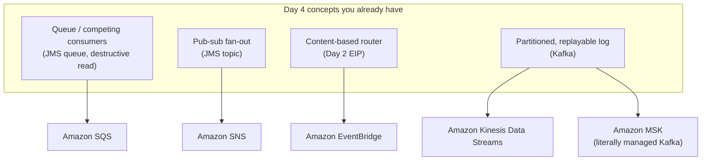
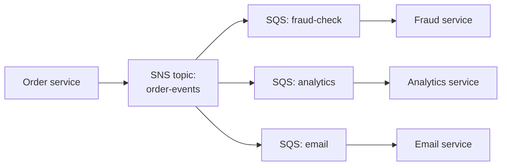

# AWS-native messaging — SQS, SNS, EventBridge, Kinesis, MSK

This page is the bridge between Day 4 and Day 6. Everything you've learned today — queue vs topic semantics, destructive reads vs retained logs, partitions, consumer groups, DLQs — already exists in AWS under different names. An AWS interviewer who has heard you talk fluently about Kafka all day will ask exactly one follow-up: *"So on AWS, which service would you actually pick, and why?"* This page makes that answer automatic.

## The one-line hook

> **Don't pick the service first — name the semantics first: queue, fan-out, router, or replayable log. Once you've said the semantics out loud, the AWS service names itself.**

## The whole page in one mapping

**Memorable hook:** *"SQS and SNS are the JMS queue and topic reborn as serverless. Kinesis and MSK are the Kafka log. EventBridge is Day 2's content-based router sold as a managed service."*

## SQS — the queue, with the destructive read you already understand

**Amazon SQS (Simple Queue Service)** is the competing-consumers work queue: each message is delivered to one consumer, and a successfully processed message is deleted — the same **destructive read** model as the JMS queues on the ActiveMQ/IBM MQ page, which means **no replay**, ever.

- **Visibility timeout** replaces the JMS acknowledge/redelivery cycle: when a consumer receives a message, it becomes invisible to other consumers for the timeout period; if the consumer deletes it in time, it's gone — if not (crash, timeout), it reappears for redelivery. Set it longer than your worst-case processing time, or you'll process messages twice by design.
- **Standard vs FIFO**: Standard queues give at-least-once delivery, best-effort ordering, and near-unlimited throughput. FIFO queues give strict ordering **per message group ID** (the direct analog of Kafka's per-key partition ordering) and deduplication within a 5-minute window — at the cost of a throughput ceiling.
- **DLQ is built in**: `maxReceiveCount` on a redrive policy is exactly the redelivery-then-park pattern from the DLQ page — AWS just made it a checkbox.

**Memorable hook:** *"SQS's visibility timeout is a lease, not an ack — 'this message is mine for 30 seconds; if I go silent, put it back.'"*

## SNS — the topic, and the fan-out pattern that makes it durable

**Amazon SNS (Simple Notification Service)** is push-based pub-sub: every subscriber gets every message — the JMS topic model. But SNS delivery to a flaky subscriber is fire-and-retry, not a durable log, so the canonical production pattern is **SNS → SQS fan-out**: one SNS topic delivering into one SQS queue *per consumer*, giving each consumer its own durable, independently-drained buffer.

This is precisely Kafka's "one topic, N consumer groups" pattern rebuilt from serverless parts — each SQS queue plays the role of one consumer group's offset. **Subscription filter policies** let each queue receive only matching messages, a first taste of content-based routing.

**Memorable hook:** *"SNS + one SQS queue per consumer = Kafka's consumer groups, assembled from Lego. Each queue is a consumer group's cursor."*

## EventBridge — Day 2's content-based router as a managed service

**Amazon EventBridge** is an event **bus** with **rules**: every event is matched against rule patterns on its *content* (source, detail-type, any payload field), and matching events are routed to targets (Lambda, Step Functions, SQS, another bus, an API). That is the **Content-Based Router EIP from Day 2**, verbatim — plus three things Camel never gave you for free: native events from nearly every AWS service, direct SaaS integrations, and clean **cross-account** event routing.

The honest trade-offs to say out loud: EventBridge has **higher latency and lower throughput** than SQS/Kinesis, and while it offers an archive-and-replay feature, replay re-injects events into the bus — it is **not** a consumer-controlled offset rewind like Kafka. EventBridge is for *routing and integrating*, not for high-volume stream processing.

**Memorable hook:** *"EventBridge is a router, not a firehose — pick it for 'send the right event to the right place,' never for 'move a million events a minute.'"*

## Kinesis vs MSK — two answers to "I want the Kafka model on AWS"

Both are partitioned, ordered, **retained, replayable logs** — the model from this morning's Kafka internals page. The translation table is worth memorizing because it lets you transfer every piece of Kafka knowledge in one move:

| Kafka concept | Kinesis Data Streams equivalent |
|---|---|
| Topic | Stream |
| Partition | Shard |
| Partition key (per-key ordering) | Partition key (per-shard ordering) |
| Offset | Sequence number |
| Consumer group | KCL application (checkpoints to a DynamoDB table) |
| Consumer group rebalancing | KCL lease-based shard assignment |
| Retention + replay | Retention (24 h default, extendable) + replay from any sequence number |
| Kafka Streams | Amazon Managed Service for Apache Flink |
| Kafka Connect | MSK Connect / Kinesis Data Firehose (for delivery to S3, etc.) |

**Amazon MSK (Managed Streaming for Apache Kafka)** is not an analog — it **is** Kafka, with AWS running the brokers and control plane. Every internals detail from today (ISR, acks, consumer groups, compaction, MirrorMaker) applies unchanged.

**The decision between them:**

| Signal | Pick |
|---|---|
| Existing Kafka code, Kafka Streams apps, Kafka Connect / **Debezium CDC** pipelines (today's outbox pattern!), cross-cluster MirrorMaker DR | **MSK** — the ecosystem is the point |
| Greenfield on AWS, want serverless scaling, IAM-native auth, zero broker/partition ops | **Kinesis** — the operations story is the point |
| Need log compaction, exact Kafka semantics, or portability off AWS later | **MSK** |
| Modest team, no Kafka operational experience, AWS-only future | **Kinesis** |

Note the outbox-pattern connection explicitly in an interview: Debezium runs on Kafka Connect, so a CDC/outbox architecture on AWS points strongly toward **MSK + MSK Connect** — that one sentence links three pages of today's material to the employer's platform.

**Memorable hook:** *"MSK when the Kafka ecosystem is the point; Kinesis when not running Kafka is the point."*

## The decision framework — semantics first, service second

| You need | Semantics | Service |
|---|---|---|
| Decouple two services with a durable work queue, competing consumers | Queue (destructive read) | **SQS** |
| One event, several independent consumers, each with its own durable buffer | Fan-out | **SNS → SQS fan-out** |
| Route events by content to many targets, react to AWS service events, integrate SaaS or cross-account | Router | **EventBridge** |
| High-throughput ordered stream, replay, multiple readers re-reading history | Replayable log | **Kinesis** |
| The above, plus existing Kafka code/ecosystem (Streams, Connect, Debezium) | Replayable log (Kafka-native) | **MSK** |

## Real-world examples

1. **Re-platforming the TnD Microservices platform's Kafka layer onto AWS** — the realistic answer is MSK, not Kinesis: the platform already had Kafka producer/consumer code and Kafka-based patterns, and MSK preserves all of it while removing broker operations. Being able to argue *against* Kinesis here, despite it being "more AWS-native," is a senior answer — it shows you weigh migration cost, not just service brochures.
2. **The nbn iB2B platform's guaranteed-delivery B2B flows mapped to AWS** — point-to-point, ordered, no-duplicate transaction processing maps to **SQS FIFO** (message group ID = trading partner, deduplication window absorbing gateway retries), a direct translation of the WMQ/AMQ semantics you actually ran in production.
3. **A single order event feeding fraud detection, analytics, and email** — on Kafka this was one topic with three consumer groups (the intellectual core of the MQ-vs-Kafka page); on serverless AWS it's one SNS topic fanning out to three SQS queues. Explicitly narrating "same pattern, different building blocks" is the cross-page connection an interviewer remembers.
