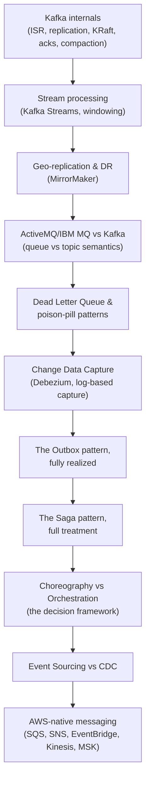

# Day 4 — Messaging & Event-Driven Architecture

## Why this day matters

Your resume lists Kafka and JMS across multiple projects (TnD Microservices, and the WMQ/AMQ stack from the nbn iB2B platform), and Day 2 already opened the door on choreography, orchestration, and the outbox pattern without going deep. Today closes that door properly — an interviewer who noticed those previews will expect you to go all the way down this time:

> "You mentioned the outbox pattern on Day 2's material — walk me through how it's actually implemented end to end. ...And if a saga fails on step 4 of 5, what actually happens? Walk me through it."

Today gives you both answers cold, plus the full Kafka internals depth a senior interviewer will expect given how central it is to your project history.

## The mental model for the whole day

Today climbs from **Kafka's own internals**, out through **its operational extensions** (streaming, geo-replication), across to **where it sits relative to traditional MQ brokers**, into **reliability patterns** (DLQ), down into **the mechanism that actually implements reliable cross-service data propagation** (CDC → Outbox), and up into **the two biggest distributed-transaction patterns** (Saga, and the choreography/orchestration decision that governs it) — then closes by **mapping every one of those semantics onto the AWS-native services** (SQS, SNS, EventBridge, Kinesis, MSK) the interviewing employer will actually expect you to reach for.

## Today's pages (10-hour day)

| # | Page | Approx. time |
|---|---|---|
| 1 | [Kafka internals deep dive](01-kafka-internals.md) | 80 min |
| 2 | [Kafka stream processing fundamentals](02-kafka-stream-processing.md) | 50 min |
| 3 | [Kafka geo-replication & multi-datacenter DR](03-kafka-geo-replication-dr.md) | 40 min |
| 4 | [ActiveMQ/IBM MQ vs Kafka](04-activemq-ibmmq-vs-kafka.md) | 50 min |
| 5 | [Dead Letter Queue & poison-pill patterns](05-dlq-poison-pill-patterns.md) | 40 min |
| 6 | [Change Data Capture (CDC) deep dive](06-change-data-capture.md) | 55 min |
| 7 | [The Outbox pattern, fully realized](07-outbox-pattern-realized.md) | 45 min |
| 8 | [The Saga pattern, full treatment](08-saga-pattern-full-treatment.md) | 70 min |
| 9 | [Choreography vs Orchestration — the decision framework](09-choreography-vs-orchestration.md) | 45 min |
| 10 | [Event Sourcing vs CDC](10-event-sourcing-vs-cdc.md) | 35 min |
| 11 | [AWS-native messaging — SQS, SNS, EventBridge, Kinesis, MSK](11-aws-native-messaging.md) | 45 min |
| 12 | [Interview Q&A drill](12-interview-qa.md) | 70 min, done cold, last |

The AWS mapping page is deliberately lighter than its slot suggests — it introduces almost no new mechanics, only new names for semantics the earlier pages already built, so it can flex into the hour-10 buffer if the day runs long.

## Real-world anchor for today

The **TnD Microservices** platform (Kafka, JMS, Docker, Kubernetes, AWS) is your primary anchor again today, especially for Kafka internals and stream processing. The **nbn iB2B platform's WMQ/AMQ stack** is the direct anchor for the ActiveMQ/IBM MQ comparison page — you're not reasoning abstractly about legacy messaging, you built on it. Where a topic reaches into newer territory (CDC, Saga, choreography/orchestration frameworks), it connects back to the same TnD decomposition story that's carried Days 1–3.
