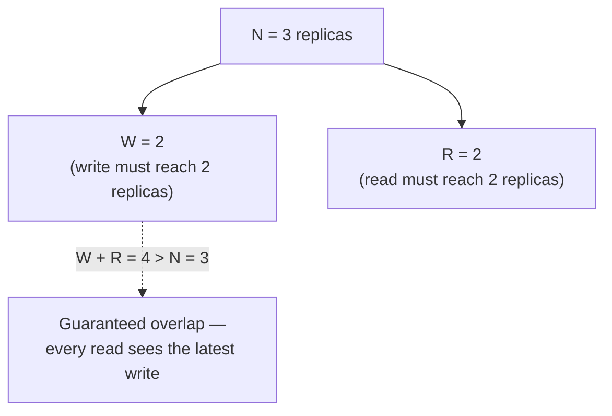

# CAP theorem & data consistency patterns

## The one-line hook

> **CAP theorem isn't a permanent architectural choice — it's about what you do the instant a network partition actually happens. Outside of a partition, you can have both consistency and availability; CAP only forces a choice during the failure itself.**

Getting this framing right immediately is worth more than reciting the theorem's three letters — it's the single most common oversimplification an interviewer will be listening for.

## The three properties, precisely

| | What it means |
|---|---|
| **Consistency (C)** | Every read receives the most recent write, or an error — never stale data |
| **Availability (A)** | Every request receives a (non-error) response — but not necessarily the most recent data |
| **Partition tolerance (P)** | The system continues operating despite network partitions between nodes |

**The real insight**: partition tolerance isn't really optional in any genuine distributed system — networks *will* partition eventually, whether from a switch failure, a region outage, or a misconfigured firewall rule. So CAP theorem's real-world content boils down to: **when a partition happens, do you choose Consistency or Availability?** — not a three-way pick, a two-way one, and only during the partition itself.

**Memorable hook:** *"CAP isn't 'pick 2 of 3' forever — it's 'partition tolerance is mandatory, so pick your fallback between C and A for the moments things actually break.'"*

## PACELC — the more complete, more sophisticated version

CAP only describes behavior *during* a partition. **PACELC** extends it: **if Partitioned (P), choose between Availability (A) and Consistency (C); Else (E), choose between Latency (L) and Consistency (C).** This captures a tradeoff CAP alone misses entirely — **even with no partition happening at all**, a system still has to decide whether to wait for full replication (higher consistency, higher latency) or respond immediately from a potentially-stale local replica (lower latency, weaker consistency). Bringing up PACELC unprompted is a genuine signal you understand the theory beyond the textbook one-liner.

## Strong vs. eventual consistency

| | Strong consistency | Eventual consistency |
|---|---|---|
| **Guarantee** | Every read reflects the most recent write, immediately | Replicas converge eventually — a read shortly after a write may return stale data |
| **Cost** | Requires coordination between replicas before acknowledging, adding latency | Lower latency, higher availability — no coordination wait |
| **Fits** | Financial balances, inventory counts, anything where stale reads cause real business harm | Product catalogs, social feeds, anything where a few seconds of staleness is genuinely harmless |

## Quorum-based consistency — the practical middle ground

Rather than a binary strong/eventual choice, many distributed data stores (Cassandra, DynamoDB) let you **tune** consistency via quorum math: with **N** total replicas, a **write quorum (W)** and **read quorum (R)** chosen such that **W + R > N** mathematically guarantees every read overlaps with the most recent write on at least one replica — giving you strong consistency without requiring *all* N replicas to participate in every operation.

**Memorable hook:** *"W + R > N is just pigeonhole logic — if your write touched more than half the replicas and your read checks more than half, they're mathematically guaranteed to share at least one replica in common."*

Tuning W and R lets you deliberately trade off: lower W for faster writes at higher read cost, lower R for faster reads at higher write cost — a genuinely tunable dial, not a fixed strong-vs-eventual binary.

## Intermediate consistency models worth naming

- **Read-your-writes consistency**: a specific user always sees their *own* writes immediately, even if other users might briefly see stale data — a common, pragmatic compromise for user-facing applications.
- **Causal consistency**: operations that are causally related (a comment that references a post) are seen in the correct order by everyone, even if unrelated operations might be seen in different orders by different observers.

## Real-world examples

1. **Kafka's `acks=all` plus ISR, from Day 4, is a concrete, already-covered instance of this exact tradeoff.** Choosing `acks=all` is choosing consistency (and accepting latency) over the fastest-possible availability — a direct, ready-made cross-day answer if asked for a real example of a CAP/PACELC tradeoff in production.
2. **Eventual consistency for a Kong customer's cached API response or product catalog view versus strong consistency for a Thai bank's account balance.** A defensible, business-requirement-driven tradeoff conversation — staleness is genuinely harmless in one case and genuinely unacceptable in the other.
3. **AWS DynamoDB's own tunable consistency** — offering both eventually consistent reads (cheaper, lower latency) and strongly consistent reads (more expensive, higher latency) as an explicit API-level choice — directly relevant given this is an AWS interview, and a preview of Day 6's AWS-specific material.
