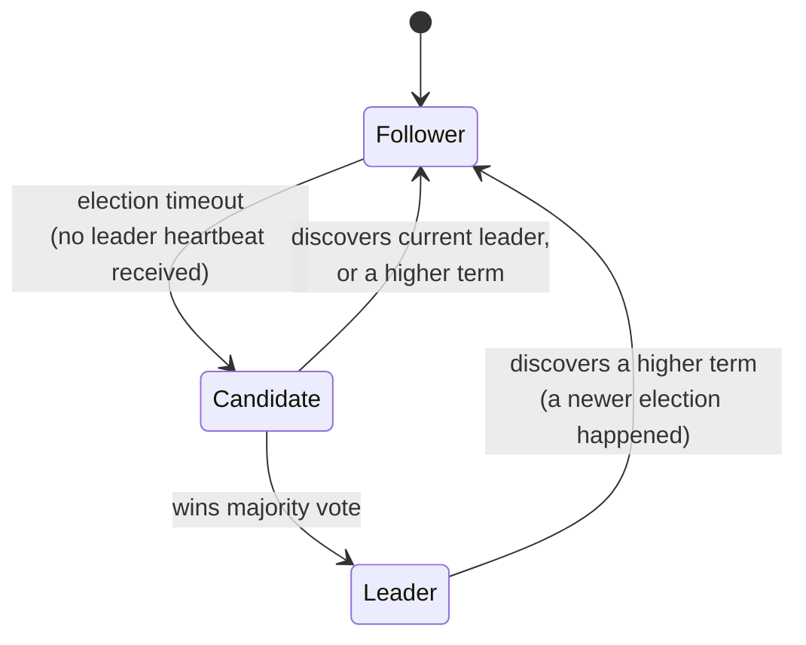

# Consensus algorithms — Raft/Paxos deep dive

This page unifies something that's been scattered across the whole week: Day 1's etcd, Day 4's Kafka KRaft controller quorum, and the ISR leader election also from Day 4 all rest on the same underlying theoretical problem. This page is where that problem finally gets a name and a mechanism.

## The one-line hook

> **Consensus is the problem of getting a group of unreliable, distributed nodes to agree on a single value — and it's the actual mechanism underneath leader election, replicated logs, and distributed locks, whether or not you ever touch the algorithm directly.**

## The problem, precisely

In a distributed system, nodes can crash, messages can be delayed or lost, and networks can partition — yet many things a system needs to do (electing a leader, agreeing on the next entry in a replicated log, granting an exclusive lock) require every participant to agree on **one single answer**, even in the face of that unreliability. **Consensus algorithms** are the formally-proven mechanisms that guarantee this agreement is possible, safely, as long as a majority of nodes are healthy and can communicate.

## Paxos — the original, and why it's notoriously hard

**Paxos** (Leslie Lamport) was the first widely studied consensus algorithm, built around three roles — **Proposers** (suggest values), **Acceptors** (vote on proposals), **Learners** (find out what was agreed) — using a two-phase protocol: **Prepare/Promise** (a proposer asks acceptors to promise not to accept older proposals), then **Accept/Accepted** (the proposer's value is actually voted on and committed once a majority accepts). It's correct and foundational, but genuinely difficult to reason about and implement correctly — widely acknowledged even by practitioners, which is exactly why an alternative was eventually built specifically to be more approachable.

## Raft — designed explicitly to be understandable

**Raft** provides the same safety guarantees as Paxos, but was deliberately designed around a more intuitive mental model:

- **Followers** passively receive updates from a leader.
- If a follower doesn't hear from a leader within a randomized election timeout, it becomes a **Candidate** and requests votes from the rest of the cluster.
- A candidate that wins a **majority** of votes becomes the **Leader**, and starts sending periodic heartbeats to prevent new elections from triggering.
- The leader handles all log replication — followers simply replicate whatever the leader tells them, in order.

**Memorable hook:** *"Raft's whole design philosophy is 'a human should be able to draw this state machine from memory' — which is exactly the three-box diagram above."*

### Terms — Raft's logical clock

Every election increments a **term** number, which acts as a logical clock — any message carrying an outdated term is automatically rejected, which is precisely how Raft prevents a stale, previously-partitioned leader from causing conflicting state once it reconnects to the cluster. A node encountering a higher term than its own immediately reverts to follower state, deferring to whatever more recent election has already happened.

## The majority quorum requirement — the same math, one more time

Both Paxos and Raft require a **majority** of nodes to agree before anything is considered committed — exactly the same quorum mathematics from the previous page's W+R>N discussion, just applied specifically to leader election and log commitment rather than general reads and writes. This is the actual underlying reason behind every "why does etcd/Kafka/a consensus cluster need an odd number of nodes" answer given so far this week: a 3-node cluster tolerates 1 failure while still having a clear majority (2 of 3); a 5-node cluster tolerates 2 (3 of 5); a 4-node cluster still only tolerates 1 failure for a higher cost, since majority of 4 is 3, no better than majority of 3.

## Where this week already used consensus, made explicit

| Where | Algorithm | Precise detail worth having |
|---|---|---|
| **Day 1 — etcd** | Raft | etcd's entire strong-consistency guarantee for Kubernetes cluster state rests on Raft-based leader election and log replication |
| **Day 4 — Kafka's KRaft controller quorum** | Raft | The controller quorum that replaced ZooKeeper uses Raft specifically for **metadata** consensus |
| **Day 4 — Kafka's partition leader election (ISR)** | **Not** Raft | Worth being precise here — Kafka's per-partition leader election among In-Sync Replicas is Kafka's own, lighter-weight mechanism, distinct from the Raft-based *metadata* consensus KRaft handles. Conflating the two is a subtle, catchable mistake. |

**Memorable hook:** *"KRaft uses Raft for agreeing on cluster metadata. ISR-based partition leader election is a separate, Kafka-specific mechanism for agreeing on which replica leads a given partition. Same underlying quorum philosophy, two genuinely different mechanisms — don't flatten them into one."*

## Where an architect needs this without implementing it

Most engineers never implement Raft or Paxos directly — they use systems built on top of it. The practical, architect-level takeaway is knowing **when a design needs a consensus-backed coordination service at all**: a distributed lock (via etcd or ZooKeeper) to guarantee only one instance of a singleton scheduled job runs across a horizontally-scaled deployment is a common, concrete real-world use — and knowing that a naive "just run two instances with a flag" approach doesn't actually provide that guarantee the way a real consensus-backed lock does.

## Real-world examples

1. **Explicitly unifying Day 1's etcd Raft and Day 4's Kafka KRaft/ISR material** into one coherent answer — a strong response to "explain consensus algorithms," since it shows the whole week connecting rather than three isolated facts.
2. **Using an etcd or ZooKeeper-based distributed lock for a singleton scheduled job** on a horizontally-scaled Kubernetes deployment, ensuring only one pod actually executes a given scheduled task even with multiple replicas running — a genuinely common, practical application.
3. **Correcting a customer's assumption that a 2-node "HA" database setup is resilient**, explaining precisely why it isn't — a 2-node cluster has no way to achieve a clear majority if the two nodes disagree or lose contact, unlike a proper 3-node quorum-based setup — a valuable, concrete architecture correction directly grounded in this page's math.
