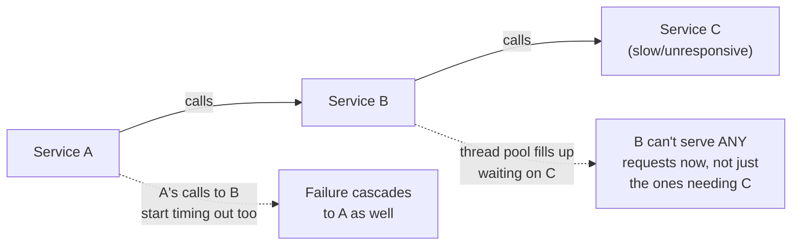
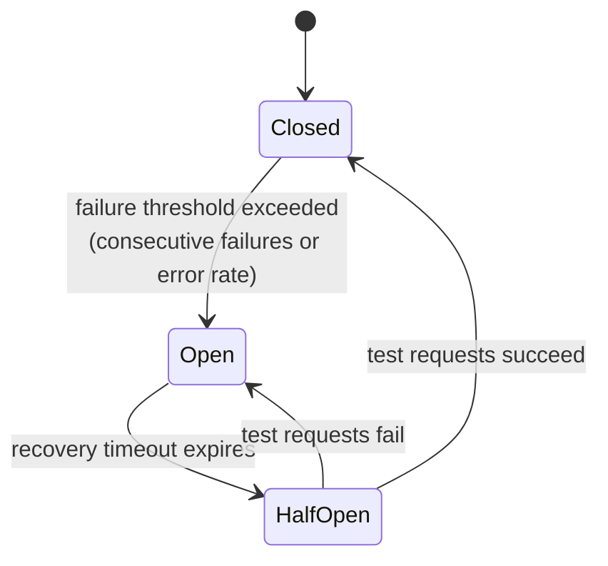

# Circuit breaker pattern deep dive

## The one-line hook

> **A circuit breaker is a deliberate, explicit choice to trade consistency for availability — the direct, concrete application of the CAP/PACELC tradeoff from earlier today, expressed as a single, well-known pattern.**

## The cascading failure problem it solves

Without protection: Service A calls B, which calls C. If C becomes slow or unresponsive, requests pile up inside B waiting on responses from C. B's own thread pool fills up with these stuck requests — and once that pool is exhausted, **B can't serve any requests at all**, including ones that never needed C in the first place. A's calls to B now start timing out too. One slow dependency has cascaded into a system-wide outage.

## The three states, precisely

| State | Behavior |
|---|---|
| **Closed** | Normal operation — requests flow through, failures are counted |
| **Open** | Requests **fail immediately**, without even attempting the call — no waiting, no thread tied up |
| **Half-Open** | After a timeout, a **limited number** of test requests are allowed through to check whether the dependency has recovered |

**Memorable hook:** *"Closed is normal traffic. Open is 'don't even bother asking, I already know the answer is no.' Half-Open is cautiously knocking on the door again after a while to see if anyone's home yet."*

## Why this is a CAP/PACELC tradeoff, made concrete

When the circuit opens, the caller gets an **immediate response** — a fast failure or a fallback — rather than waiting for what might eventually be a correct, consistent answer from the struggling dependency. That's **choosing availability over consistency**, the exact tradeoff from the CAP theorem page, just expressed as an application-level pattern instead of a database replication decision. Being able to draw this connection explicitly, unprompted, is a stronger answer than describing the circuit breaker in isolation.

## Reference implementations worth naming

- **Netflix Hystrix** — the pattern's most famous popularizer, built specifically because a single slow dependency (in Netflix's case, a recommendation service) could threaten to take down their entire streaming platform. Hystrix is now considered legacy/in maintenance mode, but remains the canonical reference case study.
- **Resilience4j** — the modern, actively maintained Java standard, offering circuit breakers plus the complementary bulkhead, retry, and rate limiter patterns covered on the next few pages, all as a cohesive library.
- **Envoy's built-in circuit breaking** — implemented at the **infrastructure layer**, inside the proxy itself, rather than in application code — meaning a service mesh (Day 3's material, revisited fully later today) can enforce circuit breaking consistently across every service without each team hand-implementing it independently.

## Real production tuning considerations

- **Threshold tuning is a genuine tradeoff.** Too aggressive (tripping on a handful of normal, transient blips) unnecessarily reduces throughput and availability of a dependency that was actually fine. Too lenient (requiring too many failures before tripping) fails to protect the caller fast enough, letting the cascading failure problem happen anyway before the breaker engages.
- **Circuit breaker state transitions are a first-class operational metric**, not an implementation detail — monitoring open/close events and correlating them with error rates is the direct, practical way to diagnose whether a production incident is actually a circuit breaker doing its job correctly, or a symptom of a threshold that's miscalibrated in either direction.

## Real-world examples

1. **A slow legacy backend call cascading through a TnD Microservices-style decomposition**, directly relevant to your Marlo integration background — a legacy WebSphere or Amdocs-adjacent system responding slowly is exactly the kind of dependency a circuit breaker with a sensible fallback (cached data, a degraded response) would protect against.
2. **Netflix's own Hystrix story** — a slow recommendation service triggering the circuit to open, falling back to cached or generic "trending" content instead of a blank screen or a cascading outage — a well-known, credible, specific case study worth being able to narrate confidently, not just name.
3. **Envoy implementing circuit breaking at the infrastructure layer**, directly connecting this page both backward to Day 3's Istio/Envoy material and forward to this same day's Service Mesh Resilience Patterns page — a clean demonstration of the whole week's material actually interlocking.
