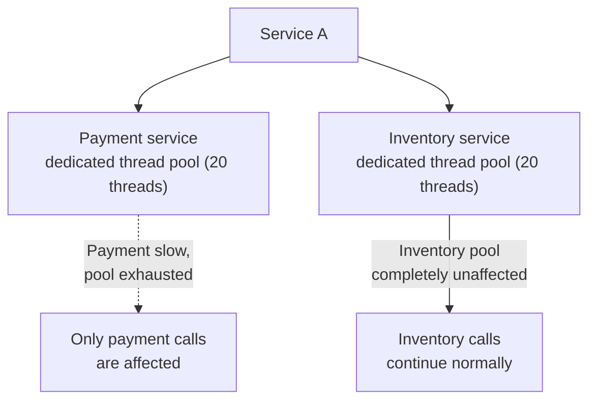
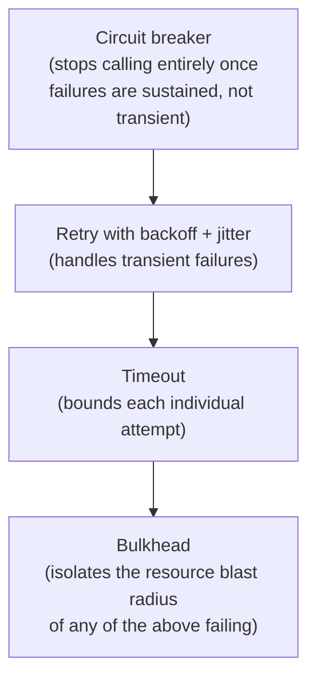

# Bulkhead, timeout & retry patterns

Circuit breakers get most of the attention, but they don't work in isolation — these three patterns are what actually make a circuit breaker's failure counting meaningful in the first place.

## The one-line hook

> **Timeout bounds a call. Retry handles a transient failure within that bound. Bulkhead limits how much of the system one failing dependency can drag down. Circuit breaker is what stops the whole cycle once failures stop being transient.**

## Bulkhead — isolating the blast radius

Named after a ship's watertight compartments — if the hull is breached, only that one compartment floods, and the ship stays afloat. Applied to software: **isolate resources (thread pools, connection pools) per dependency**, so a slow or failing payment service exhausting *its own* dedicated pool has zero effect on the completely separate pool serving inventory calls.

**Two implementation styles worth distinguishing:**

- **Thread pool isolation** — each dependency gets its own dedicated thread pool. Stronger isolation (a stuck call literally cannot consume threads meant for something else), at the cost of more overhead (context switching, more total threads to manage).
- **Semaphore isolation** — a lighter-weight counting semaphore limits how many concurrent calls to a dependency are allowed, without dedicating separate threads. Less overhead, but weaker isolation, since calls still share the same underlying thread pool.

**Memorable hook:** *"Thread pool isolation gives each dependency its own lifeboat. Semaphore isolation just limits how many people can be near the railing at once — cheaper, but not the same guarantee."*

## Timeout — the prerequisite everything else depends on

**No service call should ever wait indefinitely.** A maximum wait time, after which the call is aborted and a fallback or error triggered, is a **prerequisite** for a circuit breaker to function correctly at all — if calls can hang forever without ever technically "failing," the circuit breaker has no reliable failure signal to count in the first place. Timeout is the pattern that makes every other pattern on this page actually measurable.

## Retry — but only with backoff and jitter

Retrying a **transient** failure (a momentary network blip) is often the right move — but a naive retry, fired immediately and identically by every affected client, recreates exactly the overload that caused the original failure, at potentially even higher volume. Two refinements matter:

- **Exponential backoff** — each retry waits progressively longer (the same concept from Day 2's Camel redelivery policy, now applied to service-to-service calls generally).
- **Jitter** — adding **randomness** to the backoff delay, so that many clients retrying after the same failure don't all retry at exactly the synchronized same moment. Without jitter, a large batch of clients that all failed at once will all retry at once too, in near-perfect lockstep — recreating the load spike that caused the failure to begin with. This specific failure mode has a name: a **retry storm** (or thundering herd).

**Memorable hook:** *"Backoff without jitter is a synchronized crowd all trying the door again at exactly the same second. Jitter is what breaks that synchronization apart."*

### Retry budgets — capping the damage

A **retry budget** caps the total proportion of a system's traffic that's allowed to be retries at any given time (commonly something like "retries can never exceed 10% of total request volume") — a system-wide circuit breaker for the retry mechanism itself, preventing a struggling dependency's retries from amplifying its own overload further.

### Idempotency — the non-negotiable precondition

Directly reused from Day 2 and Day 4: retrying a **non-idempotent** operation is genuinely dangerous — a retried payment charge that actually succeeded the first time (but whose acknowledgment was lost) can double-charge a customer. Every retryable operation needs to be safe to execute more than once.

## How the layers actually stack together

**Memorable hook:** *"These aren't four competing patterns you choose between — they're four layers that wrap each other, each one handling a different failure mode the others don't cover."*

## Real-world examples

1. **Amazon's production use of bulkhead isolation during high-traffic sales events** — a well-documented, credible real case study: isolating services so a surge in one doesn't exhaust resources needed by unrelated services, directly relevant to any conversation about designing for Black Friday-style traffic spikes.
2. **A retry storm causing a secondary outage** — a realistic, valuable "the fix made things worse" incident story, showing genuine production maturity around exactly the jitter/retry-budget nuance most candidates skip past.
3. **Uber's documented use of strict timeouts and retries** for ride booking and pricing reliability — a credible, named case study for exactly this pattern combination applied to a real, familiar consumer product.
