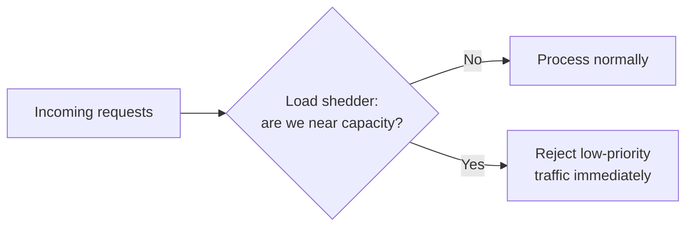

# Load shedding & backpressure

## The one-line hook

> **Circuit breakers and bulkheads protect a service from a failing dependency it's calling OUT to. Load shedding protects a service from too much traffic coming IN — a genuinely different problem, at a different point in the request path.**

## Load shedding — proactive rejection before overwhelm

Where a circuit breaker reacts to a downstream dependency already failing, **load shedding acts earlier and proactively** — deliberately rejecting some incoming requests *before* the system's own resources (CPU, memory, connection pools) become exhausted, rather than accepting every request and degrading for everyone once capacity is genuinely overwhelmed.

**The key design decision is prioritization**, not blanket rejection: a well-designed load shedder rejects **lower-priority** traffic first — batch/analytics requests, for instance — to preserve capacity for genuinely critical traffic like checkout or payment processing. This is fundamentally a **business decision**, not a purely technical one — it requires explicit input on what actually matters most when the system can't serve everyone.

**Memorable hook:** *"Circuit breaker protects you from someone else's problem. Load shedding protects everyone else from yours, when you're the one about to fall over."*

## Backpressure — the signal that prevents overwhelm in the first place

**Backpressure**, reused and extended from Day 2's `seda`/`vm` bounded queue material and Day 4's Kafka consumer model, is the general principle of a slow consumer signaling an upstream producer to **slow down**, rather than silently falling further behind or crashing.

**Push vs. pull matters enormously here**: a push-based system (a producer sending as fast as it can, regardless of the consumer's readiness) needs an *explicit* backpressure signaling mechanism bolted on. A **pull-based** system — exactly like Kafka's consumer model from Day 4 — is **naturally backpressure-friendly by design**: the consumer only requests more data when it's actually ready for it, so there's no need for a separate signal telling the producer to slow down; the pull request rate *is* the backpressure signal.

**Memorable hook:** *"Kafka never needed a special backpressure feature bolted on — pulling instead of pushing was backpressure, built into the model from day one."*

## Adaptive concurrency limits — a more sophisticated, current approach

Rather than a fixed, hand-tuned concurrency limit (which is either too conservative most of the time or too permissive during a real spike), **adaptive concurrency limiting** dynamically adjusts the allowed concurrency based on observed latency, using techniques borrowed directly from TCP's own congestion control — **AIMD (Additive Increase, Multiplicative Decrease)**: gradually increase the allowed concurrency while things look healthy, and sharply cut it back the moment latency signals congestion. Netflix's own `concurrency-limits` library is a concrete, named reference implementation of exactly this idea, worth knowing given it directly extends the same TCP-congestion-control thinking into the application layer.

## Where this fits relative to the previous page's patterns

| Pattern | Protects against | Acts at |
|---|---|---|
| Circuit breaker, retry, bulkhead | A dependency you're calling failing or degrading | The **outgoing** call path |
| Load shedding, backpressure | Too much incoming work overwhelming this service itself | The **incoming** request path |

**Memorable hook:** *"Everything from the previous page is about being a good, resilient client. Load shedding and backpressure are about being a good, resilient server — two different halves of the same overall resilience story."*

## Real-world examples

1. **Kong Gateway enforcing load shedding at the edge during a traffic spike**, directly relevant to your current role and Day 3's material — shedding lower-priority API traffic while preserving capacity for a customer's critical transaction endpoints is a realistic, concrete gateway-level configuration conversation.
2. **Kafka's pull-based consumer model as a naturally backpressure-friendly design**, a clean, direct cross-day connection back to Day 4 rather than a newly introduced concept.
3. **A Thai bank prioritizing payment/transaction traffic over reporting and analytics traffic during a load spike** — a defensible, business-informed load-shedding priority scheme, directly relevant given the regulated financial-services context in your background.
