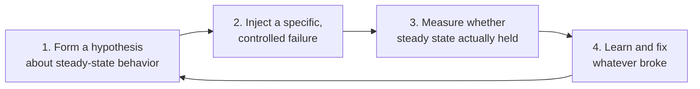

# Chaos Engineering

## The one-line hook

> **An untested circuit breaker is just code that's never been exercised — chaos engineering is the discipline of proving your resilience patterns actually work, on purpose, before a real outage finds out for you.**

## The philosophy shift this represents

Every pattern covered so far today — circuit breakers, bulkheads, fallbacks — is written with an assumption: *when things fail, this code path will run correctly.* But that assumption is usually untested. A fallback method that's never actually executed in production might have its own bug, discovered for the first time during the very outage it was supposed to protect against. **Chaos engineering** flips the posture from *hoping* resilience code works to **deliberately proving it does**, by intentionally injecting failure — killing a pod, throttling CPU, adding network latency, simulating a region outage — into a production or production-like system, on purpose, under controlled conditions.

**Memorable hook:** *"Resilience code you've never actually triggered isn't proven resilience — it's just untested code that happens to be about failure handling."*

## It's disciplined experimentation, not just "break things randomly"

The credible, correct framing borrows directly from the scientific method:

You start with a **hypothesis** — "if the recommendation service dies, users should still see a generic trending list with no visible errors" — then inject exactly that specific failure, measure whether the hypothesis actually held, and fix whatever gap the experiment revealed. This is meaningfully different from randomly destabilizing production for its own sake — it's a controlled, repeatable, falsifiable test of a specific resilience claim.

## Blast radius control — responsible practice, not recklessness

Chaos experiments should start **small and staged**: a single instance, in staging first, during low-traffic periods, with an explicit **abort mechanism** if the experiment starts causing real user-facing harm — only expanding toward broader production experiments once confidence is genuinely earned. This is the detail that separates responsible chaos engineering practice from a reckless "just YOLO it in prod" caricature of the discipline.

## Common failure injection types

| Injection type | What it simulates |
|---|---|
| Instance/pod termination | A node or container crashing unexpectedly |
| Network latency injection | A slow, degraded network path between services |
| Network partition simulation | Two parts of the system losing the ability to communicate |
| CPU/memory throttling | Resource exhaustion under load |
| Dependency failure simulation | A specific downstream call returning errors on demand |
| Region/AZ outage simulation | An entire cloud region or availability zone becoming unavailable |

## Tools worth naming

- **Chaos Monkey** (Netflix) — the original, part of Netflix's broader "Simian Army" of failure-injection tools, randomly terminating production instances specifically to force teams to build systems that treat instance failure as routine, not exceptional.
- **Gremlin** — a commercial chaos engineering platform.
- **Chaos Mesh** — a CNCF, Kubernetes-native chaos engineering tool, directly relevant given the whole week's Kubernetes/OpenShift foundation from Day 1.
- **AWS Fault Injection Simulator (FIS)** — AWS's own native service purpose-built for exactly this discipline. Given this is an AWS interview specifically, being able to name AWS FIS directly — not just chaos engineering in the abstract — is a genuinely strong, current, product-specific detail worth having ready.

## Real-world examples

1. **AWS Fault Injection Simulator (FIS)**, given the direct relevance to an AWS Solutions Architect interview — a specific, current AWS-native answer to "how would you validate resilience on this platform," rather than only naming Netflix's tooling.
2. **Netflix's Chaos Monkey**, a natural continuation of the same Netflix resilience narrative already built up across the circuit breaker and fallback pages earlier today — a coherent, connected story rather than three disconnected facts.
3. **Proposing a chaos engineering exercise for the TnD Microservices platform** to actually validate that its circuit breakers and bulkheads work as designed, before a real production incident tests them for the first time — a genuine, forward-looking architecture recommendation grounded in your own project history.
