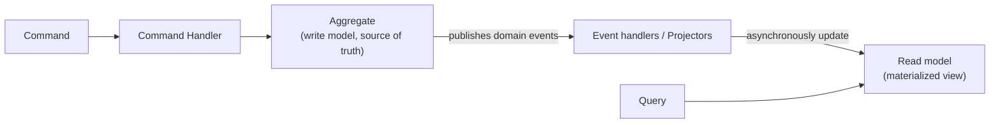

# CQRS, full treatment

## The one-line hook

> **CQRS isn't "use two databases" — it's the recognition that the requirements for changing data and the requirements for reading it are often genuinely different, and forcing one model to serve both means compromising on both.**

## Why CQRS exists

In a traditional CRUD system, one model serves both reads and writes. But the two have genuinely different needs: the **write side** cares about transactional consistency, validation, and business rule enforcement; the **read side** cares about query performance and often needs complex, denormalized views combining data that's normalized and scattered across the write side for good reason. **Command Query Responsibility Segregation (CQRS)** splits these into two separate models, each optimized for what it actually needs to do.

## The command side

A **Command** is a simple, immutable data transfer object, named with an imperative verb (`CreateOrder`, `UpdateAddress`), carrying only the intent and data needed to perform an action — **no business logic lives in the command object itself**. Validation happens in two stages:

- **Syntactic validation** at the API boundary — required fields present, correct types, valid formats — rejected immediately if it fails.
- **Business/domain validation** inside the **command handler**, checked against the current state of the relevant aggregate — this is where real business rules actually live.

## The read side — a "legitimate cache by design"

Read models are typically implemented as **materialized views**: denormalized, precomputed representations shaped around specific questions the application needs to answer, rather than around how the write side happens to be structured. A genuinely useful framing: a CQRS read model is **a cache that's part of the deliberate design**, not an afterthought bolted on for performance — built from the start to answer specific queries efficiently, often combining data from multiple write-side sources into one convenient, denormalized shape.

**Memorable hook:** *"A read model isn't cheating by pre-computing the answer — that's the entire point. It's a cache you designed on purpose, not one you were forced into later because a query got slow."*

## How the two sides actually stay in sync

Event handlers (or **projectors**) subscribe to the events a command produces, and asynchronously update the read models to reflect the change. **This asynchronous update is the primary source of eventual consistency in a CQRS system** — there's a real, if usually brief, window where the write side has changed but the read model hasn't caught up yet. This has a genuine **product/UX consequence worth naming directly**: a user might submit a change and, for a moment, not see it reflected back immediately in a query — the interface needs to be designed with that reality in mind, not just the backend.

## Two implementation variants, worth distinguishing

| | Simple CQRS | Full CQRS |
|---|---|---|
| **Storage** | One shared database, separate command/query code paths on top of it | Genuinely separate read store(s), potentially several specialized ones for different query needs |
| **Consistency** | Strong — reads immediately reflect writes | Eventually consistent — a real propagation delay exists |
| **Complexity** | Lower — a reasonable stepping stone | Higher — real infrastructure and operational cost |
| **When it fits** | You want the *conceptual* separation of commands and queries without paying for full infrastructure separation yet | Read and write scaling needs have genuinely diverged, and reads vastly outnumber writes |

## When CQRS is the wrong choice — just as important to know

- **Strong consistency requirements** — health, safety, or financial-accuracy systems where the delay between a write and its appearance in a read model is genuinely unacceptable.
- **Small or homogeneous datasets** — when read and write patterns are similar and the data model is simple, the separation provides no real benefit, only added complexity.
- **Limited team experience or tight deadlines** — CQRS requires real planning, additional infrastructure, and genuine distributed-systems operational maturity; a team without that experience, under time pressure, will likely pay the complexity cost without capturing the benefit.

**Memorable hook:** *"Knowing when NOT to reach for CQRS is just as strong a signal as knowing how to build it — reflexively applying it everywhere is itself a red flag, not a strength."*

## CQRS does not require Event Sourcing

Worth stating clearly, since the two are frequently conflated: CQRS can be implemented with a **simple, synchronous** read model update, or plain database replication, entirely without a full event-sourced write model. Event Sourcing (next page) is a *natural pairing* with CQRS — the event stream makes an excellent source for building projections — but it's a separate architectural decision, not a required dependency.

## Real-world examples

1. **A denormalized "order summary" read model on the TnD Microservices platform**, combining data from separate Order, Payment, and Inventory services into one fast, purpose-built view by subscribing to each service's events — a natural, concrete extension of that platform's actual event-driven architecture.
2. **Kong's own Vitals analytics feature**, conceptually a read-optimized, purpose-built view layer separate from the live gateway configuration write path — an accessible, product-grounded analogy directly from your current role.
3. **Explicitly declining CQRS for a small, straightforward internal tool** with simple, infrequent reads and writes — a defensible, judgment-driven "when NOT to use it" answer that shows architectural maturity rather than pattern enthusiasm for its own sake.
