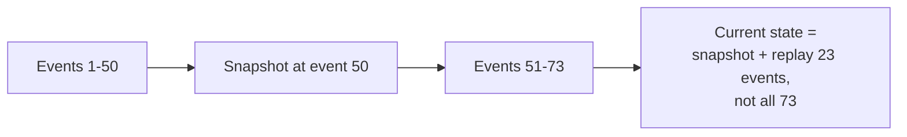

# Event Sourcing, full treatment

Day 4 drew the boundary between Event Sourcing and CDC. This page is the deep dive on the harder half of that comparison — including the genuinely sophisticated details (event ordering, snapshotting, schema evolution) that separate a textbook answer from a senior one.

## The one-line hook

> **In Event Sourcing, current state isn't stored anywhere — it's computed, on demand, by replaying every event that ever happened to that entity, from the beginning (or from a snapshot forward).**

## The event store and aggregates

The **event store** is an append-only log of immutable domain events — conceptually similar to Kafka's own append-only log from Day 4, but explicitly domain-modeled: `OrderCreated`, `PaymentProcessed`, `OrderShipped`, not generic messages. **EventStoreDB** is a specialized, purpose-built database designed specifically around this access pattern.

An **aggregate** (a Domain-Driven Design concept) is the unit that groups related events — an `Order` aggregate accumulates every event that ever happened to that specific order. **Loading an aggregate means replaying its entire event stream from the beginning**, folding each event into state, up to the present moment.

## Snapshotting — the practical performance fix

For a long-lived aggregate that's accumulated thousands of events, replaying the **entire** history every single time it's loaded becomes genuinely slow. The standard mitigation: take a **snapshot** of the aggregate's state periodically (a common rule of thumb is every 50 events), so loading only needs to replay events **since the last snapshot**, not from the very beginning.

**Memorable hook:** *"A snapshot is a checkpoint save — you don't replay a video game from the very first frame every time you load it, you load the last save and play forward from there."*

## Event ordering — the genuinely hard problem

Events arriving **out of order** is a normal, expected condition in a distributed system — network retries, multiple partitions (directly recalling Day 4's Kafka partition-ordering material), and asynchronous delivery all make this a real, not theoretical, concern. Three mitigation strategies, in order of increasing robustness:

| Strategy | How it works | Tradeoff |
|---|---|---|
| **Idempotency with versioning** | Every event carries a version number or timestamp; a handler ignores any event older than the state it's already processed | Simple, but requires every consumer to track "what version am I at" |
| **Buffering and reordering** | Briefly buffer incoming events and reorder them by sequence number before processing | Adds real latency and implementation complexity |
| **Design for commutativity** | Design the business logic so that the *order* events arrive in genuinely doesn't change the final outcome | The most robust solution — but not always achievable for genuinely order-sensitive business logic |

**Memorable hook:** *"Versioning tells you an event is stale after the fact. Reordering makes you wait to be sure of the order before acting. Commutativity is the only option where the order never mattered in the first place — but you don't always get to choose that."*

## Schema evolution — "upcasting," not migration

Events are immutable and, in principle, stored forever — but the **shape** of what an event contains will inevitably need to change as the domain model evolves. Rather than migrating years of historical stored events to a new schema (expensive, risky, and arguably a violation of "events are immutable"), the standard pattern is **upcasting**: transforming an old event version into the current format **at read time**, on the fly, leaving the original stored event untouched.

## The genuine benefits — why full Event Sourcing sometimes earns its cost

- **Complete audit trail** — every state change is a permanently recorded event, directly valuable for compliance and dispute resolution in regulated industries.
- **Point-in-time reconstruction** — replaying events up to a specific moment lets you answer "what did this look like at 3pm last Tuesday," not just "what does it look like now."
- **A natural source for CQRS projections** — directly connecting back to the previous page, the event stream is an excellent source for building read-model projections.

## Observability for event-sourced systems — a genuinely current, sophisticated detail

Distributed tracing (full treatment next page) needs special handling for event-sourced systems specifically: a **command handling flow** traces normally, like any synchronous operation — but **event publishing and projection updates happen asynchronously**, sometimes minutes or hours after the original command, and **event replay operations** (rebuilding a projection from historical events) need to be **deliberately flagged** in tracing (an explicit `is_replay: true` attribute, for instance) so replay traces don't get mixed in with real-time production traces, and don't attempt to link back to original trace contexts that may be long expired or simply irrelevant during a replay. This is a specific, current, easy-to-get-wrong detail — and a direct, natural segue into the next page.

## Real-world examples

1. **A financial ledger or banking transaction history system** genuinely needing complete audit trail and point-in-time reconstruction for regulatory compliance — the strongest, most defensible justification for full Event Sourcing given the Thai banking-adjacent context in your background, directly contrasted with Day 4's CDC-plus-Outbox as the pragmatic default for less audit-critical systems.
2. **Snapshotting a long-lived "Customer" or "Account" aggregate** in a telecom or banking context that's accumulated years of events — a concrete, realistic performance scenario grounded in your actual industry background.
3. **The event ordering problem surfacing from Kafka partition-level delivery**, directly recalling Day 4's material on ordering guarantees only holding within a single partition — a strong, specific example of exactly when one of the three ordering mitigation strategies becomes necessary in practice, not just theoretical.
