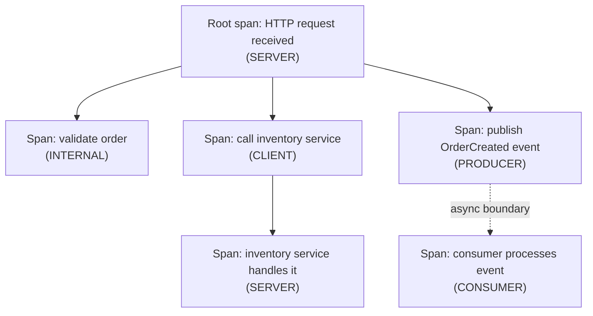

# Distributed tracing & OpenTelemetry

The previous page's note about tracing event-sourced systems was a preview — this page is the full treatment, including the failure mode research flagged as the most common real problem: broken context propagation across exactly the kind of asynchronous boundaries this whole week has been built around.

## The one-line hook

> **A trace is a tree of spans, held together entirely by context propagation — and the moment that propagation breaks across an async boundary, you don't get an error, you just silently get two disconnected traces instead of one.**

## Why distributed tracing exists

In a microservices architecture, a single user request can touch dozens of services. Traditional per-service logging is genuinely disconnected — reconstructing the full journey of one request, or finding exactly where latency or an error actually originated, is nearly impossible from isolated logs alone. **Distributed tracing** solves this by stitching every service's contribution to one request into a single, coherent, end-to-end picture.

## The core data model — trace, span, and span kinds

- A **Trace** is the complete end-to-end journey of one request, identified by a globally unique **Trace ID**.
- A **Span** is a single unit of work within that trace — a name, a start/end time, a unique **Span ID**, and a reference to its **parent span**, which is what makes a trace a genuine **tree**, not a flat list.

**Span Kinds** classify a span's role, and matter directly given this week's material: **CLIENT** (an outgoing request), **SERVER** (a request being handled), **PRODUCER** (a message/event published), **CONSUMER** (a message/event processed), and **INTERNAL** (an operation within one service). PRODUCER and CONSUMER specifically model the asynchronous messaging case — directly relevant to every Camel route and Kafka topic covered this week.

## Context propagation — the mechanism holding it all together

For spans across different services to link into **one** trace instead of many disconnected ones, the trace's context (Trace ID, parent Span ID) has to travel with the request itself. The pattern is always the same, described precisely: **extract** the incoming trace context from request metadata when a service receives a call, and **inject** the current span's context into the outgoing metadata whenever that service makes a further call onward.

**The W3C Trace Context standard** (the `traceparent` HTTP header) is the modern, recommended default — an older alternative, B3 (from Zipkin), used differently-named headers. Consistency matters: a system mixing propagation standards across services will produce broken, disconnected traces even though each individual service is technically instrumented correctly.

## Auto-instrumentation vs. manual instrumentation

| | Auto-instrumentation | Manual instrumentation |
|---|---|---|
| **Effort** | Near-zero code changes — wraps common libraries (HTTP servers, DB clients, messaging systems) automatically | Explicit code changes required |
| **Coverage** | Broad, immediate visibility into standard operations | Precise, custom spans for business-specific logic auto-instrumentation can't see |
| **Fit** | Getting baseline visibility quickly | Deep-diving into a specific, business-critical flow that needs richer detail than generic library wrapping provides |

## The most common real failure mode — broken context propagation across async boundaries

Research repeatedly flagged this as the single most common practical problem, and it's **directly relevant given how much of your background is asynchronous** — Camel routes, Kafka, JMS. An HTTP call chain often gets context propagation "for free" via auto-instrumentation. **A message published to Kafka or a JMS queue does not automatically carry trace context** unless it's deliberately propagated into the message's own headers — skip that, and the moment a request crosses from a synchronous HTTP call into an asynchronous message publish, the trace silently splits into two disconnected traces instead of remaining one continuous picture, with no error or warning that it happened.

**Memorable hook:** *"Context propagation doesn't fail loudly — it fails silently. You just end up with two traces that used to be one, and nothing tells you that happened except a trace that inexplicably stops where you expected it to continue."*

## Best practices worth naming precisely

- **Parameterize span names** — use `GET /orders/{id}` as a span name, not `GET /orders/48213`; put the specific ID in an **attribute** instead, since unique identifiers in span *names* create unbounded cardinality that inflates storage and slows down every query against your tracing backend.
- **Avoid high-cardinality attributes generally** — bucket continuous values (a latency range like `100-200ms`) rather than recording the exact raw number as a dimension used for grouping/filtering.
- **Initialize the SDK early** — before other libraries that need instrumentation are imported, since late initialization is a common, specific cause of missing spans that otherwise looks like a mysterious gap in a trace.

## Real-world examples

1. **Tracing a request through the TnD Microservices platform** as it moves from a synchronous HTTP call chain (CLIENT/SERVER spans) into an async Kafka publish and downstream consumption (PRODUCER/CONSUMER spans) — a concrete, direct illustration of exactly why span kinds matter, grounded in your own project's real architecture.
2. **The broken context propagation problem at a Camel route or Kafka producer boundary specifically** — being able to say precisely *why* trace context needs to be deliberately carried in a Kafka or JMS message's headers, not assumed to propagate the way a simple HTTP call might, is a strong, specific, current answer.
3. **Red Hat OpenShift's built-in Jaeger-based distributed tracing integration**, a natural, credible product tie-in to your Red Hat background — OpenShift ships observability tooling (echoing Day 1's material on OpenShift's integrated monitoring stack) built specifically around this same trace/span/context-propagation model.
