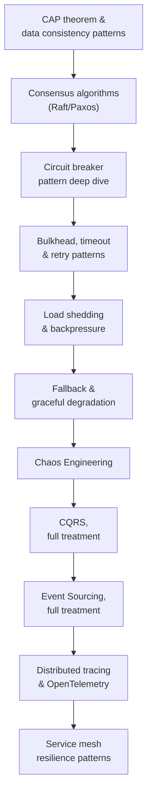

# Day 5 — Microservices & Distributed Systems Resilience

## Why this day matters

Every prior day built something — containers, integration routes, gateways, event pipelines. Today is about the question that comes *after* all of that is built: **"so how does this actually survive failure?"** This is the day where an interviewer stops asking "what did you build" and starts asking "what happens when it breaks" — and where cross-referencing the whole week becomes the strongest possible answer:

> "You've mentioned Kafka's ISR and etcd's Raft-based control plane already this week — now tell me, in general terms, what problem consensus algorithms actually solve, and why does almost every serious distributed system end up needing one somewhere?"

## The mental model for the whole day

Today climbs from **the theory underneath every consistency tradeoff** (CAP, consensus), through **the actual mechanical patterns that keep one failing service from taking down the rest** (circuit breaker, bulkhead, load shedding, fallback), validated by **deliberately breaking things on purpose** (chaos engineering), into **the two biggest data-architecture patterns for read-heavy, audit-heavy systems** (CQRS, Event Sourcing), and closes with **how you'd actually see any of this happening in production** (distributed tracing) and **where a service mesh implements a lot of it for you automatically** (a direct build-on from Day 3).

## Today's pages (10-hour day)

| # | Page | Approx. time |
|---|---|---|
| 1 | [CAP theorem & data consistency patterns](01-cap-theorem-data-consistency.md) | 50 min |
| 2 | [Consensus algorithms — Raft/Paxos deep dive](02-consensus-algorithms-raft-paxos.md) | 60 min |
| 3 | [Circuit breaker pattern deep dive](03-circuit-breaker-deep-dive.md) | 55 min |
| 4 | [Bulkhead, timeout & retry patterns](04-bulkhead-timeout-retry.md) | 45 min |
| 5 | [Load shedding & backpressure](05-load-shedding-backpressure.md) | 40 min |
| 6 | [Fallback & graceful degradation](06-fallback-graceful-degradation.md) | 35 min |
| 7 | [Chaos Engineering](07-chaos-engineering.md) | 40 min |
| 8 | [CQRS, full treatment](08-cqrs-full-treatment.md) | 55 min |
| 9 | [Event Sourcing, full treatment](09-event-sourcing-full-treatment.md) | 60 min |
| 10 | [Distributed tracing & OpenTelemetry](10-distributed-tracing-opentelemetry.md) | 50 min |
| 11 | [Service mesh resilience patterns](11-service-mesh-resilience.md) | 45 min |
| 12 | [Interview Q&A drill](12-interview-qa.md) | 70 min, done cold, last |

## Real-world anchor for today

Today leans harder on cross-day connections than on any single project: **Day 1's etcd Raft consensus** and **Day 4's Kafka ISR** both resurface as concrete instances of the consensus theory covered here. The **TnD Microservices** platform remains the natural home for circuit breaker/bulkhead/retry scenarios — a decomposed platform calling multiple downstream services is exactly where cascading failure risk lives. Where a topic doesn't map directly to a specific project, it connects to your Red Hat Solution Architect experience discussing resilience and availability requirements directly with customers.
