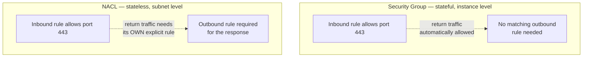
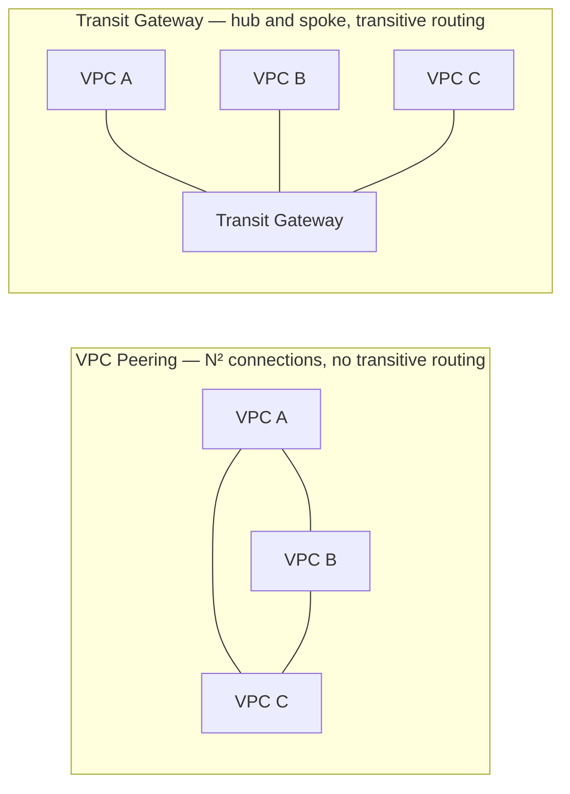

# VPC networking deep dive

## The one-line hook

> **A subnet isn't inherently "public" or "private" — that's entirely determined by what its route table points to. Everything else in VPC networking builds on that one fact.**

## VPC and subnets — the foundation

A **VPC (Virtual Private Cloud)** is a logically isolated, private virtual network within an AWS region, defined by a CIDR block, and divided into **subnets** — each subnet lives in exactly one Availability Zone. A subnet's "publicness" isn't a property you set directly; it's a consequence of its **route table**: a subnet with a route sending internet-bound traffic (`0.0.0.0/0`) to an **Internet Gateway** is a public subnet; a subnet without that route is private.

## Internet Gateway and NAT Gateway — two very different jobs

- **Internet Gateway (IGW)**: a horizontally scaled, redundant, highly available VPC component enabling **two-way** communication between the VPC and the internet — attached to the VPC as a whole, made usable by a route table entry pointing to it.
- **NAT Gateway**: lets instances in a **private** subnet initiate **outbound** connections to the internet (for patching, pulling updates) while preventing the internet from initiating **inbound** connections to them. It's AWS-managed, placed in a public subnet, and — a real architecture decision — best deployed **one per Availability Zone** for high availability, since a single shared NAT Gateway is both a single point of failure and a source of cross-AZ data transfer charges for traffic originating in other AZs.

**Memorable hook:** *"IGW is a two-way door. NAT Gateway is a one-way door that only opens outward — private instances can walk out, but nothing from outside can walk in through it."*

## Security Groups vs. NACLs — the near-universal interview question

| | Security Group | NACL |
|---|---|---|
| **State** | Stateful — return traffic is automatically allowed, regardless of outbound rules | Stateless — return traffic must be explicitly permitted by its own rule |
| **Scope** | Instance level (technically, the ENI) | Subnet level — applies to everything in the subnet |
| **Rule types** | Allow rules only — no explicit deny | Both allow **and** deny rules |
| **Evaluation** | All applicable rules evaluated together, most permissive wins | Evaluated in **rule number order** — first match wins, like a traditional firewall ACL |

**Memorable hook:** *"A Security Group only needs to hear the door open once — it remembers, and lets the reply back in automatically. A NACL has amnesia after every single packet — it needs its own explicit rule for the reply, every time."*

## VPC Peering vs. Transit Gateway — the same N² math from Day 2, applied to network topology

**VPC Peering** creates a direct, 1:1 connection between two VPCs — simple, but with **no transitive routing**: if A peers with B, and B peers with C, A still cannot reach C through B. Connecting many VPCs this way requires a direct peering connection between every pair — exactly Day 2's N² integration math, now applied to network topology instead of B2B data formats. **Transit Gateway** solves it the same way a hub-and-spoke integration platform does: a central hub that every VPC (and on-premises network) connects to once, supporting genuine **transitive routing** and scaling to thousands of connected VPCs with centralized management.

**Memorable hook:** *"Peering is point-to-point integration for networks. Transit Gateway is the hub-and-spoke fix for the exact same N² problem — same math, completely different domain, and worth saying so explicitly."*

## VPC Endpoints — private connectivity without the public internet

| | Gateway Endpoint | Interface Endpoint (PrivateLink) |
|---|---|---|
| **Cost** | Free | Hourly charge plus data processing charges |
| **Services supported** | Only **S3** and **DynamoDB** | Most other AWS services |
| **Implementation** | A route table entry | Powered by an actual ENI (Elastic Network Interface) in your subnet |

**A concrete, real cost-optimization detail worth having ready**: routing S3 and DynamoDB traffic through a **Gateway Endpoint** instead of out through a NAT Gateway avoids NAT Gateway data processing charges entirely for that traffic — a specific, quantifiable architecture decision, not a vague "it's more secure" gesture.

## Connecting to on-premises — VPN vs. Direct Connect

| | Site-to-Site VPN | AWS Direct Connect |
|---|---|---|
| **Connection** | IPsec tunnel over the public internet | Dedicated physical fiber connection |
| **Setup time** | Quick | Longer to provision |
| **Bandwidth/performance** | Lower, variable | Predictable, higher bandwidth |
| **Fit** | Fast to stand up, lower-stakes connectivity | Sustained, high-bandwidth, latency-sensitive enterprise connectivity |

## Real-world examples

1. **A realistic VPC design for the TnD Microservices platform** — public subnets hosting load balancers, private subnets for application and database tiers, one NAT Gateway per AZ for outbound patching traffic — a concrete, walkable design directly grounded in your one actual AWS project.
2. **Explicitly naming the N²-vs-hub-and-spoke math shared between Day 2's integration fundamentals and Transit Gateway** — a strong, memorable cross-day answer showing the same underlying principle applies to completely different domains, not three isolated facts about three different technologies.
3. **Recommending Direct Connect over Site-to-Site VPN for a Thai enterprise customer** needing predictable, sustained, high-bandwidth connectivity between an on-premises data center and AWS — a realistic, defensible architecture recommendation directly grounded in your Red Hat/Kong on-premises integration background.
