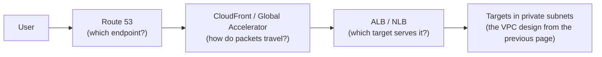

# The edge & traffic layer — ELB, Route 53, CloudFront, Global Accelerator

The VPC page built the network; this page is how traffic finds it and gets spread across it. It's also secretly home turf: load balancing, L7 routing, health checks, and TLS termination are literally your day job at Kong — this page mostly renames things you already operate for a living, then adds the two genuinely AWS-specific pieces (Route 53 policies and the CloudFront/Global Accelerator distinction) interviewers love.

## The one-line hook

> **Three different jobs, three different layers: Route 53 decides *which endpoint* (DNS), CloudFront and Global Accelerator decide *how the packets travel* (the edge), and the load balancer decides *which target does the work*. Answer any traffic question by naming which of the three jobs is actually being asked about.**

## The path of a request — the whole page in one picture

## The ELB family — ALB vs NLB (vs GWLB)

| | Application Load Balancer (ALB) | Network Load Balancer (NLB) |
|---|---|---|
| **Layer** | 7 — reads the HTTP request | 4 — forwards TCP/UDP connections |
| **Routing** | Path, host, header, query-string rules to target groups | None — it's connection plumbing |
| **Source IP** | Replaced (preserved in `X-Forwarded-For`) | Preserved end-to-end |
| **Static IP** | No — DNS name only | Yes — one static IP (or Elastic IP) per AZ |
| **Performance profile** | Rich features, more per-request work | Millions of requests/sec, ultra-low latency |
| **Special tricks** | WAF attachment, Lambda targets, OIDC authentication at the balancer | TLS passthrough, **PrivateLink endpoints are built on NLB** |

**Gateway Load Balancer (GWLB)** is the third, niche sibling: transparently steering traffic through fleets of third-party security appliances (firewalls, IDS/IPS) — name it, place it, move on.

**Memorable hook:** *"ALB reads the request; NLB just forwards the connection. The moment someone says 'route by URL path' you're at layer 7 — ALB. The moment they say 'static IP,' 'preserve source IP,' or 'not HTTP,' you're at layer 4 — NLB."*

Two details interviewers probe: **health checks** are per target group, and the balancer only routes to healthy targets — this is the circuit-breaking primitive everything else builds on; and **cross-zone load balancing** (default on for ALB, configurable on NLB) decides whether each balancer node spreads traffic across all AZs' targets or only its own.

## Route 53 routing policies — DNS as an architecture tool

| Policy | What it does | Reach for it when |
|---|---|---|
| **Simple** | One record, one answer | Nothing clever needed |
| **Weighted** | Splits traffic by percentage | Canary releases, gradual migrations (Day 7's safe deployments, at the DNS layer) |
| **Latency-based** | Answers with the lowest-latency region for that user | Multi-region active-active serving |
| **Failover** | Primary while healthy, secondary when health checks fail | Active-passive DR — the mechanism behind the multi-region page ahead |
| **Geolocation** | Answers based on where the user *is* | Data-residency/compliance routing, localized content |
| **Multivalue** | Several healthy answers, client picks | Poor-man's load balancing with health checks |

The senior-level caveat to volunteer unprompted: **DNS failover is bounded by TTLs and resolver behavior** — clients cache answers, so "Route 53 fails over" means *minutes* of stragglers, not an instant cutover. That single sentence sets up Global Accelerator below and is exactly the kind of honesty the mock-interview day rewards.

**Memorable hook:** *"DNS is the slowest failover layer you own — the record changes instantly, but the world's resolvers only notice when their cached TTL expires."*

## CloudFront vs Global Accelerator — the classic confusion pair

Both put your traffic onto AWS's edge network. They do different jobs:

| | CloudFront | Global Accelerator |
|---|---|---|
| **What it is** | A CDN — caches content at edge locations | Anycast networking — two static global IPs that ingress at the nearest edge |
| **Protocols** | HTTP/HTTPS | TCP and UDP, anything |
| **Caching** | Yes — that's the point | None — it's a faster road, not a warehouse |
| **Failover speed** | n/a (origin failover per distribution) | Near-instant regional failover, **no DNS TTL involvement** |
| **Canonical fit** | Websites, APIs with cacheable responses, static assets, video | Gaming/VoIP/IoT (non-HTTP), multi-region APIs needing fast failover, customers who must allowlist fixed IPs |

CloudFront details worth having ready: **Origin Access Control (OAC)** locks an S3 origin so it's *only* reachable via CloudFront; **signed URLs/cookies** gate paid or private content; even **dynamic, uncacheable** requests get faster via edge TLS termination and reuse of warm connections over the AWS backbone; and the cost mechanics are on the cost-optimization page — CloudFront-to-internet transfer is cheaper than origin-to-internet, so it's a cost play, not just a speed play.

**Memorable hook:** *"CloudFront is a warehouse network — it stores copies close to customers. Global Accelerator is a private highway network — nothing is stored, the truck just skips the public roads. Cacheable HTTP → CloudFront; anything else that needs to be fast or fail over instantly → Global Accelerator."*

## Where does an API gateway fit? — the question you're uniquely ready for

An ALB routes and balances; an API gateway (Kong, or AWS API Gateway) additionally does authentication, rate limiting, transformation, versioning, and per-consumer policy — Day 3's entire catalog. The architectures compose rather than compete: **CloudFront → ALB/NLB → gateway → services** is a perfectly normal stack, with each layer doing its one job. When an interviewer asks "why do I need a gateway if I have an ALB?", the answer is Day 3's API-management story, and you can answer it with the authority of someone who fields it from customers weekly.

## Real-world examples

1. **"Why do I need Kong if I already have an ALB?"** — a question you genuinely field at Kong: the ALB balances and routes; the gateway governs (authn/z, rate limits, plugins, versioning). And in the reverse direction, Kong data planes on EKS typically sit **behind an NLB** — layer-4 passthrough, preserved source IPs, static IPs for customers' firewall rules — a real deployment detail from your actual accounts.
2. **B2B partners that allowlist IPs** — an iB2B-style integration platform can't hand trading partners an ALB's ever-changing DNS-resolved IPs; partners' firewalls want fixed addresses. That's NLB static IPs per AZ, or Global Accelerator's two global anycast IPs in front of a multi-region deployment — a concrete, resume-grounded reason the "static IP" row in the ALB/NLB table actually matters.
3. **A Thailand-based platform serving users across APAC** — CloudFront for the cacheable web and content traffic, latency-based Route 53 routing to regional ALBs for the dynamic API, and the honest trade-off narration: start single-region behind CloudFront (edge TLS termination already helps distant users), and reach for true multi-region with latency routing only when the measured latency, not the brochure, demands it.
